## Technologia nas wyzwoli? {#motto .foto background-image="../assets/img/lecture00/ziemia-noca.jpg" background-size="cover" background-color="#000" background-opacity="0.6"}

::: {.wielkie .fragment .fade-in-then-out style="color:#ffd166"}
???
:::

::: {.fragment}
::: {.cytat}
„…globalizacja, blockchain, inżynieria genetyczna, sztuczna inteligencja, uczenie maszynowe — prości ludzie zapewne podejrzewają, że żadne z tych pojęć ich nie dotyczy.”
:::

::: {.zrodlo}
Yuval Noah Harari, *21 lekcji na XXI wiek*. Zdjęcie: NASA Goddard, *Black Marble — City Lights 2012*, domena publiczna.
:::
:::

## <i class="bi bi-person-raised-hand"></i> Kto decyduje o przyszłości? {#cele}

::: {.columns}
::: {.column width="32%"}
{.portret fig-alt="Yuval Noah Harari podczas Targów Książki we Frankfurcie, 2024."}

::: {.zrodlo}
Fot. Martin Kraft, CC BY-SA 4.0
:::
:::

::: {.column width="68%"}
::: {.cytat}
„Rewolucje dokonujące się w biotechnologii i technologii informacyjnej przeprowadzają inżynierowie, przedsiębiorcy i naukowcy, którzy nie zdają sobie sprawy z politycznych konsekwencji własnych decyzji i z całą pewnością nikogo nie reprezentują.”
:::

::: {.zrodlo}
Y. N. Harari, *21 lekcji na XXI wiek*
:::

::: {.fragment}
[To wy będziecie tymi inżynierami.]{.lead}

Dziś trzy pytania: **co obiecuje** Internet Rzeczy, **co może zabrać** i **co ogranicza** go naprawdę.
:::
:::
:::

## <i class="bi bi-graph-up-arrow"></i> Przyszłość jest już infrastrukturą {#skala}

::: {.columns}
::: {.column width="64%"}
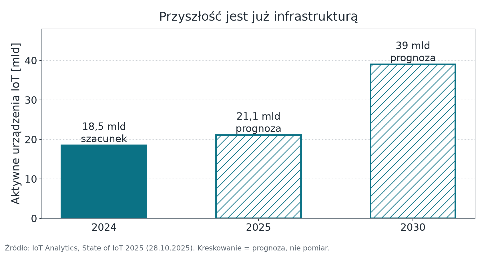{fig-alt="Wykres słupkowy: 18,5 mld aktywnych urządzeń IoT w 2024 r. (szacunek), 21,1 mld w 2025 r. i 39 mld w 2030 r. (prognozy)."}
:::

::: {.column width="36%"}
Na każdego mieszkańca Ziemi przypadają już **ponad dwa** połączone urządzenia.

::: {.fragment}
Projektując czujnik, nie budujemy „gadżetu przyszłości”. Dokładamy **kolejny węzeł** do zatłoczonej i atakowanej sieci.
:::
:::
:::

::: {.zrodlo}
IoT Analytics, *State of IoT 2025*, 28.10.2025, <https://iot-analytics.com/number-connected-iot-devices/>
:::

# Utopia {.sekcja background-color="#0b3b45"}

[Co obiecuje świat połączonych rzeczy?]{.lead}

## <i class="bi bi-stars"></i> Jasna strona mocy {#profity}

::: {.kafelki}
::: {.fragment}
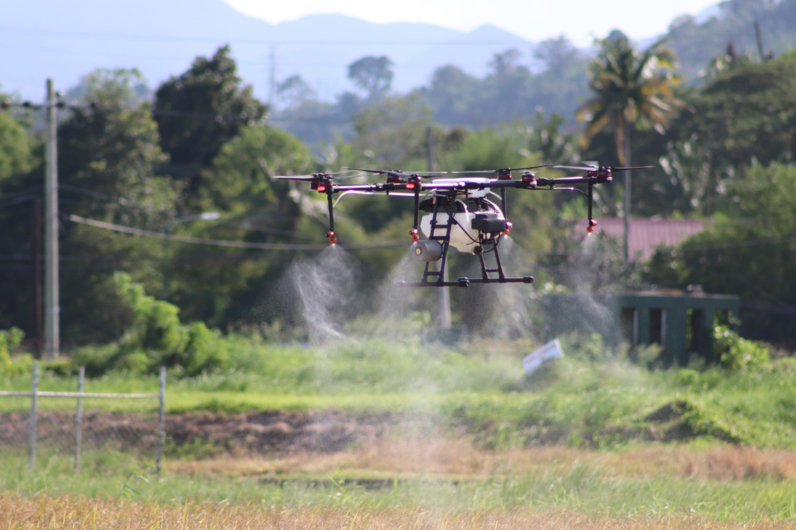{fig-alt="Dron rolniczy nad polem ryżowym podczas pokazu."}

**Rolnictwo** — dawka tam, gdzie potrzeba
:::

::: {.fragment}
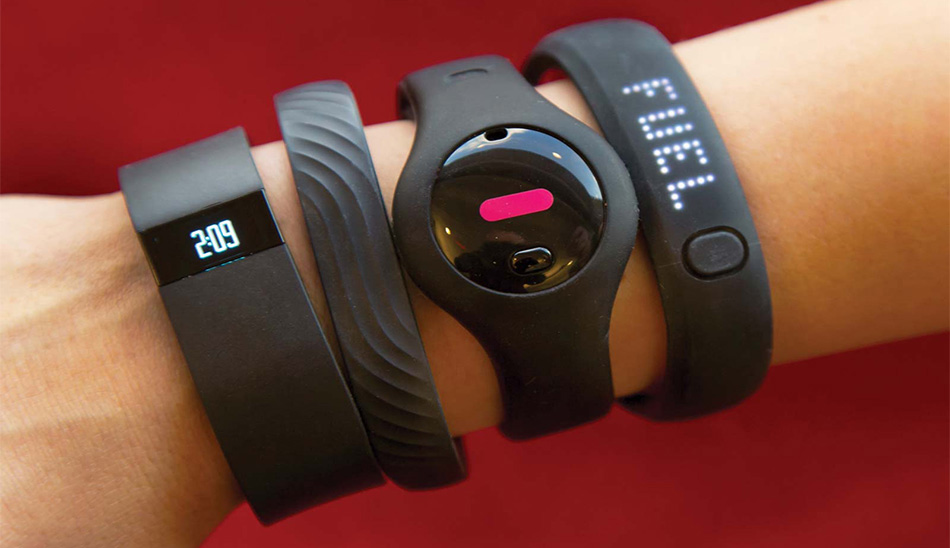{fig-alt="Trzy opaski monitorujące aktywność na nadgarstku."}

**Zdrowie** — pomiar ciała przez całą dobę
:::

::: {.fragment}
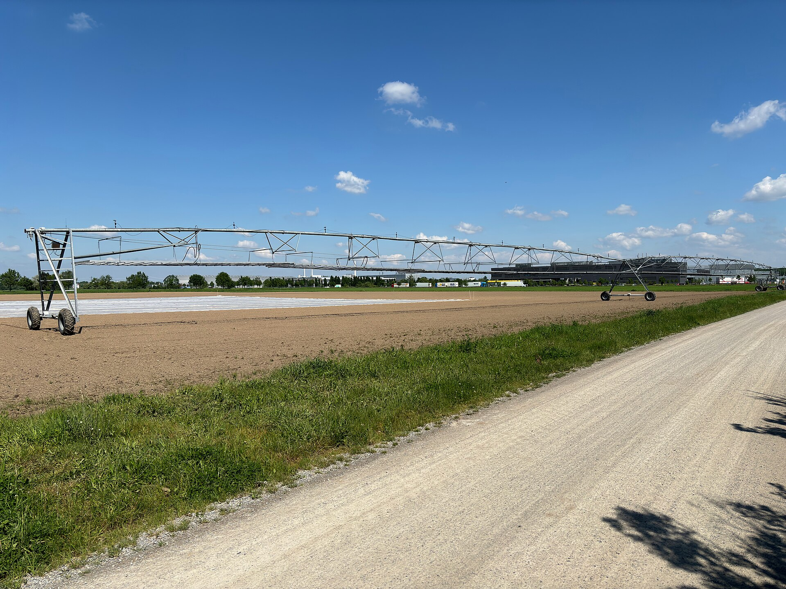{fig-alt="Deszczownia obrotowa na polu uprawnym."}

**Woda** — nawadnianie według gleby, nie kalendarza
:::

::: {.fragment}
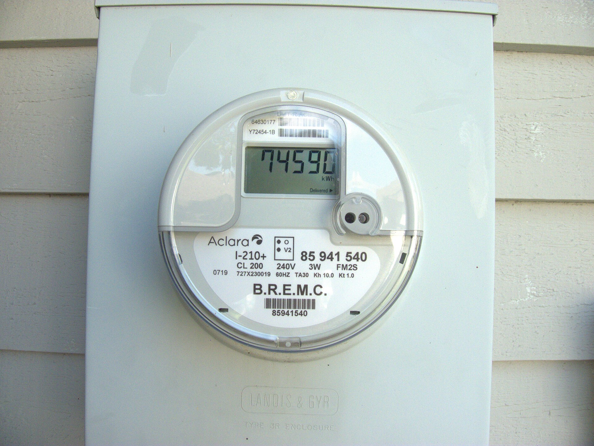{fig-alt="Inteligentny licznik energii elektrycznej na ścianie budynku."}

**Energia** — sieć widzi zużycie na bieżąco
:::
:::

::: {.zrodlo}
Fot.: Ch. Hedreyd / PIA (domena publiczna); Abas Gemini, Killarnee, 277volts (CC BY-SA 4.0) — Wikimedia Commons
:::

## <i class="bi bi-tree"></i> Poszerzenie wiedzy o środowisku {#srodowisko}

::: {.kafelki}
::: {}
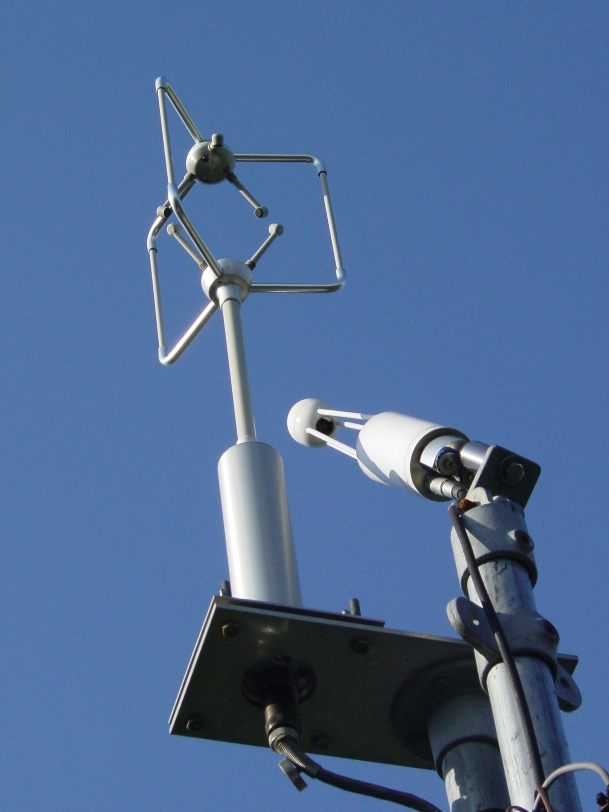{fig-alt="Anemometr ultradźwiękowy i analizator gazów na maszcie pomiarowym metody kowariancji wirów."}

**Kowariancja wirów:** 10–20 pomiarów na sekundę, żeby policzyć oddech ekosystemu
:::

::: {.fragment}
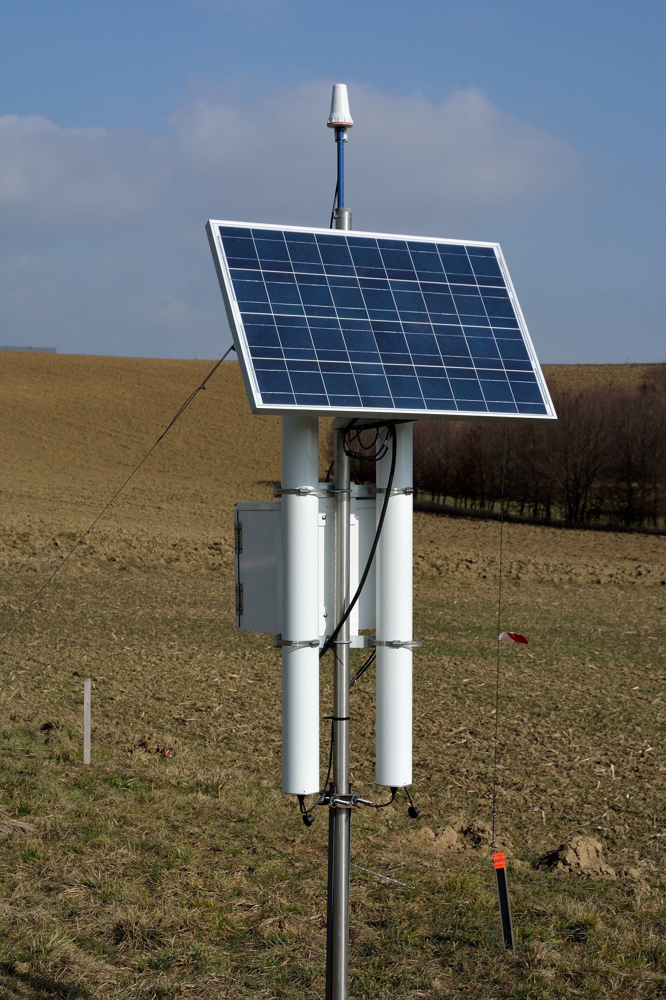{fig-alt="Czujnik promieniowania kosmicznego do pomiaru wilgotności gleby na polu."}

**Wilgotność gleby** mierzona neutronami z promieniowania kosmicznego
:::

::: {.fragment}
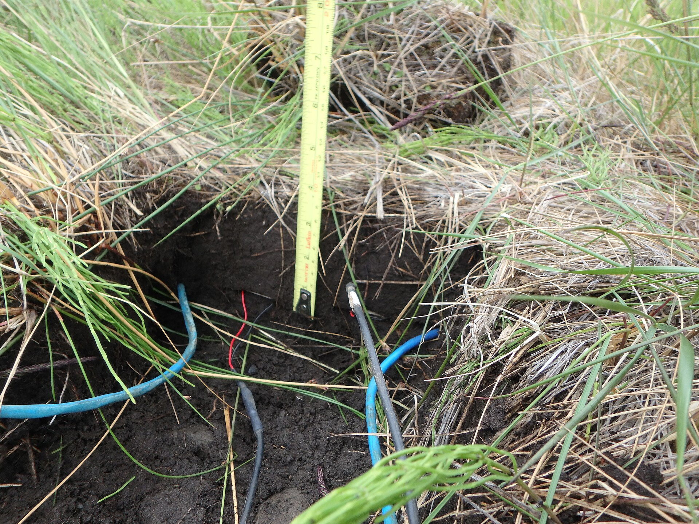{fig-alt="Kable czujników glebowych wkopane w podłoże przy stacji pomiarowej."}

**Sieć czujników glebowych** — dziesiątki punktów zamiast jednego
:::
:::

::: {.fragment}
Nature 4.0: las, pole i torfowisko stają się **obserwowalne w sposób ciągły** — tak jak hala fabryczna w Przemyśle 4.0.
:::

::: {.zrodlo}
R. Valentini i in. (2019), *New tree monitoring systems: from Industry 4.0 to Nature 4.0*, doi:10.12899/asr-1847. Fot.: Veedar (domena publiczna); P e z i (CC BY-SA 3.0 AT); UBC Micrometeorology (CC BY 2.0)
:::

## <i class="bi bi-arrow-repeat"></i> Nie „rzecz”, lecz pętla {#lancuch}

```{mermaid}
%%| fig-width: 11
%%| fig-height: 1.5
%%{init: {"themeVariables": {"fontSize": "24px", "fontFamily": "Arial, Liberation Sans, Helvetica, sans-serif"}}}%%
flowchart LR
    S["Świat fizyczny<br>gleba · roślina"]
    P["Pomiar<br>wilgotność"]
    M["Model<br>próg · prognoza"]
    D["Decyzja<br>podlać czy nie?"]
    A["Działanie<br>zawór · pompa"]
    S --> P --> M --> D --> A --> S
    classDef x fill:#e8f2f4,stroke:#0b6b78,stroke-width:2px,color:#0b3b45
    class S,P,M,D,A x
```

::: {.columns}
::: {.column width="40%"}
{fig-alt="Technicy przy polowej instalacji oszczędnego systemu nawadniania." height="280px"}

::: {.zrodlo}
Fot. NAVFAC, CC BY 2.0
:::
:::

::: {.column width="60%" .fragment}
[Czujnik ma sens dopiero wtedy, gdy **zmienia decyzję** — a decyzja otwiera zawór.]{.lead}

Każde ogniwo może wnieść błąd, stronniczość albo opóźnienie.
:::
:::

## <i class="bi bi-chat-square-quote"></i> Pytanie do sali {#pytanie-sala}

::: {.wielkie style="color:#0b3b45; font-size:1.7em"}
Gdzie w tej pętli kończy się technika,<br>a zaczyna władza?
:::

::: {.fragment}
Kto wybiera, **co mierzymy**? Kto pisze **model**? Kto może **wydać polecenie** urządzeniu?
:::

# Dystopia {.sekcja background-color="#3d1418"}

[Dobre pomysły, wspaniałe narzędzia — i ich niecne wykorzystanie.]{.lead}

## <i class="bi bi-eye"></i> Ale czy tylko korzyści? {#cambridge}

::: {.kafelki}
::: {}
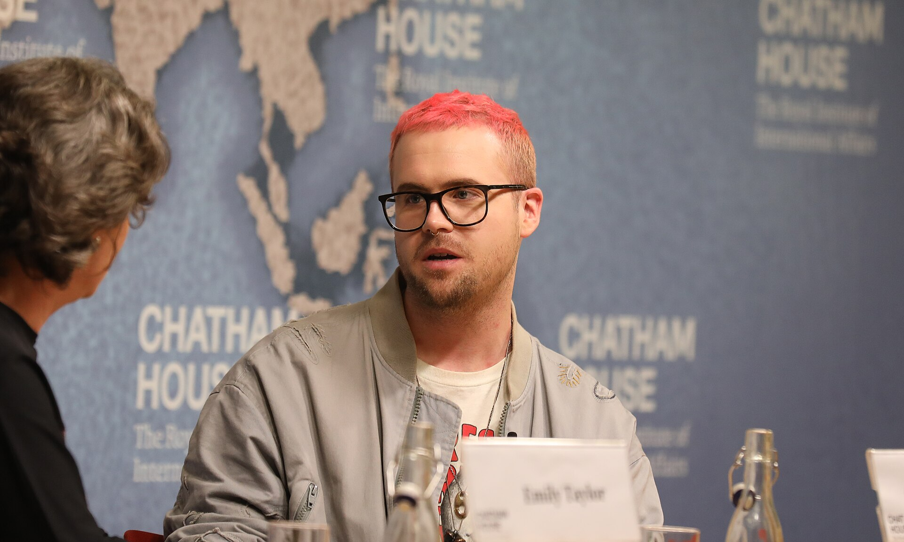{fig-alt="Christopher Wylie, sygnalista w sprawie Cambridge Analytica, podczas wystąpienia w Chatham House w 2018 r."}

**Cambridge Analytica:** dane dziesiątek milionów użytkowników Facebooka pozyskane podstępem i użyte do profilowania wyborców (ustalenia FTC).

::: {.zrodlo}
Fot. Chatham House, CC BY 2.0 — Christopher Wylie, sygnalista
:::
:::

::: {.fragment}
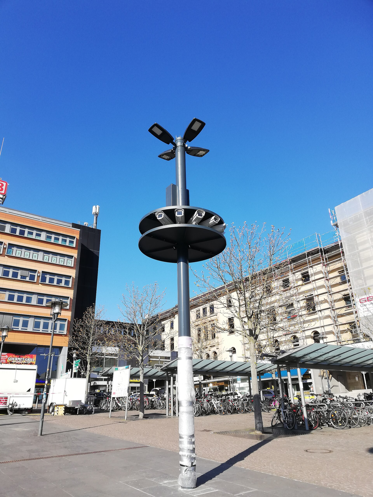{fig-alt="Słup z kilkoma kamerami monitoringu miejskiego."}

**Chiński „kredyt społeczny”:** nie jeden wynik każdego obywatela, lecz wiele rejestrów i czarnych list — z automatycznymi skutkami i trudnym odwołaniem.

::: {.zrodlo}
Fot. µKöff, CC BY 4.0
:::
:::
:::

::: {.fragment}
[Zagrożenia technologii ~~przyszłości~~ **już dzisiejszej**: powszechna inwigilacja, propaganda szyta na miarę, sterowanie potrzebami i pragnieniami jednostek.]{.lead}
:::

## <i class="bi bi-diagram-3"></i> Pętla danych jest pętlą władzy {#petla-wladzy}

```{mermaid}
%%| fig-width: 11
%%| fig-height: 1.5
%%{init: {"themeVariables": {"fontSize": "22px", "fontFamily": "Arial, Liberation Sans, Helvetica, sans-serif"}}}%%
flowchart LR
    O["Obserwacja<br>co mierzymy?"]
    I["Inferencja<br>co wnioskujemy?"]
    K["Klasyfikacja<br>do jakiej grupy?"]
    W["Interwencja<br>cena · dostęp · alarm"]
    Z["Zmiana zachowania"]
    O --> I --> K --> W --> Z --> O
    classDef n fill:#fdf3f4,stroke:#b02a37,stroke-width:2px,color:#8f2029
    class O,I,K,W,Z n
```

::: {.fragment}
[Ta sama pętla, która nawadnia pole, może **sterować człowiekiem**. Dane zebrane w jednym celu łatwo użyć w innym.]{.lead}
:::

## <i class="bi bi-cup-straw"></i> „Cukiereczki” dla mózgu {#huxley}

::: {.columns}
::: {.column width="28%"}
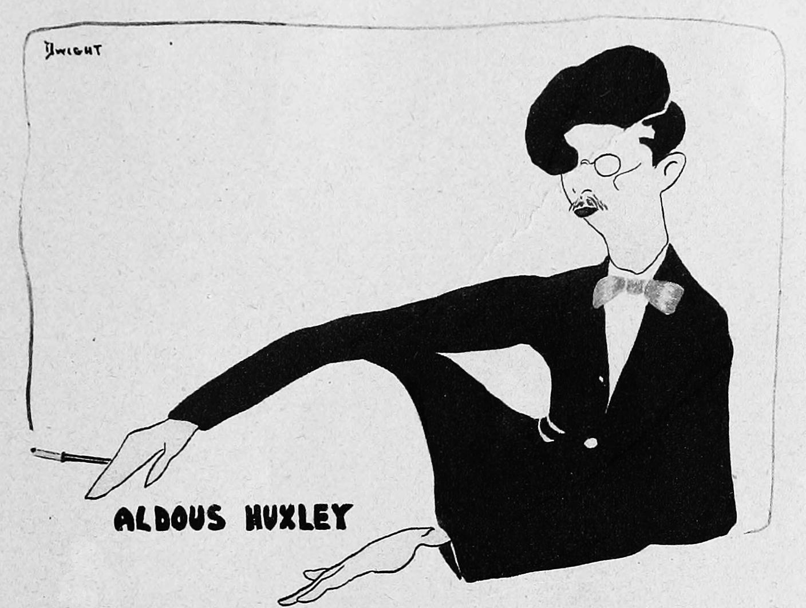{.portret fig-alt="Karykatura Aldousa Huxleya z 1923 roku."}

::: {.zrodlo}
Aldous Huxley, rys. Dwight, 1923 — domena publiczna
:::
:::

::: {.column width="72%"}
::: {.cytat}
„Jeżeli większość ludzi spędza znaczną część swojego czasu nie tu i teraz (…), ale gdzie indziej, w pozbawionych znaczenia zaświatach sportu i oper mydlanych, mitologii i metafizycznych fantazji, społeczeństwu będzie trudno oprzeć się zakusom tych, którzy chcą nim manipulować.”
:::

::: {.zrodlo}
A. Huxley, *Nowy wspaniały świat 30 lat później* (1958)
:::

::: {.fragment}
Huxley pisał o radiu i kinie. Dziś „zaświaty” mieszczą się w kieszeni i **mierzą naszą uwagę co sekundę**.
:::
:::
:::

# Człowiek i maszyna {.sekcja background-color="#0b3b45"}

[Konkurenci czy partnerzy?]{.lead}

## <i class="bi bi-braces"></i> Czy jesteśmy programami? {#czy-programy}

::: {.cytat}
„…nasze decyzje w każdej sprawie — od wyboru jedzenia po wybór partnerów — wynikają nie z jakiejś tajemniczej wolnej woli, lecz raczej z miliardów neuronów w ułamku sekundy obliczających prawdopodobieństwa. Osławiona »ludzka intuicja« jest w rzeczywistości »rozpoznawaniem wzorców«.”
:::

::: {.zrodlo}
Y. N. Harari, *21 lekcji na XXI wiek* — teza eseistyczna, nie wynik pomiaru
:::

::: {.fragment}
[Jeśli system potrafi **przewidzieć** nasze zachowanie, czy powinien też dostać prawo, by je **wywołać** — w świecie fizycznym?]{.lead}
:::

## <i class="bi bi-cpu"></i> Ile kosztuje mózg kota? {#blue-gene}

::: {.columns}
::: {.column width="52%"}
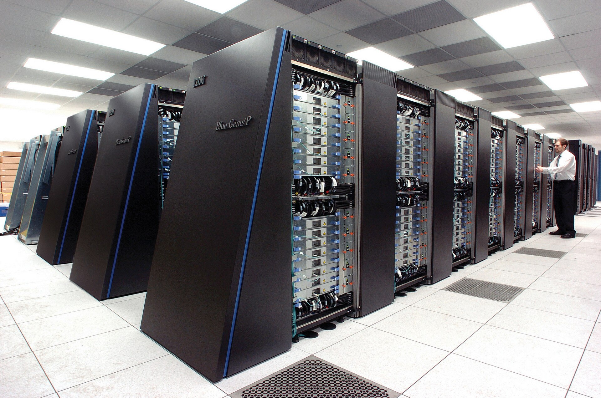{fig-alt="Szafy superkomputera IBM Blue Gene/P w hali Argonne National Laboratory."}

::: {.zrodlo}
IBM Blue Gene/P, Argonne National Laboratory, CC BY-SA 2.0
:::
:::

::: {.column width="48%"}
W 2009 r. superkomputer Blue Gene/P (**147 456 procesorów**) zasymulował korę o skali mózgu kota:

::: {.liczby}
::: {}
[1,6 mld]{.w}[neuronów]{.o}
:::
::: {}
[≈ 9 bln]{.w}[synaps]{.o}
:::
:::

::: {.fragment}
…znacznie wolniej niż żywy mózg, który zużywa około **20 W**. Inteligencja w krzemie jest dziś przede wszystkim **problemem energii**.
:::
:::
:::

::: {.zrodlo}
R. Ananthanarayanan i in., *The cat is out of the bag*, SC'09, doi:10.1145/1654059.1654124
:::

## <i class="bi bi-robot"></i> AI wychodzi z ekranu {#ai-fizyczny}

::: {.columns}
::: {.column width="38%"}
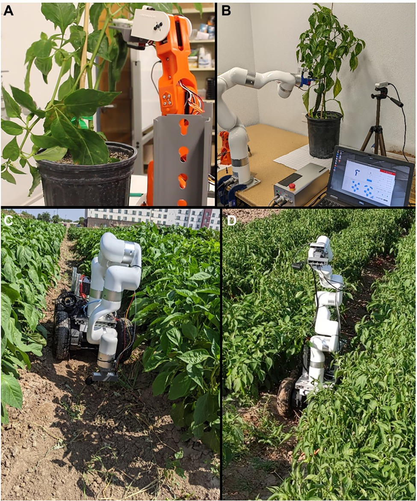{.portret fig-alt="Ramię robota z nożem na końcu zbiera zielone papryczki chili w uprawie wewnętrznej."}

::: {.zrodlo}
Lozada i in., robot do zbioru chili, CC BY 4.0
:::
:::

::: {.column width="62%"}
**AI bez IoT** analizuje tekst i obraz.<br>**IoT bez AI** mierzy i reaguje według jawnej reguły.

::: {.fragment}
**Razem:** system obserwuje, przewiduje, **działa** i uczy się z efektu.
:::

::: {.fragment}
::: {.callout-warning title="Najważniejsza zmiana"}
Błąd modelu przestaje być złą odpowiedzią na ekranie. Staje się **ruchem ramienia**, dawką nawozu albo niewysłanym alarmem.
:::
:::
:::
:::

## <i class="bi bi-people"></i> Bezużyteczna klasa? {#praca}

::: {.columns}
::: {.column width="50%"}
**Ostrzeżenie Harariego**

::: {.cytat style="font-size:0.9em"}
„Rewolucja techniczna może niedługo wypchnąć miliardy ludzi z rynku pracy i przyczynić się do powstania ogromnej, nowej, bezużytecznej klasy.”
:::

::: {.zrodlo}
Y. N. Harari, *21 lekcji na XXI wiek*
:::
:::

::: {.column width="50%" .fragment}
**Dane ILO i NASK (2025)**

* 1 na 4 pracujących ma zawód z pewną **ekspozycją** na generatywną AI,
* w najwyższej kategorii ekspozycji jest **3,3%** zatrudnionych.

Autorzy: zawód to wiele zadań, więc bardziej prawdopodobna jest **przemiana pracy** niż jej zanik.
:::
:::

::: {.zrodlo}
ILO Working Paper 140, 20.05.2025, <https://www.ilo.org/publications/generative-ai-and-jobs-refined-global-index-occupational-exposure>
:::

## <i class="bi bi-broadcast"></i> Bezpośredni transfer wrażeń? {#bci}

::: {.columns}
::: {.column width="55%"}
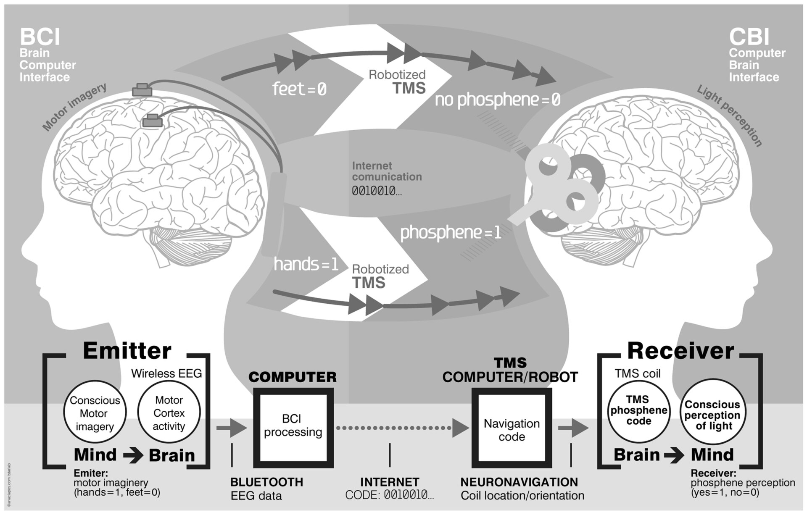{fig-alt="Schemat komunikacji mózg–mózg: nadawca z czepkiem EEG w Indiach, przesył przez internet, odbiorca we Francji ze stymulacją TMS."}

::: {.zrodlo}
C. Grau i in. (2014), PLoS ONE, CC BY 4.0
:::
:::

::: {.column width="45%"}
* **2013:** szczur w USA podpowiada szczurowi w Brazylii, którą dźwignię nacisnąć.
* **2014:** jedno słowo „przesłane” z mózgu do mózgu — Indie → Francja.

::: {.fragment}
**To potwierdza:** pojedyncze bity przez EEG i stymulację, a w klinice — przywracanie mowy sparaliżowanym.

**Nie potwierdza:** czytania myśli ani przesyłania wiedzy.
:::
:::
:::

::: {.zrodlo}
M. Pais-Vieira i in. (2013), doi:10.1038/srep01319; C. Grau i in. (2014), doi:10.1371/journal.pone.0105225; S. L. Metzger i in. (2023), doi:10.1038/s41586-023-06443-4
:::

# Rzeczywistość {.sekcja background-color="#1d2a31"}

[Fizyka, bezpieczeństwo i czas życia nie znikają z żadnej wizji.]{.lead}

## <i class="bi bi-fuel-pump"></i> Energia jest najważniejsza {#energia}

::: {.columns}
::: {.column width="40%"}
::: {.fragment}
Benzyna: **43,2 MJ/kg** → 34,56 MJ/l
:::

::: {.fragment}
7 l/100 km → **0,672 kWh/km**
:::

::: {.fragment}
Człowiek przy ciężkiej pracy: 2500–3000 kcal, czyli **10,5–12,6 MJ na dobę**
:::
:::

::: {.column width="60%" .fragment}
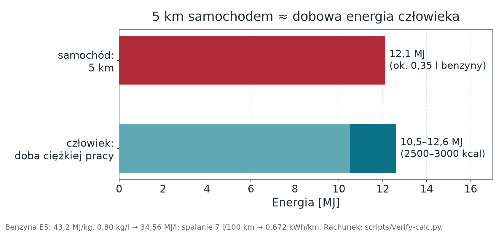{fig-alt="Wykres: 5 km jazdy samochodem zużywa 12,1 MJ, tyle co człowiek przez dobę ciężkiej pracy (10,5–12,6 MJ)."}
:::
:::

::: {.fragment}
[Wizje przyszłości często pomijają rachunek energii. Każdy czujnik, nadajnik i serwer też go ma.]{.lead}
:::

## <i class="bi bi-lightning-charge"></i> Optymalizacja ma własny rachunek {#centrum-danych}

::: {.columns}
::: {.column width="45%"}
{fig-alt="Korytarz centrum danych z rzędami szaf serwerowych podświetlonych na niebiesko."}

::: {.zrodlo}
Fot. BalticServers.com, CC BY-SA 3.0
:::
:::

::: {.column width="55%"}
**Centra danych** zużyły w 2024 r. ok. **415 TWh** — 1,5% światowej energii elektrycznej. Scenariusz na 2030 r.: ok. **945 TWh**.

::: {.fragment}
System IoT oszczędza wodę, nawóz i paliwo, ale sam zużywa energię czujnika, radia, bramy i chmury.

**Porównujemy cały cykl życia** wariantu z IoT i bez niego.
:::
:::
:::

::: {.zrodlo}
IEA, *Energy and AI* (2025), <https://www.iea.org/reports/energy-and-ai/executive-summary>
:::

## <i class="bi bi-shield-exclamation"></i> Twoje urządzenie, cudza broń, czyjś odpad {#botnet}

::: {.kafelki}
::: {}
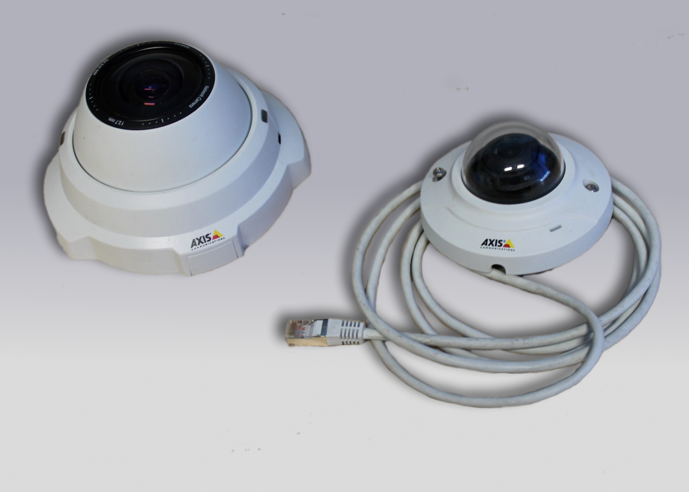{fig-alt="Kopułkowe kamery IP."}

**Raport 2026:** botnet z przejętych kamer i routerów — atak DDoS **31,4 Tb/s**.
:::

::: {.fragment}
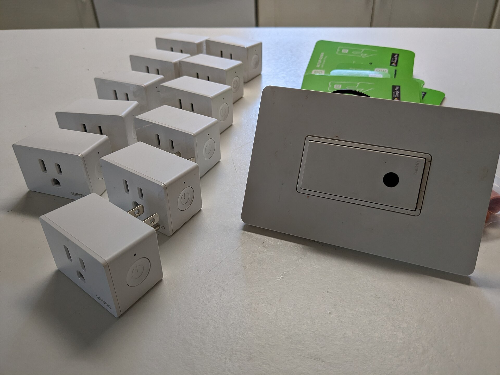{fig-alt="Inteligentne gniazdka i przełączniki Wemo."}

**2026:** Belkin wyłącza chmurę Wemo — sprzęt działa, „smart” znika.
:::

::: {.fragment}
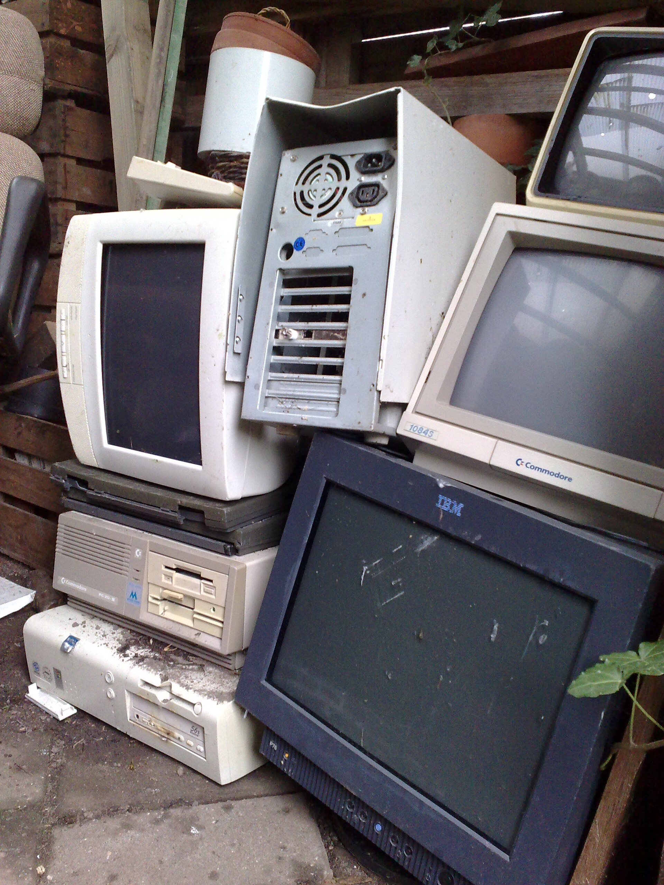{fig-alt="Stos zużytych urządzeń elektronicznych."}

Koniec serwera **nie może** oznaczać elektroodpadu.
:::
:::

::: {.zrodlo}
Cloudflare, *2026 Threat Report*; Belkin, *Wemo Support Ending* (2026). Fot.: Bungle, Harborsparrow (CC BY-SA 4.0); AvWijk (domena publiczna)
:::

## <i class="bi bi-people-fill"></i> Człowiek nie wygrał dzięki samotnej inteligencji {#koordynacja}

::: {.columns}
::: {.column width="30%"}
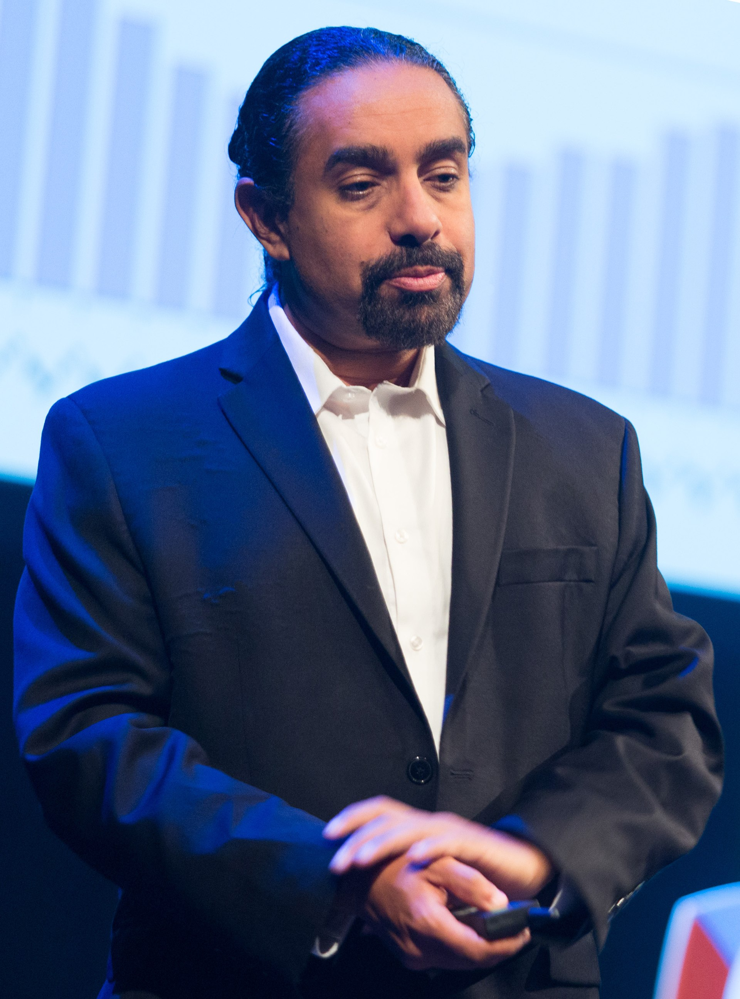{.portret fig-alt="Ramez Naam podczas wystąpienia na konferencji w 2016 r."}

::: {.zrodlo}
Ramez Naam, fot. S. ter Burg, CC BY 2.0
:::
:::

::: {.column width="70%"}
::: {.cytat}
„Ludzkość osiągnęła to, co osiągnęła, nie dzięki sile, pazurom czy zbroi, nawet nie dzięki indywidualnej inteligencji. To zdolność ludzi do koordynowania, wspólnej pracy, wspólnego tworzenia pomysłów i rozwiązań naprawdę ich wyróżnia.”
:::

::: {.zrodlo}
R. Naam, *Crux* (2013), przekład własny
:::

::: {.fragment}
Projektujemy nie tylko przepływ danych, ale też **warunki współpracy** — albo kontroli.
:::
:::
:::

# Od wizji do projektu {.sekcja background-color="#0b3b45"}

## <i class="bi bi-question-diamond"></i> Sześć pytań przed wyborem czujnika {#pytania}

::: {.pytania}
* **Decyzja:** kto i co zrobi dzięki danym?
* **Dowód:** skąd będziemy wiedzieć, że jest lepiej niż bez systemu?
* **Błąd:** ile kosztuje fałszywy alarm, a ile przeoczenie?
* **Władza:** kto widzi dane, zmienia model i wydaje polecenia?
* **Awaria:** jaki stan jest bezpieczny bez sieci i chmury?
* **Koniec życia:** kto aktualizuje, eksportuje dane i usuwa urządzenie?
:::

## <i class="bi bi-signpost-split"></i> Mapa kursu {#most}

::: {.tabela-gesta}
| Pytanie z dzisiejszego wykładu | Moduł |
|:---|:---|
| Co budujemy i jak poznamy, że działa? | **01** Architektura i wymagania |
| Ile energii kosztuje pomiar? | **02** Urządzenie, sensory i energia |
| Co, gdy zniknie łącze? Jak bezpiecznie zmienić firmware? | **03** Łączność i OTA |
| Jak dane zachowują znaczenie między komponentami? | **04** MQTT i kontrakt danych |
| Gdzie walidować i agregować? | **05** Brzeg sieci, Node-RED i Sheets |
| Jak modelować stan, wizualizować i sterować? | **06** ThingsBoard CE |
| Co przy ataku, awarii i zmianie prawa? | **07** Odporność, bezpieczeństwo i eksploatacja |
:::

## <i class="bi bi-flag"></i> Utopia, dystopia, rzeczywistość {#podsumowanie}

::: {.incremental}
* IoT to nie katalog gadżetów, lecz **pętle pomiar → decyzja → działanie**.
* Ta sama pętla może nawadniać pole i **sterować człowiekiem** — o tym decyduje projekt.
* AI przenosi błąd z ekranu **do świata fizycznego**.
* Energia, bezpieczeństwo i koniec wsparcia są częścią architektury **od pierwszego dnia**.
:::

::: {.fragment}
[Technologia nas nie wyzwoli ani nie zniewoli sama. Zrobią to **decyzje projektantów** — czyli wasze.]{.lead}
:::

## <i class="bi bi-bookshelf"></i> Co warto przeczytać {#literatura}

::: {.columns}
::: {.column width="60%"}
1. Y. N. Harari, *21 lekcji na XXI wiek*; *Homo Deus. Krótka historia jutra*
2. A. Huxley, *Nowy wspaniały świat* (1932); *Nowy wspaniały świat 30 lat później* (1958)
3. S. Lem, *Powrót z gwiazd* (1961); *Summa technologiae* (1964)
4. J. Dukaj, *Po piśmie* (2019)
5. R. Naam, *Nexus · Crux · Apex* (2012–2015)
6. M. Weiser, „The Computer for the 21st Century” (1991)
:::

::: {.column width="18%"}
{.portret fig-alt="Portret Stanisława Lema."}

::: {.zrodlo}
Stanisław Lem, CC BY-SA 3.0
:::
:::

::: {.column width="22%"}
::: {.callout-note title="Do rozmowy"}
Która wizja najlepiej opisuje świat połączonych rzeczy: wyzwolenie, łagodna kontrola czy nowa zdolność współpracy?
:::
:::
:::

## <i class="bi bi-journal-text"></i> Źródła {#zrodla}

::: {style="font-size: 0.48em;"}
* IoT Analytics, *State of IoT 2025*, <https://iot-analytics.com/number-connected-iot-devices/>
* R. Valentini i in., *New tree monitoring systems: from Industry 4.0 to Nature 4.0*, 2019, doi:10.12899/asr-1847
* Federal Trade Commission, *Cambridge Analytica, LLC*, sprawa 182 3107, <https://www.ftc.gov/legal-library/browse/cases-proceedings/182-3107-cambridge-analytica-llc-matter>
* K. Drinhausen, V. Brussee, *China’s Social Credit System in 2021*, MERICS, <https://merics.org/en/report/chinas-social-credit-system-2021-fragmentation-towards-integration>
* R. Ananthanarayanan i in., *The cat is out of the bag: cortical simulations with 10⁹ neurons, 10¹³ synapses*, SC'09, doi:10.1145/1654059.1654124
* ILO, *Generative AI and Jobs: A Refined Global Index of Occupational Exposure*, WP 140, 2025, <https://www.ilo.org/publications/generative-ai-and-jobs-refined-global-index-occupational-exposure>
* M. Pais-Vieira i in., *A brain-to-brain interface for real-time sharing of sensorimotor information*, Sci. Rep. 2013, doi:10.1038/srep01319
* C. Grau i in., *Conscious brain-to-brain communication in humans using non-invasive technologies*, PLoS ONE 2014, doi:10.1371/journal.pone.0105225
* S. L. Metzger i in., *A high-performance neuroprosthesis for speech decoding and avatar control*, Nature 2023, doi:10.1038/s41586-023-06443-4
* IEA, *Energy and AI*, 2025, <https://www.iea.org/reports/energy-and-ai/executive-summary>
* Cloudflare, *2026 Threat Report*, <https://blog.cloudflare.com/2026-threat-report/>
* Belkin, *Wemo Support Ending*, 2026, <https://www.belkin.com/support-article/?articleNum=335419>
* Ilustracje: Wikimedia Commons — autorzy i licencje podane pod każdym zdjęciem; wykresy własne, CC BY 4.0
:::
