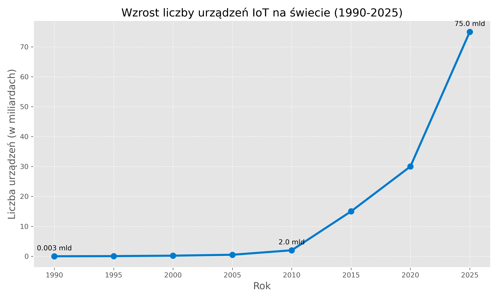
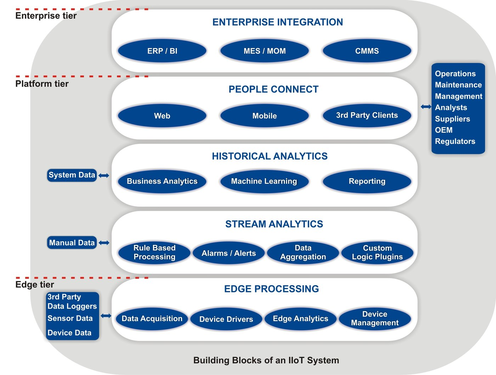

## <i class="bi bi-compass"></i> Po co ten wykład {#cele}

[Pytanie modułu: **co dokładnie budujemy i skąd będziemy wiedzieć, że jest gotowe?**]{.lead}

::: {.columns}
::: {.column width="52%"}
### Cele

::: {.incremental}
* Nazwać warstwy systemu IoT i przypisać im odpowiedzialność.
* Wyznaczyć **granicę systemu**: co jest częścią projektu, a co założeniem.
* Rozróżnić trzy klasy komunikatów i ich konsekwencje techniczne.
* Zapisać kryterium odbioru tak, żeby dało się je zmierzyć.
:::
:::

::: {.column width="48%"}
### Droga

1. Skąd się wzięła idea — i dlaczego to ważne dla inżyniera
2. Model odniesienia: percepcja → sieć → aplikacja
3. Granica systemu i lista założeń
4. Kryterium akceptacji jako liczba
5. Stanowisko laboratoryjne jako przypadek
:::
:::

# Skąd się to wzięło {.sekcja background-color="#0b3b45"}

## <i class="bi bi-telephone-outbound"></i> Od punktu do punktu {#geneza}

[Zanim maszyny zaczęły rozmawiać autonomicznie, trzeba było zbudować drogi.]{.lead}

::: {.incremental}
* **1832** — Baron Schilling buduje telegraf elektromagnetyczny: komunikacja punkt–punkt.
* **1844** — publiczne wiadomości telegraficzne kodem Samuela Morse'a.
* **1876** — patent Alexandra Bella na telefon.
* **1955 / 1960–61** — Edward O. Thorp: koncepcja komputera ubieralnego, a następnie działające urządzenie zbudowane z Claude'em Shannonem.
* **1969** — ARPANET: komutacja pakietów, fundament dzisiejszego Internetu.
:::

---

## <i class="bi bi-cup-straw"></i> Mit założycielski: pragnienie {#coke}

[Kawa, kod i chęć oszczędzenia sobie schodów.]{.lead}

::: {.columns}
::: {.column width="58%"}
::: {.incremental}
* **Gdzie:** Carnegie Mellon University, wydział informatyki.
* **Kiedy:** 1982.
* **Problem:** studenci schodzili piętro niżej do automatu z napojami i często zastawali go pustym.
* **Rozwiązanie:** mikroprzełączniki wykrywały obecność butelek w sześciu kolumnach; program serwera obliczał, jak długo każda butelka była chłodzona. Odczyt zdalny udostępniono później przez `finger coke@cmua`.
:::
:::

::: {.column width="42%"}
::: {.fragment}
::: {.callout-note title="Dlaczego to nadal jest wzorzec"}
Zmierzono **stan fizyczny rzeczy** i udostępniono go w sieci bez człowieka w łańcuchu. Wszystko, co robimy przez resztę semestru, jest rozwinięciem tego jednego pomysłu.
:::
:::
:::
:::

---

## <i class="bi bi-person-badge"></i> Kevin Ashton: od ciekawostki do łańcucha dostaw {#ashton}

::: {.columns}
::: {.column width="50%"}
### Pierwsze urządzenie w TCP/IP (1990)

::: {.incremental}
* John Romkey na konferencji Interop: zdalnie sterowany **toster**.
* Włączany i wyłączany przez sieć.
* Jedna wada: chleb nadal wkładał człowiek.
:::
:::

::: {.column width="50%"}
### Termin „Internet of Things" (1999)

::: {.incremental}
* Kevin Ashton, Procter & Gamble — analiza pustych półek z kosmetykami.
* Prezentacja pt. **„The Internet of Things"**.
* RFID jako klucz do śledzenia towaru bez udziału człowieka.
* Teza: *komputery wiedzą o świecie tylko to, co im powiemy*.
:::
:::
:::

---

## <i class="bi bi-graph-up-arrow"></i> Skala zjawiska {#skala}

[Prawdziwy IoT zaczyna się tam, gdzie człowiek przestaje być głównym twórcą danych.]{.lead}

::: {.columns}
::: {.column width="52%"}
::: {.incremental}
* **Definicja robocza:** sieć urządzeń o unikalnych identyfikatorach, wymieniających dane autonomicznie.
* **Dwie rodziny urządzeń:**
  * *digital-first* — projektowane dla sieci (telefon, laptop),
  * *physical-first* — rzeczy, które stają się widoczne w sieci dzięki dołożonej elektronice.
* Przełom umieszczany w latach **2008–2009**: liczba urządzeń przekracza liczbę ludzi.
:::
:::

::: {.column width="48%"}
{width="98%" fig-alt="Wykres liniowy: szacowana liczba urządzeń IoT na świecie w latach 1990–2025, wzrost od tysięcznych części miliarda do kilkudziesięciu miliardów."}

:::
:::

---

## <i class="bi bi-bullseye"></i> Po co to robimy {#zastosowania}

[Wymagania systemu wynikają z decyzji, którą ma wesprzeć — nie z listy czujników.]{.lead}

::: {.columns}
::: {.column width="50%"}
**Środowisko i produkcja rolna**

* mikroklimat w łanie i w koronie drzew (temperatura, wilgotność, PAR),
* wilgotność i odczyn gleby → dawka wody i nawozu zamiast harmonogramu,
* ograniczenie zabiegów do momentu przekroczenia progu fizycznego.

**Przemysł**

* analiza drgań i temperatury łożysk → wymiana przed awarią,
* pełna lokalizacja partii w łańcuchu dostaw.
:::

::: {.column width="50%"}
**Infrastruktura i zasoby**

* nawadnianie sprzężone z prognozą i czujnikiem opadu,
* oświetlenie reagujące na rzeczywisty ruch,
* bilans energii i wody liczony na bieżąco, nie raz na kwartał.

::: {.fragment}
::: {.callout-important title="Test sensowności"}
Jeżeli **nikt nie podejmuje decyzji** na podstawie pomiaru, zbudowaliśmy rejestrator, a nie system IoT.
:::
:::
:::
:::

# Model odniesienia {.sekcja background-color="#0b3b45"}

## <i class="bi bi-layers"></i> Trzy warstwy {#warstwy}

[Podział, który pozwala wymieniać elementy bez przebudowy całości.]{.lead}

::: {.columns}
::: {.column width="55%"}
::: {.incremental}
* **Percepcja** — czujniki, aktuatory, firmware, energia.
* **Sieć** — radio, brama, transport komunikatów.
* **Aplikacja** — model danych, pulpit, reguły, ludzie.
:::

::: {.fragment}
Zaleta praktyczna: wymiana routera nie może wymagać zmiany w czujniku, a zmiana czujnika nie może wymagać zmiany pulpitu.
:::
:::

::: {.column width="45%"}
{width="88%" fig-alt="Schemat bloków przemysłowego IoT: urządzenia i czujniki, łączność, przetwarzanie danych oraz aplikacje biznesowe."}

::: {.zrodlo}
S. Tilak, *IIoT System Building Blocks*, [Wikimedia Commons](https://commons.wikimedia.org/wiki/File:IIoT_System_Building_Blocks.jpg), CC BY-SA 4.0. Pomniejszono.
:::

Podział na trzy warstwy jest **modelem odniesienia**, który pomaga przypisać odpowiedzialność; konkretne architektury przemysłowe bywają bardziej szczegółowe.
:::
:::

---

## <i class="bi bi-diagram-3"></i> Przepływ w pionie — i skrót na brzegu {#przeplyw}

```{mermaid}
%%| fig-width: 11
%%| fig-height: 3.4
%%{init: {"themeVariables": {"fontSize": "24px"}}}%%
flowchart LR
    A["<b>Percepcja</b><br>czujnik · aktuator<br>firmware · energia"]
    B["<b>Sieć</b><br>radio · brama<br>transport komunikatów"]
    C["<b>Aplikacja</b><br>model danych · pulpit<br>reguły · decyzja"]
    L{{"reakcja lokalna<br>bez czekania na odpowiedź"}}
    A -- "telemetria" --> B
    B -- "telemetria" --> C
    C -. "polecenie" .-> B
    B -. "polecenie" .-> A
    A -- "próg przekroczony" --> L
    L -- "wyjście wykonawcze" --> A
    classDef w fill:#e8f2f4,stroke:#0b6b78,stroke-width:2px,color:#0b3b45
    classDef s fill:#fdf3f4,stroke:#b02a37,stroke-width:2px,color:#8f2029
    class A,B,C w
    class L s
```

Telemetria idzie **w górę**, polecenia **w dół**, a decyzja krytyczna czasowo zapada **na miejscu**.

---

## <i class="bi bi-signpost-2"></i> Warstwy a moduły tego kursu {#mapa-kursu}

| Warstwa | Zawartość | Moduł |
|:---|:---|:---|
| Percepcja / urządzenie | czujnik, aktuator, firmware, budżet energii | **02** |
| Sieć | dobór radia, stabilne łącze, wydanie firmware przez OTA | **03** |
| Transport aplikacyjny | MQTT, kontrakt danych | **04** |
| Brzeg | Node-RED: walidacja, routing, zapis raportowy | **05** |
| Platforma / aplikacja | ThingsBoard CE: model danych, pulpit, sterowanie | **06** |
| Przekrojowo | odporność, bezpieczeństwo, eksploatacja | **07** |

Każdy kolejny moduł domyka jeden poziom tego samego, jednego systemu.

# Od narracji do wymagań {.sekcja background-color="#0b3b45"}

## <i class="bi bi-bounding-box"></i> Granica systemu — cztery pytania {#granica}

[Zadajemy je **przed** wyborem sprzętu. Brak tego etapu jest najczęstszą przyczyną nieudanych projektów.]{.lead}

::: {.pytania}
* **Kto jest użytkownikiem i jaką decyzję podejmuje?** Bez decyzji nie ma systemu, jest rejestrator.
* **Co jest wewnątrz, a co poza systemem?** Wi-Fi budynku, konto Google, broker i serwer platformy mogą należeć do kogoś innego — to założenia, nie części.
* **Jakie dane płyną i w którą stronę?** Telemetria w górę, polecenia w dół, stan opisuje samo urządzenie.
* **Co się dzieje, gdy element zawiedzie?** Zachowanie po awarii jest częścią specyfikacji, nie skutkiem ubocznym implementacji.
:::

---

## <i class="bi bi-inboxes"></i> Trzy klasy komunikatów {#klasy}

[Nie mieszamy ich — każda ma inne konsekwencje techniczne.]{.lead}

| Klasa | Częstość | Czy strata jest dopuszczalna | Konsekwencja projektowa |
|:---|:---|:---|:---|
| **Telemetria** (pomiar) | sekundy–minuty | tak, pojedyncza próbka | osobny temat, QoS 0/1, **bez** retained |
| **Stan i atrybuty** | rzadko, przy zmianie | nie | publikacja **retained** — nowy odbiorca od razu zna stan |
| **Polecenie** | pojedyncze zdarzenie | nie | potwierdzenie, identyfikator żądania, **idempotencja** |

::: {.fragment}
::: {.callout-warning title="Pierwsza pułapka, o której wrócimy w module 04"}
Polecenie opublikowane jako `retained` zostanie wykonane ponownie przy każdym starcie urządzenia. W systemie z pompą albo grzałką ma to konsekwencje fizyczne.
:::
:::

---

## <i class="bi bi-rulers"></i> Kryterium akceptacji jest liczbą {#kryterium}

::: {.callout-tip title="Wzór kryterium"}
**warunek wejściowy** → **obserwowalny skutek** → **limit czasu** → **miejsce pomiaru**
:::

::: {.columns}
::: {.column width="50%"}
### Dobrze

> Po wykonaniu pomiaru wartość pojawia się na pulpicie platformy w czasie **nie dłuższym niż 5 s**; sprawdzane **na pulpicie**, zegarem odniesienia jest znacznik `ts` w komunikacie.

Da się sprawdzić stoperem. Da się oblać.
:::

::: {.column width="50%"}
### Źle

> System działa szybko i stabilnie.

::: {.fragment}
Nie ma warunku, skutku, limitu ani miejsca pomiaru. Takie zdanie nie jest wymaganiem — jest życzeniem.
:::
:::
:::

---

## <i class="bi bi-list-check"></i> Lista założeń oddawana razem z architekturą {#zalozenia}

[Założenie niezapisane staje się cudzą winą dopiero w dniu odbioru.]{.lead}

::: {.incremental}
* dostępność i parametry sieci Wi-Fi na stanowisku — pasmo, uwierzytelnianie, izolacja klientów;
* adres i port brokera oraz **kto nim administruje**;
* zakres i wymagana dokładność czujnika wraz z tolerancją;
* dopuszczalny czas niedostępności systemu i skutek jego przekroczenia;
* kto ma dostęp do danych i jak długo są przechowywane.
:::

::: {.fragment}
Te pięć pozycji to jednocześnie lista ryzyk projektu. Jeśli któraś jest pusta, ryzyko nie zniknęło — zostało przemilczane.
:::

---

## <i class="bi bi-cpu"></i> Przypadek: stanowisko pilotażowe {#stanowisko}

[Ten sam system rozwijamy przez wszystkie siedem modułów.]{.lead}

::: {.columns}
::: {.column width="56%"}
```{mermaid}
%%| fig-width: 7.6
%%| fig-height: 3.4
%%{init: {"themeVariables": {"fontSize": "24px"}}}%%
flowchart LR
    D["Urządzenie<br>Nano ESP32 / Stamp-C3U<br>czujnik + wyjście"]
    W(("Wi-Fi<br>2,4 GHz"))
    M["Broker MQTT"]
    N["Node-RED<br>walidacja"]
    G[("Arkusz<br>raportowy")]
    T["ThingsBoard CE<br>pulpit · reguły"]
    D --> W --> M
    M --> N --> G
    M --> T
    T -. "polecenie" .-> M -.-> D
    classDef k fill:#e8f2f4,stroke:#0b6b78,stroke-width:2px,color:#0b3b45
    class D,M,N,T k
```
:::

::: {.column width="44%"}
**Decyzja, którą system ma wesprzeć**

Czy w tej chwili włączyć wyjście wykonawcze — i czy wartość, na podstawie której to robimy, jest wiarygodna.

**Co jest założeniem, nie częścią systemu**

sieć budynku · broker · konto usługi arkusza · instalacja platformy
:::
:::

---

## <i class="bi bi-question-circle"></i> Pytania sprawdzające {#pytania}

::: {.pytania}
* Student zgłasza: „czujnik wysyła co sekundę wilgotność, wersję firmware i adres IP — wszystko jako telemetrię". Które z tych trzech pól jest tu zakwalifikowane błędnie i jaki jest tego koszt po miesiącu pracy?
* Przepisz na kryterium akceptacji zdanie: „pulpit ma się szybko odświeżać". Podaj warunek wejściowy, skutek, limit czasu i miejsce pomiaru.
* Wi-Fi w laboratorium należy do uczelni i bywa restartowane. Czy to jest część systemu, czy założenie — i co z tej odpowiedzi wynika dla specyfikacji zachowania po awarii?
:::

---

## <i class="bi bi-flag"></i> Podsumowanie i przejście {#podsumowanie}

::: {.columns}
::: {.column width="55%"}
**Co zostaje z tego modułu**

::: {.incremental}
* Model trzech warstw jest **narzędziem dydaktycznym**, nie normą — ale dobrze porządkuje odpowiedzialność.
* Granica systemu i lista założeń powstają **przed** wyborem sprzętu.
* Telemetria, stan i polecenie to trzy różne klasy z trzema różnymi zestawami reguł.
* Kryterium odbioru bez liczby i miejsca pomiaru nie jest kryterium.
:::
:::

::: {.column width="45%"}
::: {.callout-note title="Moduł 02 — urządzenie, sensory i energia"}
Zejdziemy o warstwę niżej: co fizycznie stoi na stanowisku, jak wielkość fizyczna zamienia się w liczbę i dlaczego okres raportowania jest decyzją energetyczną, a nie kosmetyczną.
:::
:::
:::

---

## <i class="bi bi-journal-text"></i> Źródła {#zrodla}

::: {style="font-size: 0.72em;"}
* IEEE 2413-2019 — *Standard for an Architectural Framework for the Internet of Things*, <https://standards.ieee.org/ieee/2413/6226/>
* ISO/IEC/IEEE 42010 — *Architecture description*, <https://www.iso.org/standard/74393.html>
* K. Ashton, *That „Internet of Things" Thing*, RFID Journal 2009 — autorska relacja z prezentacji z 1999 r., <https://www.rfidjournal.com/expert-views/that-internet-of-things-thing/73881/>
* Carnegie Mellon University, *The „Only" Coke Machine on the Internet*, <https://www.cs.cmu.edu/~coke/history_long.txt>
* D. Evans, *The Internet of Things* (Cisco IBSG, 2011) — źródło tezy o przełomie 2008–2009.
* E. O. Thorp, *The Invention of the First Wearable Computer*, Proc. ISWC 1998 — datowanie koncepcji i realizacji.
:::
