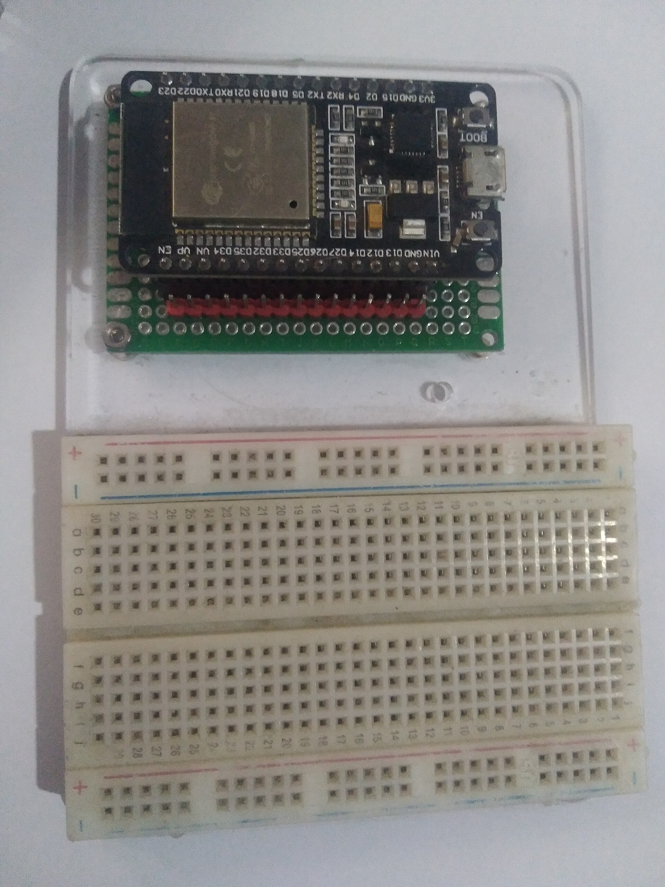
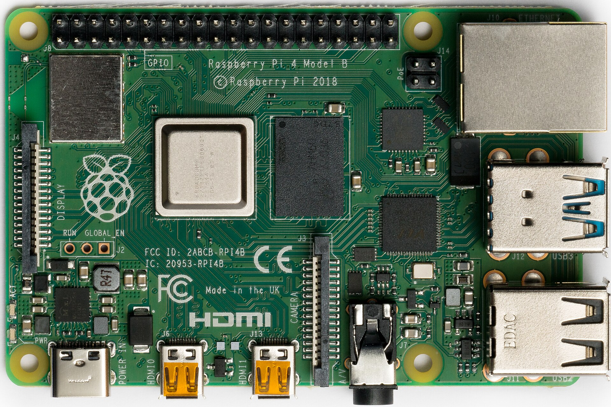
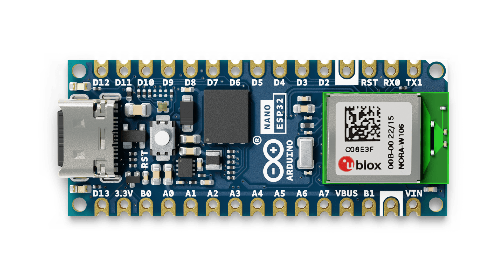
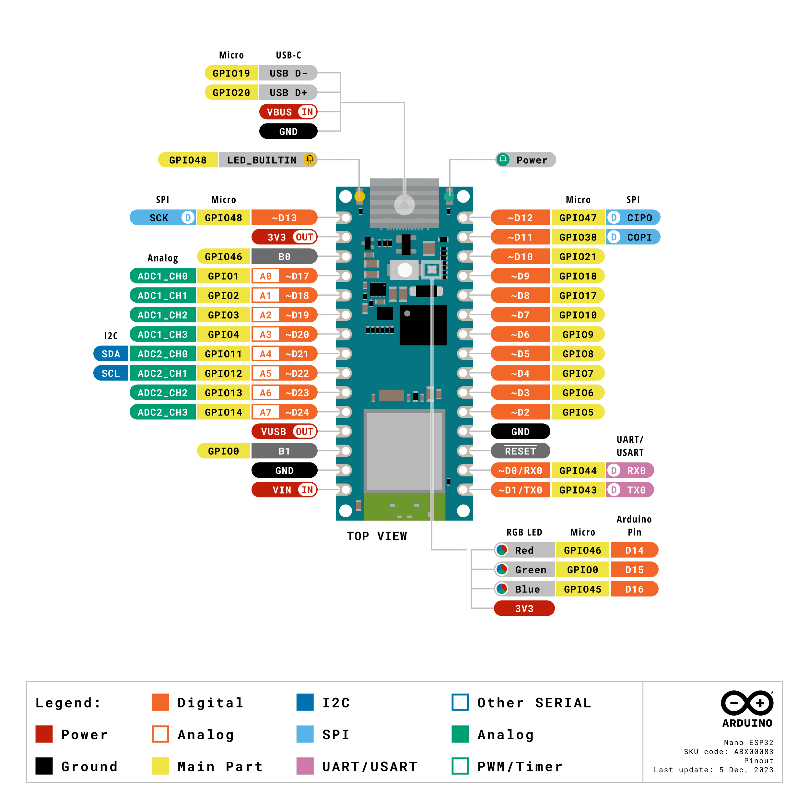
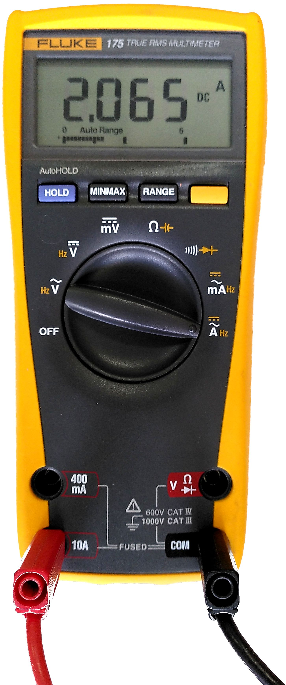
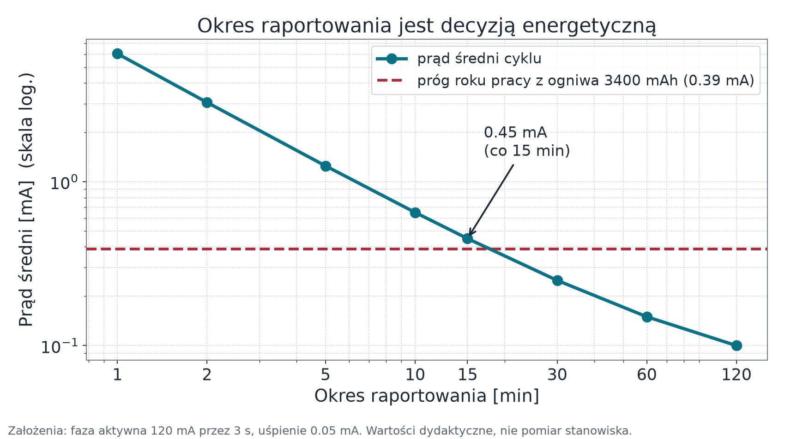

## <i class="bi bi-compass"></i> Po co ten wykład {#cele}

[Pytanie modułu: **skąd bierze się liczba, której zamierzamy zaufać — i ile energii kosztuje jej dostarczenie?**]{.lead}

::: {.columns}
::: {.column width="52%"}
### Cele

::: {.incremental}
* Prześledzić łańcuch od wielkości fizycznej do wartości w komunikacie.
* Odróżnić **rozdzielczość** przetwornika od **dokładności** pomiaru.
* Zdefiniować **stan bezpieczny** wyjścia wykonawczego.
* Policzyć budżet energii zamiast powtarzać hasło „trzy lata na baterii".
:::
:::

::: {.column width="48%"}
### Droga

1. Warstwa percepcji: czujniki i aktuatory
2. Łańcuch pomiarowy i jego błędy
3. Dwie płytki stanowiska — konkretne liczby
4. Zasilanie, logika, prąd wyprowadzeń
5. Budżet energii jako rachunek
:::
:::

# Percepcja: zmysły i mięśnie {.sekcja .foto background-color="#0b3b45" background-image="../assets/img/kurs/lutowanie.jpg" background-size="cover"}


[Fot. Aisart, CC BY-SA 3.0]{.zrodlo}

## <i class="bi bi-eye"></i> Czym system „czuje" {#czujniki}

::: {.columns}
::: {.column width="58%"}
::: {.incremental}
* **Wielkości mierzone:** temperatura, wilgotność, natężenie światła, gazy (CO₂, VOC), ciśnienie, przyspieszenie i drgania, położenie.
* **Podział ze względu na zasadę działania:**
  * *generacyjne* — same wytwarzają sygnał (termopara, piezo),
  * *parametryczne* — zmieniają np. rezystancję i wymagają prądu pobudzenia (termistor, fotorezystor),
  * *aktywne* w sensie teledetekcji — emitują falę i mierzą odpowiedź (ultradźwięki, lidar).
* **Podział ze względu na wyjście:**
  * *analogowe* — napięcie do przetworzenia przez ADC,
  * *cyfrowe* — gotowa wartość przez I²C, SPI lub 1-Wire.
:::
:::

::: {.column width="42%"}
::: {.fragment}
::: {.callout-warning title="Środowisko niszczy sprzęt"}
Drgania linii produkcyjnej rozerwą połączenie lutowane szybciej, niż zdezaktualizuje się jakikolwiek protokół. Zabrudzony czujnik to pierwszy powód fałszywych odczytów — wcześniejszy niż jakikolwiek błąd w kodzie.
:::
:::

::: {.fragment}
Wybór **cyfrowy zamiast analogowego** przenosi kondycjonowanie i kalibrację do układu czujnika. Dla pomiarów o wymaganej dokładności to zwykle właściwa decyzja.
:::
:::
:::

---

## <i class="bi bi-arrow-right-circle"></i> Łańcuch pomiarowy {#lancuch}

[Pięć ogniw. Błąd z kondycjonowania często ujawnia się dopiero przy walidacji.]{.lead}

```{mermaid}
%%| fig-width: 12
%%| fig-height: 1.6
%%{init: {"themeVariables": {"fontSize": "24px", "fontFamily": "Arial, Liberation Sans, Helvetica, sans-serif"}}}%%
flowchart LR
    P["Przetwornik<br>wielkość fizyczna<br>→ sygnał"]
    K["Kondycjonowanie<br>dzielnik · filtr<br>wzmacniacz"]
    A["ADC<br>próbkowanie<br>kwantyzacja"]
    C["Kalibracja<br>zero i wzmocnienie<br>wobec wzorca"]
    W["Walidacja lokalna<br>zakres fizyczny<br>licznik odrzuceń"]
    P --> K --> A --> C --> W
    classDef n fill:#e8f2f4,stroke:#0b6b78,stroke-width:2px,color:#0b3b45
    classDef r fill:#fdf3f4,stroke:#b02a37,stroke-width:2px,color:#8f2029
    class P,A,C n
    class K,W r
```

::: {.fragment}
**Zasada kursu:** wartość wysyłana do systemu ma jednostkę w nazwie pola (`temperature_c`) i nigdy
nie jest surową liczbą z ADC. Przeliczenie wykonuje urządzenie, bo tylko ono zna swój układ wejściowy.
:::

---

## <i class="bi bi-rulers"></i> Rozdzielczość to nie dokładność {#adc}

::: {.columns}
::: {.column width="48%"}
**Rozdzielczość** — liczba kroków, na jakie przetwornik dzieli zakres.

Dla 12 bitów i zakresu 3,3 V (rachunkowo; ADC ESP32-S3 mierzy efektywnie do ok. 2,9 V):

::: {.liczby}
<div><span class="w">4096</span><span class="o">kroków (2¹²)</span></div>
<div><span class="w">0,81 mV</span><span class="o">wartość jednego kroku (LSB)</span></div>
:::

To mówi, jak **drobno** odczytujemy — nie mówi, jak **blisko prawdy** jesteśmy.
:::

::: {.column width="52%"}
Rozdzielczość przetwornika nie jest dokładnością pomiaru. Krok to **0,81 mV**, a błąd przetwornika SAR w ESP32-S3 po kalibracji to według producenta **±50 mV** — około 60 kroków. Gdy pomiar ma spełniać wymaganie dokładności, wybieramy czujnik z interfejsem cyfrowym zamiast walczyć z torem analogowym.


::: {.fragment}
**Dryft zera jest zjawiskiem, nie usterką.** Zapisujemy datę kalibracji razem z wynikiem — inaczej po pół roku nie odróżnimy zmiany w świecie od zmiany w czujniku.
:::
:::
:::

---

## <i class="bi bi-hammer"></i> Aktuatory i pętla sterowania {#aktuatory}

::: {.columns}
::: {.column width="50%"}
::: {.incremental}
* **Elektryczne:** przekaźniki półprzewodnikowe, serwomechanizmy, silniki krokowe, oświetlenie.
* **Ciecze i gazy:** elektrozawory nawadniania, upusty ciśnienia.
* **Pętla:** pomiar → decyzja → akcja → *ponowny pomiar potwierdzający skutek*.
:::

::: {.fragment}
Ostatnie ogniwo bywa pomijane. Bez niego nie wiemy, czy wyjście faktycznie zadziałało — wiemy tylko, że wysłaliśmy polecenie.
:::
:::

::: {.column width="50%"}
::: {.callout-important title="Ryzyko twarde"}
Jeśli uszkodzony termistor zgłosi fałszywy mróz, system w dobrej wierze załączy grzałkę. Błąd warstwy percepcji zamienia się w skutek fizyczny — dlatego walidacja zakresu należy do urządzenia, a nie dopiero do chmury.
:::
:::
:::

---

## <i class="bi bi-shield-check"></i> Stan bezpieczny wyjścia {#stan-bezpieczny}

[Definiujemy go **przed** implementacją, bo „bezpieczny" znaczy co innego dla każdego wyjścia.]{.lead}

::: {.columns}
::: {.column width="46%"}
| Wyjście | Stan bezpieczny |
|:---|:---|
| pompa nawadniająca | **wyłączona** |
| zawór odcinający gaz | **zamknięty** |
| oświetlenie drogi ewakuacyjnej | **załączone** |
| siłownik przepustnicy | **ostatni stan** |

Nie ma jednej odpowiedzi — jest decyzja projektowa, którą trzeba zapisać.

::: {.fragment}
**Watchdog** ma prowadzić do stanu bezpiecznego, a nie tylko restartować pętlę główną.
:::
:::

::: {.column width="54%"}
**Trzy zdarzenia do przetestowania**

::: {.incremental}
1. **Reset procesora** — stan pinu po resecie (z datasheetu) to nie *nasz* stan bezpieczny, a przy starcie bywają impulsy. Gwarantuje go **sprzęt** (rezystor ściągający); firmware ustawia go **przed** startem Wi-Fi.
2. **Zanik i powrót zasilania** — urządzenie startuje w stanie bezpiecznym i nie wykonuje zaległego polecenia.
3. **Utrata łączności dłuższa niż tolerancja** — przejście do stanu bezpiecznego jest wymaganiem, nie efektem ubocznym.
:::
:::
:::

# Płytki stanowiska {.sekcja .foto background-color="#0b3b45" background-image="../assets/img/kurs/pcb-smd.jpg" background-size="cover"}


[Fot. wdwd, CC BY-SA 4.0]{.zrodlo}

## <i class="bi bi-motherboard"></i> Klasy platform — i po co je rozróżniać {#platformy}

::: {.columns}
::: {.column width="34%"}
### Mikrokontroler (MCU)

Brak systemu operacyjnego albo RTOS. Pobór liczony w mikroamperach w uśpieniu. Rola: **węzeł pomiarowo-wykonawczy**.
:::

::: {.column width="33%"}
### System on Chip z radiem

MCU z Wi-Fi i Bluetooth LE w jednym układzie. To klasa obu płytek naszego stanowiska.

{height="260px" fig-alt="Płytka deweloperska ESP32 wpięta w płytkę stykową."}

[Fot. Edwiyanto, CC BY-SA 4.0]{.zrodlo}
:::

::: {.column width="33%"}
### Komputer jednopłytkowy (SBC)

Pełny system operacyjny, stałe zasilanie. Rola: **brzeg sieci** — broker, Node-RED, bufor.

{height="260px" fig-alt="Komputer jednopłytkowy Raspberry Pi 4 widziany z góry."}

[Raspberry Pi 4. Fot. Laserlicht, CC BY-SA 4.0]{.zrodlo}
:::
:::

Nano ESP32 ma Wi-Fi oraz Bluetooth LE na płytce. Raspberry Pi należy do innej klasy urządzeń; kryterium wyboru stanowią rola w architekturze i budżet energii, a nie etykieta „nowoczesności".

---

## <i class="bi bi-cpu"></i> „ESP32" to rodzina, nie układ {#rodzina}

[Trzy układy z tej rodziny, które spotkamy w materiałach — i dlaczego nie są zamienne.]{.lead}

::: {.tabela-duza}
| | ESP32 (oryginalny) | **ESP32-S3** | **ESP32-C3** |
|:---|:---|:---|:---|
| Rdzeń | Xtensa LX6, 2 rdzenie | **Xtensa LX7, 2 rdzenie**, do 240 MHz | **RISC-V, 1 rdzeń**, do 160 MHz |
| Na naszym stanowisku | — | Arduino Nano ESP32 | M5Stack Stamp-C3U |
| Konsekwencja | — | inna numeracja pinów i inne peryferia niż oryginalny ESP32 | **inna architektura** — inny łańcuch narzędzi i inne warianty bibliotek |
:::

::: {.fragment}
::: {.callout-warning title="Co z tego wynika w praktyce"}
Numery GPIO, dostępność ADC i gotowe biblioteki **nie przenoszą się automatycznie** między tymi układami ani z ESP8266 czy UNO. Każde przeniesienie układu wymaga jawnego mapowania pinów i ponownego testu.
:::
:::

---

## <i class="bi bi-1-circle"></i> Arduino Nano ESP32 (ABX00083) {#nano-esp32}

::: {.columns}
::: {.column width="44%"}
{width="96%" fig-alt="Zdjęcie płytki Arduino Nano ESP32 z góry: podłużna płytka z gniazdem USB-C i dwiema listwami po 15 pinów."}

::: {.zrodlo}
Materiał Arduino, licencja [CC BY-SA 4.0](https://creativecommons.org/licenses/by-sa/4.0/).
:::
:::

::: {.column width="56%"}
::: {.liczby}
<div><span class="w">ESP32-S3</span><span class="o">w module u-blox NORA-W106-10B</span></div>
<div><span class="w">3,3 V</span><span class="o">logika wszystkich wyprowadzeń</span></div>
:::

| Parametr | Wartość | Znaczenie w projekcie |
|:---|:---|:---|
| Pamięć | 512 kB SRAM, 16 kB SRAM w RTC | bufory JSON i TLS liczymy w kilobajtach |
| PSRAM / flash | 8 MB PSRAM, 16 MB flash | flash mieści **dwie partycje aplikacji** dla OTA |
| Zasilanie | USB-C 4,8–5,5 V albo VIN 6–21 V | brak osobnego pinu 5 V na listwie |
| Radio | Wi-Fi 2,4 GHz, Bluetooth LE | **brak pasma 5 GHz** — punkt dostępowy musi dawać 2,4 GHz |
| Uśpienie | 7 µA deep sleep, 240 µA light sleep | **dane samego układu SoC**, nie płytki |
| Temperatura | −40…+65 °C (moduł z 8 MB PSRAM) | instrukcja Arduino podaje więcej — wiążący jest moduł u-blox |
:::
:::

---

## <i class="bi bi-pin-map"></i> Nano ESP32 — co jest na listwie {#nano-listwa}

::: {.columns}
::: {.column width="47%"}
{width="100%" fig-alt="Oficjalny rysunek wyprowadzeń Arduino Nano ESP32: dwie listwy po 15 pinów z opisami zasilania, GPIO, ADC i magistral."}

::: {.zrodlo}
Ryc. — oficjalny pinout ABX00083 (aktualizacja 5.12.2023).
Źródło: [docs.arduino.cc](https://docs.arduino.cc/resources/pinouts/ABX00083-full-pinout.pdf), [CC BY-SA 4.0](https://creativecommons.org/licenses/by-sa/4.0/).
:::
:::

::: {.column width="53%"}
::: {.tabela-gesta}
| Grupa | Na płytce | ESP32-S3 | Uwaga praktyczna |
|:---|:---|:---|:---|
| Wejście zasilania | VIN | — | 6–21 V, typowo 7 V |
| 5 V | VBUS (opis VUSB) | — | tylko z USB-C |
| Wyjście 3,3 V | 3V3 | — | = logika GPIO |
| GPIO cyfrowe | D2–D13 | 5–10, 17, 18, 21, 38, 47, 48 | D13 to także `LED_BUILTIN` |
| UART0 | D0/RX0, D1/TX0 | 44, 43 | TX0: rezystor 499 Ω |
| I²C | A4 = SDA, A5 = SCL | 11, 12 | **te same piny co ADC2_CH0/CH1** |
| SPI | D13/D12/D11 | 48, 47, 38 | CS wybiera program |
| ADC tor 1 | A0–A3 | 1–4 | pomiar do ok. 2,9 V |
| ADC tor 2 | A4–A7 | 11–14 | dzielony z I²C i Wi-Fi |
| Piny strapping | B0, B1, A2 | 46, 0, 3 | wybór trybu rozruchu |
:::
:::
:::

---

## <i class="bi bi-2-circle"></i> M5Stack Stamp-C3U (SKU C122-B) {#stamp-c3u}

[Druga płytka stanowiska. **Nie mylić ze Stamp-C3** — różnice są praktyczne, nie kosmetyczne.]{.lead}

::: {.columns}
::: {.column width="50%"}
::: {.liczby}
<div><span class="w">ESP32-C3</span><span class="o">RISC-V, 1 rdzeń, do 160 MHz</span></div>
<div><span class="w">400 kB</span><span class="o">SRAM · 4 MB flash</span></div>
:::

* Wi-Fi 2,4 GHz 802.11 b/g/n oraz Bluetooth LE, antena 3D.
* **Zasilanie modułu 5 V / 500 mA**; przetwornica 5 V → 3,3 V jest na płytce.
* **Logika wyprowadzeń 3,3 V** — tak samo jak w Nano ESP32.
* Wymiary 34,0 × 20,0 × 4,6 mm; montaż SMT, DIP albo przewodami.
* Sprzętowo: secure boot, szyfrowanie pamięci flash, podpis cyfrowy.
:::

::: {.column width="50%"}
::: {.callout-important title="Nie mylić zasilania z logiką"}
**5 V zasila płytkę.** Linie GPIO pracują z **3,3 V** i podanie na nie 5 V grozi trwałym uszkodzeniem układu. Czujnik 5 V podłączamy przez konwerter poziomów, nigdy „na skróty".
:::

::: {.fragment}
::: {.callout-note title="Rysunki producenta"}
Zdjęcie płytki i oficjalna mapa wyprowadzeń: [docs.m5stack.com/en/core/stamp_c3u](https://docs.m5stack.com/en/core/stamp_c3u).

Tabela na następnym slajdzie zestawia najważniejsze różnice na podstawie dokumentacji producenta.
:::
:::
:::
:::

---

## <i class="bi bi-shuffle"></i> Stamp-C3 a Stamp-C3U — gdzie leży różnica {#c3-vs-c3u}

::: {.tabela-gesta}
| Cecha | Stamp-C3 (C056-B) | **Stamp-C3U (C122-B) — nasza płytka** | Uwaga praktyczna |
|:---|:---|:---|:---|
| Liczba GPIO na listwie | 13 | **14** | cała różnica to dodatkowe wyprowadzenie **G3** |
| Skrajny górny pin lewej listwy | GND | **G3** | ten sam fizyczny otwór, inna funkcja — sprawdź nadruk |
| Komunikacja z komputerem | przez układ **CH9102** | **wbudowany USB-Serial/JTAG** układu ESP32-C3 | C3 wymaga sterownika; w C3U włącz *USB CDC On Boot*, inaczej `Serial` nie wyjdzie przez USB |
| USB | G18 = D−, G19 = D+ + CH9102 | G18 = D−, G19 = D+, bez pośrednika | — |
| Przycisk użytkownika | G3 (nie na listwie) | **G9** (na listwie, pin strapping) | przytrzymanie G9 przy zasilaniu → tryb wgrywania |
| Wejścia analogowe | G0, G1, G4, G5 | G0, G1, **G3**, G4, G5 | G0–G4 to tor ADC1; G5 to ADC2 — na C3 niestabilny, nie używać |
| Masa | GND × 4 | GND × 3 | konsekwencja wyprowadzenia G3 |
| Piny strapping | G2, G8, G9 | G2, G8, G9 | na listwie dostępne G8 i G9 |
:::

Stamp-C3 i Stamp-C3U nie różnią się liczbą sprzętowych UART układu ESP32-C3. Istotne różnice to mostek CH9102 wobec natywnego USB-Serial/JTAG, jedno dodatkowe GPIO i położenie przycisku.

---

## <i class="bi bi-exclamation-diamond"></i> Piny strapping — zanim podłączysz {#strapping}

[Po każdym resecie układ odczytuje poziomy na kilku wyprowadzeniach i dopiero na tej podstawie wybiera tryb rozruchu.]{.lead}

::: {.columns}
::: {.column width="52%"}
| Układ | Piny strapping | Na listwie |
|:---|:---|:---|
| **ESP32-S3**<br>(Nano ESP32) | GPIO0, GPIO3, GPIO45, GPIO46 | B1, A2, B0<br>(GPIO45 niewyprowadzony) |
| **ESP32-C3**<br>(Stamp-C3U) | GPIO2, GPIO8, GPIO9 | G8, G9<br>(G2 steruje diodą RGB) |

*Za dokumentacją Espressif ESP-IDF, „GPIO & RTC GPIO".*
:::

::: {.column width="48%"}
::: {.callout-warning title="Wniosek praktyczny"}
Te wyprowadzenia zostawiamy wolne albo podłączamy do nich układy, które w chwili startu są w stanie wysokiej impedancji (wyjątek: GPIO3 w S3 przy ustawionym eFuse JTAG).

Przycisków i czujników z twardym stanem początkowym tam **nie wieszamy** — objaw wygląda jak „płytka nie startuje", a przyczyną jest element trzymający pin przy masie.
:::

::: {.fragment}
::: {.callout-tip title="Ćwiczenie z czytania dokumentacji"}
Tabela specyfikacji Stamp-C3U u producenta wymienia wyprowadzenie „G22". Układ ESP32-C3 kończy numerację na GPIO21, a oficjalna mapa wyprowadzeń pokazuje w tym miejscu **G20 (Rx0)**. Przy dwóch sprzecznych zapisach u tego samego producenta wybieramy ten, który da się sprawdzić na płytce.
:::
:::
:::
:::

---

## <i class="bi bi-lightning-charge"></i> Prąd wyprowadzenia: limit, nie prąd pracy {#prad-pinu}

::: {.columns}
::: {.column width="52%"}
Instrukcja Arduino dla ABX00083 podaje wydajność prądową pinu:

::: {.liczby}
<div><span class="w">40 mA</span><span class="o">prąd źródłowy</span></div>
<div><span class="w">28 mA</span><span class="o">prąd odbiornikowy</span></div>
:::

W datasheecie ESP32-S3 to wartości **typowe**, przy maksymalnej sile wyjścia i spadku napięcia do 2,64 V — domyślna siła wyjścia w ESP-IDF jest niższa.

::: {.fragment}
Obciążenia indukcyjne — przekaźnik, zawór, silnik — **zawsze** przez stopień mocy z diodą gaszącą i osobnym zasilaniem.
:::
:::

::: {.column width="48%"}
::: {.callout-warning title="Granica, nie punkt pracy"}
**40 mA to wydajność w warunkach katalogowych** — nie prąd, na który wolno projektować. Dobieramy obciążenie z zapasem i uwzględniamy warunki elektryczne układu.
:::
:::
:::

# Energia {.sekcja .foto background-color="#0b3b45" background-image="../assets/img/kurs/ogniwa.jpg" background-size="cover"}


[Fot. Mk2010, CC BY-SA 3.0]{.zrodlo}

## <i class="bi bi-battery-half"></i> Deep sleep — na czym polega kompromis {#deep-sleep}

::: {.columns}
::: {.column width="55%"}
::: {.incremental}
* Moduł Wi-Fi pobiera przy nadawaniu szczytowo ponad 300 mA, średnio ok. 100 mA, przez kilka sekund wyszukiwania sieci i zestawiania połączenia.
* Paradygmat: **obudź się → zmierz → nadaj → uśpij**, wszystko w ułamku sekundy.
* W deep sleep procesor odcina sobie zasilanie, zostawiając minimalny zegar RTC do wybudzenia.
* Pojemność ogniw od 1991 r. wzrosła ok. trzykrotnie; pobór w uśpieniu spadł o kilka rzędów wielkości. Postęp dało przede wszystkim **zarządzanie poborem**.
:::
:::

::: {.column width="45%"}
::: {.callout-note title="Dane katalogowe a cała płytka"}
Wartości **7 µA** i **240 µA** z dokumentacji dotyczą **samego układu ESP32-S3** (z 8 MB PSRAM light sleep to ok. 380 µA). Dioda zasilania, przetwornica i pamięci podnoszą pobór seryjnej Nano ESP32 w deep sleep do ok. **2 mA**.

Budżet energii liczymy **z pomiaru na stanowisku**; dane katalogowe służą do sprawdzenia, czy pomiar jest sensowny.
:::

{height="300px" fig-alt="Multimetr w trybie pomiaru prądu stałego z podłączonymi przewodami."}

[Pomiar prądu multimetrem. Fot. Christiankral, CC BY 4.0]{.zrodlo}
:::
:::

---

## <i class="bi bi-calculator"></i> Budżet energii to rachunek, nie hasło {#budzet}

::: {.columns}
::: {.column width="44%"}
Dla cyklu o okresie $T$ z czasem aktywności $t$:

$$I_{\text{śr}} = \frac{I_{\text{akt}} \cdot t + I_{\text{sleep}} \cdot (T-t)}{T}$$

$$Q_{\text{wym}} = I_{\text{śr}} \cdot t_{\text{życia}}$$

**Przykład dydaktyczny** — pomiar co 15 min, faza aktywna 3 s przy 120 mA (Wi-Fi + TLS + publikacja), uśpienie **płytki zoptymalizowanej** (własne PCB) 0,05 mA; prąd liczony po stronie ogniwa, sprawność przetwornicy pominięta:

::: {.liczby}
<div><span class="w">0,45 mA</span><span class="o">prąd średni</span></div>
<div><span class="w">3,94 Ah</span><span class="o">na rok pracy</span></div>
:::
:::

::: {.column width="56%"}
::: {.callout-tip title="Jak czytać wzór"}
Faza aktywna trwa sekundy, ale przy 120 mA dominuje w średniej. Uśpienie trwa prawie cały okres — więc jego prąd decyduje, gdy okres jest długi.
:::
:::
:::

---

## <i class="bi bi-battery"></i> Ile wytrzyma ogniwo? {#budzet-wniosek}

::: {.columns}
::: {.column width="56%"}
{width="100%" fig-alt="Wykres log-log: prąd średni cyklu w funkcji okresu raportowania od 1 do 120 minut, z poziomą linią progu roku pracy z ogniwa 3400 mAh."}

::: {.fragment}
Płytka zoptymalizowana: ogniwo 18650 (≈3400 mAh) wystarczy na **około 10 miesięcy**; rok osiągniemy przy okresie **ok. 18 min** lub dłuższym.
:::
:::

::: {.column width="44%"}
::: {.liczby}
<div><span class="w">≈ 10 mies.</span><span class="o">płytka zoptymalizowana, co 15 min</span></div>
<div><span class="w">≈ 2 mies.</span><span class="o">seryjna Nano ESP32 (2 mA w uśpieniu)</span></div>
:::

::: {.fragment}
::: {.callout-warning title="Wniosek dla stanowiska"}
Seryjna płytka zużywa ogniwo w ok. 2 miesiące **prawie niezależnie od okresu** — liczy się uśpienie, nie raportowanie. **CR2032 odpada**: nie dostarczy szczytowego prądu Wi-Fi.
:::
:::
:::
:::

---

## <i class="bi bi-clipboard-check"></i> Okres raportowania jest decyzją {#decyzja-okres}

[Ten sam czujnik, ta sama bateria, płytka zoptymalizowana (0,05 mA w uśpieniu) — a czas pracy różni się o rząd wielkości.]{.lead}

::: {.tabela-duza}
| Okres raportowania | Prąd średni | Czas z ogniwa 3400 mAh |
|:---|:---|:---|
| co 1 min | 6,05 mA | ok. 23 dni |
| co 5 min | 1,25 mA | ok. 3,7 miesiąca |
| **co 15 min** | **0,45 mA** | **ok. 10 miesięcy** |
| co 30 min | 0,25 mA | ok. 1,6 roku |
| co 60 min | 0,15 mA | ok. 2,6 roku |
:::

::: {.fragment}
Pytanie projektowe nie brzmi „jak często możemy mierzyć", tylko **„jak rzadko wystarczy, żeby decyzja z modułu 01 nadal była podejmowana na czas"**.
:::

---

## <i class="bi bi-question-circle"></i> Pytania sprawdzające {#pytania}

::: {.pytania}
* Zespół podłączył przekaźnik bezpośrednio do pinu cyfrowego Nano ESP32, argumentując: „cewka bierze 35 mA, a limit to 40 mA". Wymień dwa niezależne powody, dla których to złe rozwiązanie.
* Czujnik wysyła `temperature: 512`. Odbiorca wyświetla 512 °C. W którym ogniwie łańcucha pomiarowego leży błąd i jaka zasada kursu została złamana?
* System ma raportować co 5 minut i pracować rok z ogniwa 3400 mAh. Z tabeli wynika, że to niewykonalne przy założonej fazie aktywnej. Podaj **dwie różne** zmiany projektowe, z których każda samodzielnie zbliża do celu, i powiedz, co każda kosztuje.
:::

---

## <i class="bi bi-flag"></i> Podsumowanie i przejście {#podsumowanie}

::: {.columns}
::: {.column width="55%"}
**Co zostaje z tego modułu**

::: {.incremental}
* Wartość wysyłana do systemu ma jednostkę w nazwie i jest przeliczona przez urządzenie.
* Rozdzielczość ADC nie jest dokładnością pomiaru.
* Stan bezpieczny wyjścia to decyzja zapisana przed implementacją i sprawdzana w trzech scenariuszach.
* 40 mA na pinie to wydajność katalogowa, nie prąd pracy.
* Okres raportowania jest decyzją energetyczną — i da się ją policzyć.
:::
:::

::: {.column width="45%"}
::: {.callout-note title="Moduł 03 — łączność i OTA"}
Urządzenie potrafi już zmierzyć i zareagować. Teraz musi utrzymać łącze, podnosić się po awarii sieci i dać się zaktualizować zdalnie **bez ryzyka, że przestanie się uruchamiać**.
:::
:::
:::

---

## <i class="bi bi-journal-text"></i> Źródła {#zrodla}

::: {style="font-size: 0.7em;"}
* Arduino, *Nano ESP32 User Manual / Datasheet* (SKU ABX00083) — rozdziały *Features*, *Recommended Operating Conditions*, *Pin Voltage*, *VIN Rating*, *VBUS*, *Pin Current*: <https://docs.arduino.cc/resources/datasheets/ABX00083-datasheet.pdf>
* Arduino, strona produktu i pinout Nano ESP32: <https://docs.arduino.cc/hardware/nano-esp32/>
* u-blox, moduł NORA-W10 series (NORA-W106-10B): <https://www.u-blox.com/en/product/nora-w10-series>
* M5Stack, dokumentacja Stamp-C3U (SKU C122-B): <https://docs.m5stack.com/en/core/stamp_c3u> oraz Stamp-C3 (C056-B): <https://docs.m5stack.com/en/core/stamp_c3>
* Espressif, *ESP32-S3 Datasheet* v2.2 — charakterystyki DC, ADC, pobór prądu: <https://documentation.espressif.com/esp32-s3_datasheet_en.pdf>
* u-blox, *NORA-W10 Data Sheet* — zakres temperatur modułu: <https://content.u-blox.com/sites/default/files/documents/NORA-W10_DataSheet_UBX-21036702.pdf>
* Espressif, *ADC Oneshot Mode* dla ESP32-S3 i ESP32-C3: <https://docs.espressif.com/projects/esp-idf/en/stable/esp32s3/api-reference/peripherals/adc/adc_oneshot.html>
* Espressif, *Sleep Modes*: <https://docs.espressif.com/projects/esp-idf/en/stable/esp32s3/api-reference/system/sleep_modes.html>
* Espressif, *GPIO & RTC GPIO* — piny strapping dla ESP32-S3 i ESP32-C3: <https://docs.espressif.com/projects/esp-idf/en/stable/esp32s3/api-reference/peripherals/gpio.html>
* Pomiary poboru seryjnej Nano ESP32 w deep sleep (społeczność): <https://forum.arduino.cc/t/power-hungry-in-deep-sleep/1204775>
:::
