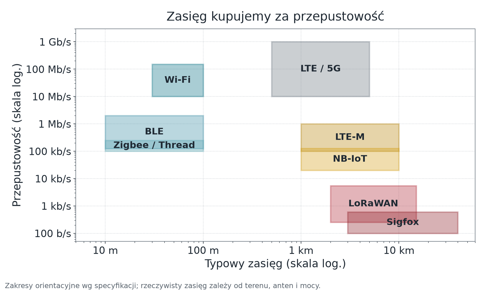
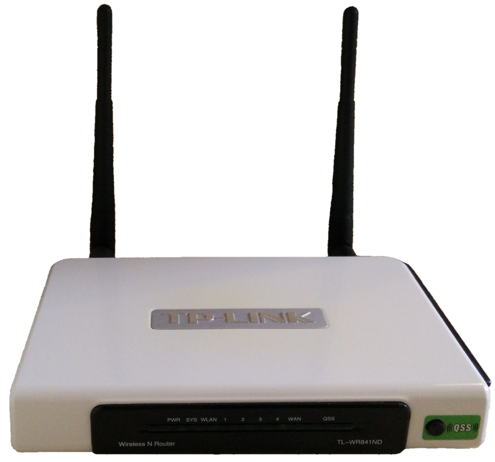
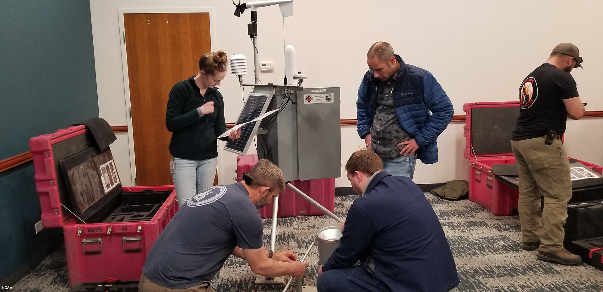
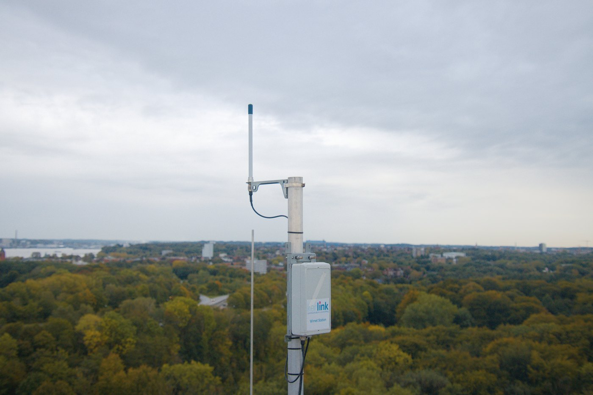

## <i class="bi bi-compass"></i> Po co ten wykład {#cele}

[Pytanie modułu: **jak wybrać radio na podstawie liczb — i jak wymienić oprogramowanie w urządzeniu, do którego nie mamy dostępu fizycznego?**]{.lead}

::: {.columns}
::: {.column width="52%"}
### Cele

::: {.incremental}
* Dobrać technologię radiową z czterech policzalnych parametrów, nie z preferencji.
* Zaprojektować ponowne łączenie, które nie zawiesza urządzenia i nie zalewa sieci.
* Wyjaśnić, dlaczego OTA **nie jest** nadpisaniem firmware.
* Opisać wydanie firmware jako procedurę z dowodem powrotu po nieudanej aktualizacji.
:::
:::

::: {.column width="48%"}
### Droga

1. Fizyczne granice: trójkąt niemożliwy
2. Technologie krótkiego i dalekiego zasięgu
3. Metodyka doboru — cztery liczby
4. Łącze, które się samo podnosi
5. OTA: partycje, self-test, wycofanie
6. Wydanie zarządzane przez platformę
:::
:::

# Fizyczne granice {.sekcja .foto background-color="#0b3b45" background-image="../assets/img/kurs/maszty.jpg" background-size="cover"}


[Fot. CEphoto, Uwe Aranas, CC BY-SA 3.0]{.zrodlo}

## <i class="bi bi-triangle"></i> Trójkąt niemożliwy {#trojkat}

::: {.columns}
::: {.column width="50%"}
Komunikacja maszyna–maszyna opiera się na kompromisach nieznanych w świecie komputerów osobistych.

::: {.incremental}
* Miliardy urządzeń bez gniazdka 230 V — z ogniwem wielkości monety.
* Pracują w piwnicach, na morzu, zakopane w glebie.
* Fala elektromagnetyczna wymaga energii i napotyka opór ścian i odległości.
:::

::: {.fragment}
::: {.callout-important title="Wybierasz dwa z trzech"}
1. **zasięg** (kilometry)
2. **przepustowość** (megabity na sekundę)
3. **czas życia na baterii** (lata)
:::
:::
:::

::: {.column width="50%"}
{width="100%" fig-alt="Wykres zakresów w skali logarytmicznej: Wi-Fi, BLE i Zigbee na krótkim zasięgu z dużą przepustowością, LTE-M i NB-IoT na kilometrach z setkami kb/s, LoRaWAN i Sigfox na kilometrach z kilobitami lub setkami bitów na sekundę."}
:::
:::

---

## <i class="bi bi-wifi"></i> Wi-Fi: wszędzie obecne, kosztowne energetycznie {#wifi}

::: {.columns}
::: {.column width="58%"}
::: {.incremental}
* **Zalety:** duża przepustowość, infrastruktura w każdym budynku, natywna integracja z IP.
* **Wady:** wyszukiwanie sieci i zestawienie połączenia to kilka sekund z prądem rzędu **100 mA i więcej** (szczytowo 200–300 mA przy nadawaniu), zanim prześlemy jedną wartość wilgotności.
* Pasmo 2,4 GHz w gęstej zabudowie jest zatłoczone — degradacja jakości połączenia bywa główną przyczyną „niestabilności" przypisywanej urządzeniu.
* **Rola w IoT:** tam, gdzie jest stałe zasilanie — bramy, urządzenia AGD, asystenci głosowi. Rzadko jako radio węzła bateryjnego; zmieniają to Wi-Fi 6 (TWT) i Wi-Fi HaLow (802.11ah, sub-GHz).
:::
:::

::: {.column width="42%"}
{height="220px" fig-alt="Domowy router Wi-Fi z przezroczystą obudową i widoczną płytką."}

[Fot. Florian838, CC BY 4.0]{.zrodlo}

::: {.callout-note title="Dlaczego to wybór naszego stanowiska"}
Urządzenie pilotażowe ma **stałe zasilanie** i wymaga **sterowania zwrotnego** z małym opóźnieniem. W tym układzie Wi-Fi 2,4 GHz jest wnioskiem, nie przyzwyczajeniem — ale procedurę doboru i tak wykonujemy jawnie.
:::

::: {.fragment}
Obie płytki stanowiska (ESP32-S3 i ESP32-C3) obsługują wyłącznie **2,4 GHz**. Punkt dostępowy pracujący tylko w 5 GHz jest dla nich niewidoczny.
:::
:::
:::

---

## <i class="bi bi-bluetooth"></i> Bluetooth LE i sieci kratowe {#ble-mesh}

::: {.columns}
::: {.column width="50%"}
### Bluetooth Low Energy

::: {.incremental}
* **Classic** projektowano dla ciągłego strumienia (audio) i utrzymywanego połączenia.
* **BLE** (od Bluetooth 4.0): urządzenie śpi, nadaje kilka pakietów w milisekundy, wraca do uśpienia.
* Średni pobór spada o rzędy wielkości; ogniwo CR2032 może wystarczyć na lata.
* Zastosowania: opaski, tagi lokalizacyjne, czujniki w zasięgu kilkunastu–kilkudziesięciu metrów w budynku (BLE 5 Coded PHY — więcej).
:::
:::

::: {.column width="50%"}
### Zigbee, Thread i Z-Wave — topologia kratowa

::: {.incremental}
* Urządzenia zasilane z sieci (gniazdka, żarówki) pracują jednocześnie jako routery, przekazując pakiety słabych czujników bateryjnych.
* **Z-Wave** działa w paśmie sub-GHz (868 MHz w Europie) — lepsza penetracja ścian niż 2,4 GHz.
:::

::: {.fragment}
Sieć odtworzy trasę tylko wtedy, gdy istnieje alternatywny węzeł-router **zasilany z sieci**. Czujniki bateryjne są urządzeniami końcowymi i nie pośredniczą w ruchu — dodanie kolejnego czujnika **nie zwiększa zasięgu**.
:::
:::
:::

::: {.fragment}
Zigbee i **Thread** korzystają z tego samego radia IEEE 802.15.4; Thread przenosi IPv6. Standard **Matter** (Connectivity Standards Alliance, dawniej Zigbee Alliance) działa po IP: przez Wi-Fi, Thread i Ethernet — urządzenia Zigbee dołącza tylko przez **mosty**. Kratową siatkę ma też **Bluetooth Mesh**.
:::

---

## <i class="bi bi-broadcast"></i> LPWAN: telemetria na kilometry {#lpwan}

::: {.columns}
::: {.column width="52%"}
**Low Power Wide Area Network** — zasięg kupiony za przepustowość.

::: {.incremental}
* Przepustowość: od **~100 b/s** (Sigfox) przez pojedyncze **kb/s** (LoRaWAN) do **setek kb/s** (NB-IoT, LTE-M); ładunek komunikatu bywa ograniczony do kilkunastu–kilkudziesięciu bajtów.
* Żywotność ogniwa: 5–10 lat (np. litowo-tionylowego).
* Zasięg: kilkanaście kilometrów w terenie otwartym.
* Służy **przede wszystkim** telemetrii. Czujnik wilgotności gleby — tak. Strumień z kamery — nie; pojedyncze zdjęcie przez LTE-M — wyjątkowo.
:::
:::

::: {.column width="48%"}
{width="100%" fig-alt="Przenośna automatyczna stacja meteorologiczna na statywie w terenie, z panelem słonecznym i anteną."}

::: {.zrodlo}
Zdalna automatyczna stacja pomiarowa — typowy węzeł bez gniazdka i bez Wi-Fi. Fot. NOAA, domena publiczna.
:::
:::
:::

---

## <i class="bi bi-antenna"></i> LoRaWAN a NB-IoT: własna sieć czy abonament {#lora-nbiot}

::: {.columns}
::: {.column width="50%"}
### LoRa / LoRaWAN

::: {.incremental}
* **LoRa** — modulacja CSS (Semtech), odporna na zakłócenia.
* **LoRaWAN** — otwarty protokół; można postawić własną bramę.
* The Things Network: bez opłat, *Fair Use* **30 s nadawania i 10 komunikatów w dół na dobę**.
* Słabsza niż NB-IoT penetracja piwnic.
:::
:::

::: {.column width="50%"}
### NB-IoT / LTE-M

::: {.incremental}
* Standard **3GPP od Release 13 (2016)**, korzystający z infrastruktury operatora.
* **NB-IoT:** doskonała penetracja piwnic i parkingów; urządzenie stacjonarne.
* **LTE-M:** wyższa przepustowość, obsługa mobilności.
* Koszt: stała opłata za kartę SIM i zależność od operatora.
:::
:::
:::

::: {style="font-size:0.82em"}
* Pasmo 863–870 MHz (SRD) jest bez opłat, ale z limitem **współczynnika wypełnienia** zależnym od podpasma: 0,1%, **1%** (kanały LoRaWAN) albo 10%. 1% = najwyżej 36 s nadawania na godzinę.
* NB-IoT nie przełącza stacji w trybie połączonym; mobilność obsługuje LTE-M.
:::

---

## <i class="bi bi-router"></i> Brama LoRaWAN to infrastruktura {#brama-lorawan}

::: {.columns}
::: {.column width="62%"}
{width="100%" fig-alt="Zewnętrzna brama Kerlink LoRaWAN zamontowana na maszcie, z antenami i przewodami doprowadzonymi do obudowy."}

::: {.zrodlo}
Brama Kerlink LoRaWAN w Kilonii. Fot. Fabian Horst, [Wikimedia Commons](https://commons.wikimedia.org/wiki/File:2020-10-05_-_Kerlink_LoRaWAN_Gateway_in_Kiel.jpg), CC BY-SA 4.0. Pomniejszono.
:::
:::

::: {.column width="38%"}
Brama nie jest „mocniejszym czujnikiem”. Łączy dwa światy:

::: {.incremental}
* odbiera ramki radiowe wielu węzłów,
* przekazuje je łączem IP do serwera sieciowego,
* wymaga zasilania, ochrony pogodowej i miejsca z dobrą propagacją,
* nie interpretuje pomiaru jako decyzji aplikacyjnej.
:::
:::
:::

---

## <i class="bi bi-soundwave"></i> Sigfox — i ryzyko operatora {#sigfox}

::: {.columns}
::: {.column width="52%"}
Model „sieć jako usługa": operator dostarcza łączność, użytkownik nie buduje infrastruktury.

::: {.incremental}
* Maksymalnie **140 komunikatów na dobę** z jednego urządzenia.
* Ładunek: **12 bajtów** w górę; w dół 8 bajtów, najwyżej 4 razy na dobę.
* Architektura silnie asymetryczna — bardzo ograniczona transmisja zwrotna.
* Idealny do potwierdzenia „jestem sprawny"; nieprzydatny do sterowania.
:::
:::

::: {.column width="48%"}
Spółka Sigfox została przejęta w 2022 r. przez UnaBiz; sieć działa jako **Sigfox 0G**, a francuska spółka operatora weszła w 2025 r. w sądową restrukturyzację. Przy doborze technologii na lata **ryzyko operatora jest parametrem projektowym** — tak samo jak zasięg.

::: {.fragment}
To ten sam rodzaj ryzyka, który w module 06 zobaczymy przy platformach chmurowych. Pytanie brzmi zawsze tak samo: *co robimy, gdy dostawca zamknie usługę?*
:::
:::
:::

---

## <i class="bi bi-123"></i> Metodyka doboru — cztery liczby {#cztery-liczby}

[Dopiero po zapisaniu tych czterech wartości wybór staje się wnioskiem, a nie preferencją.]{.lead}

::: {.pytania}
* **Ile bajtów na komunikat i ile komunikatów na godzinę?** Iloczyn daje wymaganą przepustowość użytkową.
* **Jaki dystans i ile przegród** między urządzeniem a najbliższym punktem dostępu?
* **Jakie źródło zasilania i jaki dopuszczalny czas między serwisami?**
* **Czy wymagana jest łączność zwrotna** — i z jakim opóźnieniem?
:::

::: {.fragment}
::: {.callout-note title="Zastosowanie do naszego stanowiska"}
Kilkaset bajtów co kilkanaście sekund · jedno pomieszczenie, jedna ściana · zasilanie stałe ·
**łączność zwrotna wymagana, opóźnienie poniżej kilku sekund** → **Wi-Fi 2,4 GHz**.

Ten sam rachunek dla czujnika w polu, bez zasilania i bez sterowania, dałby LoRaWAN.
:::
:::

# Łącze, które się podnosi {.sekcja .foto background-color="#0b3b45" background-image="../assets/img/kurs/przelacznik.jpg" background-size="cover"}


[Fot. Raysonho, CC0]{.zrodlo}

## <i class="bi bi-arrow-repeat"></i> Ponowne łączenie z wycofaniem {#reconnect}

::: {.columns}
::: {.column width="48%"}
::: {.incremental}
* Próba połączenia ma **limit czasu**. Brak limitu zawiesza urządzenie na stałe — to najczęstszy błąd w firmware studenckim.
* Odstęp między próbami rośnie wykładniczo: 1, 2, 4, 8, 16 s, z **górnym ograniczeniem**.
* Do odstępu dokładamy **losowy jitter**, żeby cała grupa urządzeń nie wracała do sieci równocześnie po zaniku zasilania.
* Siła sygnału, adres IP i wersja firmware to **atrybuty**, publikowane przy zmianie — nie telemetria wysyłana w każdym cyklu.
:::
:::

::: {.column width="52%"}
::: {.mermaid-wysoka}
```{mermaid}
%%| fig-width: 7.2
%%| fig-height: 5.2
%%{init: {"themeVariables": {"fontSize": "24px"}}}%%
flowchart TD
    S["Start / utrata łącza"] --> B["Wyjście w stan bezpieczny"]
    B --> P{"Próba połączenia<br>z limitem czasu"}
    P -- "sukces" --> O["Praca normalna<br>publikacja stanu"]
    P -- "porażka" --> W["Odczekaj<br>min(2ⁿ · t₀, t_max) + jitter"]
    W --> P
    O -- "utrata łącza" --> B
    classDef n fill:#e8f2f4,stroke:#0b6b78,stroke-width:2px,color:#0b3b45
    classDef r fill:#fdf3f4,stroke:#b02a37,stroke-width:2px,color:#8f2029
    class O,P n
    class B,W r
```
:::
:::
:::

::: {.fragment}
**Brak sieci nie zwalnia z odpowiedzialności za wyjście.** Aktuator przechodzi w stan bezpieczny zdefiniowany w module 02 — zanim zaczniemy ponawiać połączenie.
:::

---

## <i class="bi bi-hdd"></i> Buforowanie pomiarów w czasie awarii {#bufor}

::: {.columns}
::: {.column width="50%"}
Pomiary wykonane bez łączności można zbuforować — pod trzema warunkami:

::: {.incremental}
1. Bufor ma **skończony rozmiar** i jawną politykę nadpisywania (najstarsze wypada), zapisaną w dokumentacji.
2. Każdy zbuforowany pomiar niesie **własny znacznik czasu**, nie czas wysłania.
3. Odbiorca jest **idempotentny** — wysyłka zaległości po powrocie sieci nie może podwoić danych.
:::
:::

::: {.column width="50%"}
::: {.callout-warning title="Pułapka znacznika czasu"}
Urządzenie bez zegara RTC i bez synchronizacji NTP nie zna czasu bezwzględnego po restarcie. Zbuforowany pomiar dostanie wtedy czas liczony od startu — bezużyteczny dla szeregu czasowego.

Rozwiązania: zegar RTC z podtrzymaniem, synchronizacja po odzyskaniu sieci i korekta znaczników w buforze, albo jawna decyzja, że zaległości odrzucamy.
:::
:::
:::

# Wydanie firmware {.sekcja .foto background-color="#0b3b45" background-image="../assets/img/kurs/szafa-sieciowa.jpg" background-size="cover"}


[Fot. Shixart1985, CC BY 2.0]{.zrodlo}

## <i class="bi bi-arrow-down-circle"></i> OTA to nie „nadpisanie firmware" {#ota-co-to}

Nowy obraz trafia do nieaktywnej partycji OTA, jest weryfikowany, a dopiero potem wybierany do uruchomienia. Przerwa zasilania podczas zapisu nie może naruszyć działającej partycji.

::: {.columns}
::: {.column width="46%"}
Aktualizacja w ESP-IDF **nie nadpisuje działającej aplikacji**. Wymaga:

* co najmniej **dwóch partycji aplikacji** (`ota_0`, `ota_1`),
* partycji danych OTA (`otadata`).

Nowy obraz trafia do partycji **nieużywanej w danym rozruchu**. Dopiero po weryfikacji `otadata` wskazuje, z której partycji uruchomić system następnym razem.
:::

::: {.column width="54%"}
```{mermaid}
%%| fig-width: 7.4
%%| fig-height: 4.2
%%{init: {"themeVariables": {"fontSize": "24px"}}}%%
flowchart TD
    subgraph F["Pamięć flash"]
      O0["<b>ota_0</b><br>wersja 1.4.2<br><i>działa teraz</i>"]
      O1["<b>ota_1</b><br>wersja 1.5.0<br><i>zapisywana</i>"]
      OD["<b>otadata</b><br>2 sektory, zapis podwójny<br>wskazuje partycję rozruchu"]
    end
    OD -. "teraz wskazuje" .-> O0
    OD -. "po weryfikacji<br>wskaże" .-> O1
    classDef a fill:#e8f2f4,stroke:#0b6b78,stroke-width:2px,color:#0b3b45
    classDef d fill:#fff8e6,stroke:#b8860b,stroke-width:2px,color:#6b5200
    class O0,O1 a
    class OD d
```
:::
:::

::: {.fragment}
Partycja `otadata` ma rozmiar dwóch sektorów flash (0x2000 B) i jest zapisywana **podwójnie**, żeby zanik zasilania w trakcie samego zapisu wskaźnika nie unieruchomił urządzenia.
:::

---

## <i class="bi bi-gear-wide-connected"></i> Mechanizmy ESP-IDF {#ota-api}

::: {.tabela-gesta}
| Mechanizm | Co robi | Konsekwencja dla projektu |
|:---|:---|:---|
| `esp_ota_begin` / `esp_ota_write` / `esp_ota_end` | zapis nowego obrazu do wolnej partycji | w trakcie zapisu urządzenie **nadal działa** na starej wersji |
| `esp_ota_set_boot_partition` | wskazuje partycję do następnego rozruchu | zamiana wersji to **jedna operacja, odwracalna** |
| `CONFIG_BOOTLOADER_APP_ROLLBACK_ENABLE` | włącza tryb potwierdzania nowej wersji | nowa wersja startuje jako **próbna** |
| `esp_ota_mark_app_valid_cancel_rollback()` | oznacza wersję jako sprawną po self-teście | **bez tego wywołania** bootloader wróci do poprzedniej wersji |
| `esp_ota_mark_app_invalid_rollback_and_reboot()` | jawne wycofanie po nieudanej diagnostyce | urządzenie samo decyduje o cofnięciu |
| `CONFIG_BOOTLOADER_APP_ANTI_ROLLBACK` | blokada wersji o niższym numerze bezpieczeństwa (eFuse) | uniemożliwia atak „wgraj starą, dziurawą wersję" |
:::

---

## <i class="bi bi-clipboard-pulse"></i> Self-test: najpierw dowód, potem zatwierdzenie {#self-test}

[Kolejność jest odwrotna do intuicyjnej — i to jest sedno mechanizmu.]{.lead}

```{mermaid}
%%| fig-width: 11
%%| fig-height: 3.0
%%{init: {"themeVariables": {"fontSize": "24px"}}}%%
flowchart LR
    R["Restart<br>na nowej wersji"] --> T["Self-test:<br>czujnik · sieć<br>broker"]
    T -- "wszystko<br>przeszło" --> V["mark_app_valid<br>_cancel_rollback"]
    T -- "cokolwiek<br>zawiodło" --> I["mark_app_invalid<br>_rollback_and_reboot"]
    V --> OK["Wersja<br>zatwierdzona"]
    I --> P["Powrót do wersji<br>poprzedniej"]
    T -. "zawieszenie →<br>watchdog → reset" .-> P
    classDef n fill:#e8f2f4,stroke:#0b6b78,stroke-width:2px,color:#0b3b45
    classDef r fill:#fdf3f4,stroke:#b02a37,stroke-width:2px,color:#8f2029
    class R,T,V,OK n
    class I,P r
```

Pełne nazwy funkcji: `esp_ota_mark_app_valid_cancel_rollback()` oraz
`esp_ota_mark_app_invalid_rollback_and_reboot()`.

::: {.fragment}
Kluczowa własność: **brak zatwierdzenia jest równoważny odrzuceniu** — ale dopiero przy **następnym rozruchu**. Zawieszona wersja nic sama nie wycofa: self-test potrzebuje limitu czasu, a watchdog musi wymuszać **reset** (w ESP-IDF Task WDT domyślnie tylko loguje). Wtedy bootloader wraca do poprzedniej wersji bez udziału człowieka i bez sieci.
:::

---

## <i class="bi bi-exclamation-octagon"></i> Czego OTA nie gwarantuje {#ota-granice}

[Mechanizm jest mocny, ale obietnice trzeba formułować precyzyjnie.]{.lead}

::: {.columns}
::: {.column width="50%"}
**Co gwarantuje**

::: {.incremental}
* Urządzenie nie zostanie unieruchomione przez przerwanie pobierania — stara wersja pozostaje nietknięta.
* Obraz o niezgodnej sumie kontrolnej nie zostanie uruchomiony.
* Wersja, która nie przejdzie self-testu, zostanie wycofana automatycznie.
* Przy anti-rollback nie da się wgrać starszej wersji bezpieczeństwa.
:::
:::

::: {.column width="50%"}
**Czego nie gwarantuje**

::: {.incremental}
* **Że nowa wersja jest poprawna** — self-test sprawdza tylko to, co w nim napisano.
* **Że wycofanie po zatwierdzeniu będzie automatyczne** — po `mark_app_valid` powrót wymaga jawnej akcji: polecenia przełączenia partycji albo nowego wydania.
* **Że obraz pochodzi od nas** — to zapewnia podpis i secure boot.
* **Że aktualizacja dotrze do urządzenia offline** — ono zostaje na starej wersji dowolnie długo.
:::
:::
:::

::: {.fragment}
**Formułowanie obietnic:** „system da się zaktualizować zdalnie" jest prawdą. „System zawsze wróci do działania po nieudanej aktualizacji" — tylko wtedy, gdy self-test wykrywa to, co ma wykryć.
:::

---

## <i class="bi bi-diagram-2"></i> Wydanie zarządzane przez platformę {#ota-platforma}

::: {.columns}
::: {.column width="45%"}
W ThingsBoard pakiet firmware ma **tytuł, wersję i sumę kontrolną** (domyślnie SHA-256).
Para tytuł + wersja jest **unikalna w obrębie dzierżawcy** — nie nadpisujemy istniejącej wersji.

Stan aktualizacji ma znaczenie dowodowe, bo część stanów ustawia platforma,
a część **raportuje samo urządzenie**.

Dzięki temu wiemy, **na którym etapie** utknęła aktualizacja — a nie tylko, że się nie udała.
:::

::: {.column width="55%"}
::: {.tabela-gesta}
| Stan | Ustawia | Znaczenie |
|:---|:---|:---|
| `QUEUED` | platforma | powiadomienie czeka na wysłanie |
| `INITIATED` | platforma | urządzenie powiadomione |
| `DOWNLOADING` | urządzenie | pobieranie rozpoczęte |
| `DOWNLOADED` | urządzenie | pobieranie zakończone |
| `VERIFIED` | urządzenie | suma kontrolna zgodna |
| `UPDATING` | urządzenie | aktualizacja stosowana |
| `UPDATED` | urządzenie | aktualizacja udana |
| `FAILED` | urządzenie | błąd pobierania, sumy lub zastosowania |
:::
:::
:::

---

## <i class="bi bi-hourglass-split"></i> Tempo wdrożenia jest ograniczone {#ota-tempo}

::: {.columns}
::: {.column width="50%"}
::: {.callout-note title="Domyślne parametry platformy"}
Domyślnie platforma wysyła **100 powiadomień na 60 s**
(`TB_QUEUE_CORE_OTA_PACK_SIZE`, `TB_QUEUE_CORE_OTA_PACK_INTERVAL_MS`).
:::

$$t_{\text{wydania}} = \left\lceil \frac{n_{\text{urządzeń}}}{100} \right\rceil \cdot 60\ \text{s}$$
:::

::: {.column width="50%"}
::: {.liczby}
<div><span class="w">60 s</span><span class="o">1–100 urządzeń</span></div>
<div><span class="w">3 min</span><span class="o">250 urządzeń</span></div>
<div><span class="w">10 min</span><span class="o">1000 urządzeń</span></div>
:::

Wartości są **konserwatywnym górnym ograniczeniem dla pełnych okien wysyłki**. Dokumentacja podaje średnie tempo `n / pack_size × interval`; dla 240 urządzeń daje to 2,4 min, a licząc pełne paczki — najwyżej 3 min.
:::
:::

---

## <i class="bi bi-list-ol"></i> Procedura wydania w pilocie {#procedura}

::: {.pytania}
* **Reprodukowalny build** dla dokładnego modelu płytki i dokładnego układu partycji.
* **Testy przed wydaniem:** odczyt czujnika, ponowne łączenie, obsługa polecenia, aktualizacja na płytce referencyjnej.
* **Suma SHA-256** pliku `.bin`; klucz podpisu przechowywany poza platformą i poza katalogiem roboczym CI.
* **Niezmienny tytuł, semantyczna wersja** — nigdy nie nadpisujemy istniejącej wersji.
* **Najpierw jedno urządzenie `canary`**, dopiero potem przypisanie do profilu.
* **Dwa celowe błędy:** (a) obraz z nieprawidłową sumą → stan `FAILED`, urządzenie zostaje na starej wersji; (b) poprawny obraz, który **nie przechodzi self-testu** (np. zły adres brokera) → automatyczne wycofanie.
:::

::: {.fragment}
::: {.callout-important title="Kryterium zaliczenia"}
Bez ostatniego punktu — obu przypadków — ćwiczenie nie jest zaliczone. Mechanizm wycofania, którego nigdy nie wywołano, jest założeniem — nie zabezpieczeniem.
:::
:::

---

## <i class="bi bi-question-circle"></i> Pytania sprawdzające {#pytania}

::: {.pytania}
* Urządzenie pobrało nowy obraz, zapisało go, przestawiło partycję rozruchową i zrestartowało się. Po starcie nie łączy się z brokerem, ale poza tym działa i nie zawiesza się. Co się stanie, jeśli nic go nie zrestartuje, a co po kolejnym restarcie, jeżeli firmware **nie wywołał** funkcji zatwierdzającej? Co trzeba dodać do self-testu, żeby powrót był pewny?
* Zespół chce wydać poprawkę dla 240 urządzeń i zapowiada operatorowi „aktualizacja zajmie minutę". Policz rzeczywisty czas przy domyślnych parametrach platformy i wskaż, co poza tempem wysyłki może ten czas wydłużyć.
* Czujnik ma pracować w polu przez sezon, zasilany z ogniwa, i raportować raz na godzinę. Zastosuj cztery liczby doboru technologii i uzasadnij, dlaczego Wi-Fi jest tu złym wyborem, mimo że płytka je obsługuje.
:::

---

## <i class="bi bi-flag"></i> Podsumowanie i przejście {#podsumowanie}

::: {.columns}
::: {.column width="55%"}
**Co zostaje z tego modułu**

::: {.incremental}
* Technologię radiową wybieramy z czterech liczb, nie z przyzwyczajenia.
* Ponowne łączenie ma limit czasu, wycofanie wykładnicze, jitter i górne ograniczenie.
* OTA zapisuje nowy obraz do **drugiej partycji**; przełączenie następuje po weryfikacji.
* Brak zatwierdzenia po self-teście = automatyczne wycofanie.
* Wydanie firmware jest procedurą z dowodem, nie pojedynczą komendą.
:::
:::

::: {.column width="45%"}
::: {.callout-note title="Moduł 04 — MQTT i kontrakt danych"}
Łącze stoi i firmware da się wymienić. Teraz zdefiniujemy, **co dokładnie** przez to łącze płynie: hierarchię tematów, poziomy jakości usługi i samoopisujący się ładunek, którego zmiana nie wywróci wszystkich odbiorców naraz.
:::
:::
:::

---

## <i class="bi bi-journal-text"></i> Źródła {#zrodla}

::: {style="font-size: 0.7em;"}
* Espressif, *Over The Air Updates (OTA)* dla ESP32-S3 — partycje, rollback, anti-rollback: <https://docs.espressif.com/projects/esp-idf/en/stable/esp32s3/api-reference/system/ota.html>
* Espressif, *Partition Tables*: <https://docs.espressif.com/projects/esp-idf/en/stable/esp32s3/api-guides/partition-tables.html>
* ThingsBoard, *OTA Updates* — pakiety, suma kontrolna, stany aktualizacji, tempo wdrożenia: <https://thingsboard.io/docs/user-guide/ota-updates/>
* ETSI EN 300 220-2 V3.2.1 — urządzenia krótkiego zasięgu 25–1000 MHz (moc, współczynnik wypełnienia): <https://www.etsi.org/standards>
* The Things Network — *Duty cycle* i *Fair Use Policy*: <https://www.thethingsnetwork.org/docs/lorawan/duty-cycle/>
* LoRa Alliance — specyfikacja LoRaWAN i parametry regionalne: <https://resources.lora-alliance.org/technical-specifications>
* 3GPP Release 13 — wprowadzenie NB-IoT (2016).
* UnaBiz — sieć Sigfox 0G po przejęciu: <https://www.unabiz.com/>
* Connectivity Standards Alliance — Zigbee i Matter: <https://csa-iot.org/>
:::
