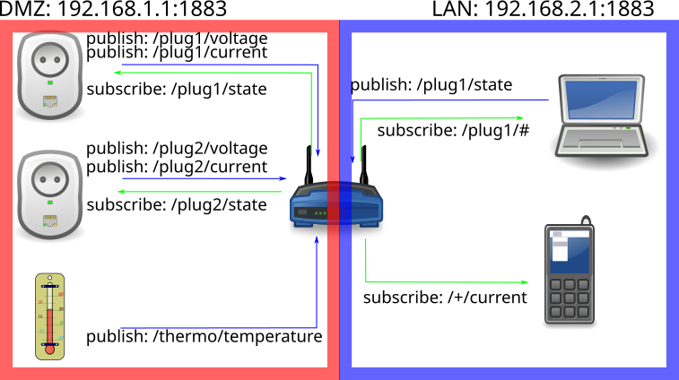

## <i class="bi bi-compass"></i> Po co ten wykład {#cele}

[Pytanie modułu: **jak zapisać umowę między urządzeniem, brokerem i odbiorcami, żeby dało się ją później zmienić bez zatrzymywania systemu?**]{.lead}

::: {.columns}
::: {.column width="52%"}
### Cele

::: {.incremental}
* Uzasadnić wybór pub/sub zamiast żądanie–odpowiedź.
* Przypisać każdą klasę komunikatu do tematu API urządzenia ThingsBoard — z jawnym kierunkiem.
* Dobrać QoS świadomie — wraz z jego kosztem.
* Zapisać **samoopisujący się ładunek** i uczynić polecenia idempotentnymi.
:::
:::

::: {.column width="48%"}
### Droga

1. Dlaczego HTTP nie pasuje do węzła
2. MQTT: broker, tematy, faktyczny narzut
3. Tematy platformy, QoS, Last Will, keep alive
4. Kontrakt danych i jego wersjonowanie
5. Poświadczenia urządzenia i TLS
6. Test odbioru kontraktu
:::
:::

# Protokół {.sekcja .foto background-color="#0b3b45" background-image="../assets/img/kurs/sortownia-poczty.jpg" background-size="cover"}


[Fot. Archives New Zealand, CC BY-SA 2.0]{.zrodlo}

## <i class="bi bi-x-octagon"></i> Dlaczego HTTP nie pasuje {#http}

::: {.columns}
::: {.column width="56%"}
::: {.incremental}
* **Narzut nagłówków** — nagłówki HTTP potrafią zająć więcej bajtów niż sama wartość „temperatura = 22,5 °C".
* **Model żądanie–odpowiedź** — każda wymiana zaczyna się od klienta; nowe połączenie TLS to kilka dodatkowych wymian z włączonym, prądożernym radiem.
* **Brak natywnej asynchroniczności i rozgłaszania** — każdy odbiorca musi indywidualnie odpytywać serwer, a urządzenie nie otrzyma polecenia bez stałego połączenia albo odpytywania.
:::

::: {.fragment}
Dla skali: samo zestawienie sesji TLS i nagłówki HTTP to zwykle **setki bajtów do kilku kB** na żądanie — przy ładunku rzędu kilkudziesięciu bajtów. Utrzymane połączenie MQTT płaci ten koszt raz.
:::
:::

::: {.column width="44%"}
::: {.callout-note title="To nie znaczy „HTTP jest zły”"}
HTTP jest właściwym wyborem tam, gdzie jest stałe zasilanie i model żądanie–odpowiedź pasuje do zadania: bramy, panele administracyjne, interfejsy serwerowe.

Problemem nie jest protokół, tylko jego użycie w roli, do której go nie projektowano.
:::
:::
:::

---

## <i class="bi bi-envelope-paper"></i> MQTT: publikacja i subskrypcja {#mqtt}

::: {.columns}
::: {.column width="52%"}
::: {.incremental}
* Czujnik nie łączy się z odbiorcą danych. Publikuje komunikat do **brokera** pod określonym **tematem**.
* Broker filtruje i rozsyła komunikaty do wszystkich zainteresowanych subskrybentów.
* Klienci **nie wiedzą o swoim istnieniu** — znają tylko brokera.
* Protokół jest asynchroniczny i zaprojektowany pod niestabilne łącza.
:::
:::

::: {.column width="48%"}
{width="96%" fig-alt="Schemat MQTT: wielu nadawców publikuje komunikaty do jednego brokera, który przekazuje je wielu subskrybentom."}

::: {.zrodlo}
Ademant, *MQTT single broker multiple listener*, [Wikimedia Commons](https://commons.wikimedia.org/wiki/File:MQTT_single_broker_multiple_listener.svg), CC BY-SA 4.0.
:::
:::
:::

Protokół powstał w 1999 r. we współpracy **Andy'ego Stanforda-Clarka (IBM)** i **Arlena Nippera** (wówczas Arcom Control Systems). MQTT jest dziś standardem **OASIS**: wersja 3.1.1 (2014) została również opublikowana jako **ISO/IEC 20922:2016**, a wersja 5.0 jako standard OASIS w 2019 r.

---

## <i class="bi bi-rulers"></i> „Nagłówek MQTT to 2 bajty" — ile naprawdę {#naglowek}

::: {.columns}
::: {.column width="50%"}
Dwa bajty to **minimalny rozmiar nagłówka stałego**: jeden bajt typu pakietu i flag oraz co najmniej jeden bajt pola `Remaining Length`, kodowanego jako liczba zmiennobajtowa **o długości 1–4 bajtów**.

Do tego dochodzi nagłówek zmienny — przede wszystkim **nazwa tematu**, a przy QoS > 0 identyfikator pakietu — w MQTT 5.0 jeszcze właściwości (co najmniej 1 B). MQTT 5 pozwala zastąpić długi temat **aliasem** (Topic Alias), liczbą o długości 2 B.

Realny narzut pakietu `PUBLISH` zależy więc głównie od **długości nazwy tematu**. Binarny jest nagłówek MQTT; format ładunku (np. JSON, CBOR lub Protobuf) określa osobny kontrakt danych.
:::

::: {.column width="50%"}
Ten sam pusty ładunek, dwa tematy telemetrii platformy (MQTT 3.1.1):

| Temat | Długość | Pakiet `PUBLISH` |
|:---|:---|:---|
| `v2/t` (temat skrócony) | 4 zn. | **10 B** (QoS 1) |
| `v1/devices/me/telemetry` | 23 zn. | **29 B** (QoS 1) |

::: {.fragment}
Różnica **19 B na komunikat** wynika wyłącznie z długości tematu. Przy publikacji co 10 s przez 365 dni to **59,9 MB rocznie**
(57,1 MiB) dodatkowych bajtów `PUBLISH`. Bez ACK, TCP/IP i TLS; czasu pracy radia nie wyliczymy z samej liczby bajtów.
:::

::: {.fragment}
**Wniosek:** segmenty tematu mają być **krótkie, ale znaczące**. Dlatego platforma oferuje obok czytelnych tematów `v1/…` także skrócone `v2/…` — dla urządzeń, którym każdy bajt łącza się liczy.
:::
:::
:::

# Tematy i niezawodność {.sekcja .foto background-color="#0b3b45" background-image="../assets/img/kurs/panel-krosowy.jpg" background-size="cover"}


[Fot. Dsimic, CC BY-SA 4.0]{.zrodlo}

## <i class="bi bi-folder2-open"></i> Kontrakt tematów: API urządzenia ThingsBoard {#tematy}

[Urządzenie nie wymyśla własnych tematów — **przestrzega kontraktu platformy**. Temat niesie **kierunek** i **klasę komunikatu**.]{.lead}

::: {.tabela-srednia}
| Klasa komunikatu | Temat | Kto publikuje |
|:---|:---|:---|
| Telemetria (pomiary) | `v1/devices/me/telemetry` | **tylko urządzenie** |
| Stan: wersja firmware, adres, przyjęta konfiguracja | `v1/devices/me/attributes` | urządzenie (atrybuty klienta) |
| Konfiguracja z platformy | `v1/devices/me/attributes` (subskrypcja), po starcie `…/attributes/request/{id}` | platforma (atrybuty współdzielone) |
| Polecenie | `v1/devices/me/rpc/request/+` | **platforma**; urządzenie wyłącznie subskrybuje |
| Odpowiedź na polecenie | `v1/devices/me/rpc/response/{id}` | urządzenie, z **tym samym** `{id}` |
:::

::: {.fragment}
`me` znaczy: urządzenie, którego **token** przedstawiono przy połączeniu. Tożsamość wynika z poświadczenia, nie z nazwy tematu.
Tematy skrócone, porty i format ładunku omawia wykład 05.
:::

---

## <i class="bi bi-exclamation-triangle-fill"></i> Polecenie nigdy nie jest trwałą wartością {#retained}

::: {.columns}
::: {.column width="50%"}
W MQTT komunikat `retained` broker dostarcza **każdemu nowemu subskrybentowi** zaraz po subskrypcji. W platformie tę rolę pełni **atrybut współdzielony**: platforma pamięta ostatnią wartość, a urządzenie pobiera ją po każdym starcie.

::: {.fragment}
Polecenie zapisane jako trwała wartość zostanie więc wykonane ponownie **przy każdym restarcie urządzenia**. Polecenie wysyłamy jako **RPC** — jednorazowe żądanie z odpowiedzią. Trwałe RPC czeka na urządzenie offline do upływu czasu ważności, więc polecenie fizyczne dostaje **krótki** termin.
:::

::: {.fragment}
**Stan i konfiguracja** natomiast **muszą** być trwałe — żeby pulpit po odświeżeniu i urządzenie po restarcie od razu znały bieżącą wartość.
:::
:::

::: {.column width="50%"}
::: {.callout-important title="To nie jest błąd teoretyczny"}
Pompa, grzałka albo zawór po przerwie w zasilaniu **sama** załącza wyjście na podstawie polecenia sprzed godzin. Objaw: „pompa włącza się sama”.
:::

::: {.fragment}
```{mermaid}
%%| fig-width: 6.8
%%| fig-height: 3.4
%%{init: {"sequence": {"mirrorActors": false, "actorMargin": 30, "width": 150, "height": 46, "boxMargin": 6, "noteMargin": 6, "messageMargin": 22, "diagramMarginX": 10, "diagramMarginY": 6, "actorFontFamily": "Arial, Liberation Sans, Helvetica, sans-serif", "messageFontFamily": "Arial, Liberation Sans, Helvetica, sans-serif", "noteFontFamily": "Arial, Liberation Sans, Helvetica, sans-serif"}, "themeVariables": {"fontFamily": "Arial, Liberation Sans, Helvetica, sans-serif"}}}%%
sequenceDiagram
    participant O as Operator
    participant P as Platforma
    participant D as ESP32
    O->>P: atrybut pump=true
    P->>D: aktualizacja: pump=true
    Note over D: pompa startuje
    D->>P: restart: attributes/request
    P->>D: pump=true (ostatnia wartość!)
    Note over D: pompa startuje SAMA
```
:::
:::
:::

---

## <i class="bi bi-shield-check"></i> QoS i jego koszt {#qos}

::: {.columns}
::: {.column width="55%"}
::: {.tabela-gesta}
| Mechanizm | Kiedy stosujesz | Koszt |
|:---|:---|:---|
| **QoS 0** — co najwyżej raz | telemetria o wysokiej częstości, gdzie strata próbki jest dopuszczalna | brak potwierdzeń; nie wiesz, czy komunikat dotarł |
| **QoS 1** — co najmniej raz | stan, zdarzenia, polecenia w prostych układach | możliwe **duplikaty** — odbiorca musi być idempotentny |
| **QoS 2** — dokładnie raz | operacje, których powtórzenie jest kosztowne | czterofazowa wymiana; największe opóźnienie i zużycie energii |
:::
:::

::: {.column width="45%"}
Specyfikacja opisuje trzy poziomy jako: *co najwyżej raz*, *co najmniej raz* i *dokładnie raz*. **Żaden poziom nie gwarantuje dostarczenia przy trwale przerwanym łączu.** Zaległe QoS 1 i 2 są dostarczane po powrocie tylko przy zachowanej sesji (Clean Session = 0, w MQTT 5 Session Expiry > 0).

QoS działa **na jednym odcinku**: subskrybent dostaje min(QoS publikacji, QoS subskrypcji).

::: {.fragment}
::: {.callout-warning title="I jeszcze jedno ograniczenie"}
Broker wbudowany w ThingsBoard (wykład 05) obsługuje **wyłącznie QoS 0 i 1** — żądanie subskrypcji z QoS 2 zostaje obniżone do QoS 1. Projekt nie może zakładać semantyki „dokładnie raz" na styku z platformą — **idempotencja odbiornika jest obowiązkowa**, a nie opcjonalna.
:::
:::
:::
:::

---

## <i class="bi bi-sliders2"></i> Retained, Last Will, keep alive, sesja — i platforma {#mechanizmy}

[Cztery mechanizmy obok QoS. Specyfikacja MQTT je opisuje, a platforma rozwiązuje te same problemy po swojemu.]{.lead}

::: {.tabela-srednia}
| Mechanizm MQTT | Problem | Koszt i pułapka w MQTT | Na platformie ThingsBoard |
|:---|:---|:---|:---|
| **Retained** | nowy odbiorca od razu zna stan | nieaktualny stan „żyje” do nadpisania | ostatnią wartość przechowuje platforma: atrybuty i najnowsza telemetria; urządzenie po starcie pobiera atrybuty |
| **Last Will** | wykrycie nieuprzejmego rozłączenia | ustawiany przy `CONNECT`; **nie zadziała** po `DISCONNECT` z kodem 0x00 (w MQTT 5 kod 0x04 celowo go wyzwala) | nie należy do API urządzenia; platforma odnotowuje rozłączenie, a `active = false` ustawia po `inactivityTimeout` (domyślnie 600 s) |
| **Keep alive** | detekcja martwego łącza TCP | krótki okres = częstsze `PINGREQ` = więcej energii; broker rozłącza po **1,5 × keep alive** | o aktywności decyduje telemetria, atrybuty lub RPC — próg nieaktywności dobieramy do okresu raportowania (wykład 06) |
| **Sesja trwała**, Session Expiry | odbiór zaległości po powrocie urządzenia | broker utrzymuje stan sesji — pamięć serwera | zaległe polecenie czeka jako **trwałe RPC** (statusy, ponowienia, czas ważności); zwykłe RPC do urządzenia offline przepada |
:::

---

## <i class="bi bi-arrow-left-right"></i> Sekwencja trzech poziomów {#qos-sekwencja}

::: {.columns}
::: {.column width="33%"}
**QoS 0 — wyślij i zapomnij**

```{mermaid}
%%| fig-width: 4.6
%%| fig-height: 1.5
%%{init: {"sequence": {"mirrorActors": false, "actorMargin": 30, "width": 150, "height": 46, "boxMargin": 6, "noteMargin": 6, "messageMargin": 22, "diagramMarginX": 10, "diagramMarginY": 6, "actorFontFamily": "Arial, Liberation Sans, Helvetica, sans-serif", "messageFontFamily": "Arial, Liberation Sans, Helvetica, sans-serif", "noteFontFamily": "Arial, Liberation Sans, Helvetica, sans-serif"}, "themeVariables": {"fontFamily": "Arial, Liberation Sans, Helvetica, sans-serif"}}}%%
sequenceDiagram
    participant C as Czujnik
    participant B as Broker
    C->>B: PUBLISH
```
:::

::: {.column width="33%"}
**QoS 1 — co najmniej raz**

```{mermaid}
%%| fig-width: 4.6
%%| fig-height: 1.8
%%{init: {"sequence": {"mirrorActors": false, "actorMargin": 30, "width": 150, "height": 46, "boxMargin": 6, "noteMargin": 6, "messageMargin": 22, "diagramMarginX": 10, "diagramMarginY": 6, "actorFontFamily": "Arial, Liberation Sans, Helvetica, sans-serif", "messageFontFamily": "Arial, Liberation Sans, Helvetica, sans-serif", "noteFontFamily": "Arial, Liberation Sans, Helvetica, sans-serif"}, "themeVariables": {"fontFamily": "Arial, Liberation Sans, Helvetica, sans-serif"}}}%%
sequenceDiagram
    participant C as Czujnik
    participant B as Broker
    C->>B: PUBLISH
    B-->>C: PUBACK
```
:::

::: {.column width="33%"}
**QoS 2 — dokładnie raz**

```{mermaid}
%%| fig-width: 4.6
%%| fig-height: 2.9
%%{init: {"sequence": {"mirrorActors": false, "actorMargin": 30, "width": 150, "height": 46, "boxMargin": 6, "noteMargin": 6, "messageMargin": 22, "diagramMarginX": 10, "diagramMarginY": 6, "actorFontFamily": "Arial, Liberation Sans, Helvetica, sans-serif", "messageFontFamily": "Arial, Liberation Sans, Helvetica, sans-serif", "noteFontFamily": "Arial, Liberation Sans, Helvetica, sans-serif"}, "themeVariables": {"fontFamily": "Arial, Liberation Sans, Helvetica, sans-serif"}}}%%
sequenceDiagram
    participant C as Czujnik
    participant B as Broker
    C->>B: PUBLISH
    B-->>C: PUBREC
    C->>B: PUBREL
    B-->>C: PUBCOMP
```
:::
:::

::: {.fragment}
Koszt energetyczny rośnie z liczbą wymian: QoS 2 to **cztery pakiety** zamiast jednego, a radio musi
pozostać włączone przez cały czas wymiany.
:::

# Kontrakt danych {.sekcja .foto background-color="#0b3b45" background-image="../assets/img/kurs/panel-sterowania.jpg" background-size="cover"}


[Fot. Shixart1985, CC BY 2.0]{.zrodlo}

## <i class="bi bi-file-earmark-code"></i> Samoopisujący się ładunek {#kontrakt}

::: {.columns}
::: {.column width="46%"}
```json
{
  "ts": 1790760003000,
  "values": {
    "schema": 1,
    "temperature_c": 22.5,
    "humidity_pct": 61,
    "pump": false,
    "seq": 10472
  }
}
```

Telemetria w formacie platformy (`v1/devices/me/telemetry`). Ten komunikat da się zinterpretować **bez dokumentacji obok**. To jest cel.
:::

::: {.column width="54%"}
::: {.incremental}
* **`schema`** — numer wersji kontraktu. Bez niego nie da się wprowadzić zmiany bez przestoju wszystkich odbiorców.
* **`ts`** — czas pomiaru w **UTC**, w milisekundach od epoki Unix; bez `ts` platforma przypisze czas odbioru. Czas lokalny psuje dane przy zmianie czasu: godzina 02:30 występuje dwa razy albo wcale.
* **Jednostka jest częścią nazwy pola** (`_c`, `_pct`) — odbiorca nie musi zgadywać ani pytać.
* **`seq`** — licznik rosnący; pozwala wykryć lukę i duplikat z QoS 1. Po restarcie licznik się zeruje — dlatego przechowujemy go nieulotnie albo łączymy z identyfikatorem rozruchu.
* **Tożsamość i `fw` nie jadą w każdym pomiarze** — urządzenie identyfikuje token, a wersję firmware wysyłamy jako atrybut klienta (wykład 05).
:::
:::
:::

---

## <i class="bi bi-diagram-2"></i> Wersjonowanie kontraktu {#wersjonowanie}

[Zmiana kontraktu po wdrożeniu wymaga aktualizacji wszystkich stron. Pole `schema` pozwala zrobić to etapami.]{.lead}

::: {.columns}
::: {.column width="50%"}
**Zmiana zgodna wstecz** — dodanie pola

::: {.incremental}
* Urządzenie wysyła nowe pole, `schema` bez zmian.
* Starzy odbiorcy ignorują nieznane pole — o ile kontrakt nakazuje tolerancyjny parser — nowi z niego korzystają.
:::

**Zmiana niezgodna** — inne znaczenie albo jednostka

::: {.incremental}
* Podnosimy `schema` do 2.
* Odbiorca odrzuca nieobsługiwaną wersję **z powodem**, zamiast interpretować ją błędnie.
* W okresie przejściowym publikujemy w obu wersjach albo aktualizujemy urządzenia przez OTA (moduł 03).
:::
:::

::: {.column width="50%"}
::: {.callout-warning title="Najgorszy wariant"}
Zmiana jednostki z °C na dziesiąte części °C **bez** podniesienia `schema`.

Odbiorca nadal parsuje komunikat poprawnie i wykresy się rysują — ale wartości są dziesięciokrotnie za duże. Alarmy progowe zaczynają się wyzwalać fałszywie, a historia zostaje wymieszana z danymi w innej jednostce.
:::

::: {.fragment}
Jednostka w **nazwie pola** pomaga człowiekowi, ale niczego nie wymusza. Wymusza dopiero **walidacja** po stronie odbiorcy — np. JSON Schema z dopuszczalnym zakresem albo reguła w platformie, która odrzuca wartość spoza zakresu. Standardowy zapis jednostek: SenML, RFC 8428.
:::
:::
:::

---

## <i class="bi bi-arrow-clockwise"></i> Idempotencja polecenia {#idempotencja}

::: {.columns}
::: {.column width="50%"}
Polecenie przychodzi jako RPC w temacie `…/rpc/request/{id}`. `{id}` służy do skojarzenia odpowiedzi,
ale **nie identyfikuje polecenia na trwałe** — ponowienie trwałego RPC może dostarczyć to samo polecenie drugi raz.
Dlatego polecenie niesie własny **identyfikator żądania**, a urządzenie zapamiętuje ostatnie wykonane —
**nieulotnie** — i ignoruje powtórzenia.

```json
{
  "method": "setSwitch",
  "params": { "on": true, "req_id": "c7f1-0042" }
}
```

::: {.fragment}
Polecenie „ustaw stan = X” zamiast „przełącz” jest idempotentne z natury. **QoS 1 z duplikatami przestaje być problemem**, a odpowiedź może być bezpiecznie wysłana ponownie.
:::
:::

::: {.column width="50%"}
```{mermaid}
%%| fig-width: 6.6
%%| fig-height: 5.8
%%{init: {"sequence": {"mirrorActors": false, "actorMargin": 30, "width": 150, "height": 46, "boxMargin": 6, "noteMargin": 6, "messageMargin": 22, "diagramMarginX": 10, "diagramMarginY": 6, "actorFontFamily": "Arial, Liberation Sans, Helvetica, sans-serif", "messageFontFamily": "Arial, Liberation Sans, Helvetica, sans-serif", "noteFontFamily": "Arial, Liberation Sans, Helvetica, sans-serif"}, "themeVariables": {"fontFamily": "Arial, Liberation Sans, Helvetica, sans-serif"}}}%%
sequenceDiagram
    participant P as Platforma
    participant D as ESP32
    P->>D: request/17: req_id=0042
    Note over D: nowy → wykonaj,<br>zapamiętaj
    D->>P: response/17: on=true
    P->>D: request/18: req_id=0042
    Note over D: znany →<br>NIE wykonuj
    D->>P: response/18: on=true
```

::: {.fragment}
Odpowiedź wysyłamy **za każdym razem** — powtórzenie odpowiedzi jest nieszkodliwe, a jej brak wygląda jak awaria.
:::
:::
:::

---

## <i class="bi bi-lock"></i> Poświadczenia urządzenia i TLS {#dostep}

::: {.columns}
::: {.column width="52%"}
::: {.incremental}
* **Osobne poświadczenie dla każdego urządzenia** — w ThingsBoard zwykle token, podawany jako nazwa użytkownika MQTT. Wspólny token nie pozwala odciąć jednego urządzenia.
* **Tożsamość z poświadczenia, nie z tematu.** Platforma przypisuje dane do właściciela tokenu — urządzenie nie zapisze cudzej telemetrii. Ogólny broker wymaga do tego list ACL.
* **TLS na porcie 8883** z weryfikacją certyfikatu serwera; bez TLS token płynie jawnym tekstem. Certyfikat CA jest częścią firmware i podlega OTA.
* **Unikalny `ClientID`** — wg specyfikacji MQTT broker rozłącza starszą sesję o tym samym identyfikatorze; objaw wygląda jak „niestabilna sieć”.
:::
:::

::: {.column width="48%"}
Certyfikat klienta **X.509** przy dwustronnym TLS usuwa współdzielony sekret z firmware — to opcja na wdrożenie produkcyjne. Typy poświadczeń w platformie omawia wykład 05.

Token i hasło Wi-Fi leżą w `arduino_secrets.h`, **poza repozytorium**.

::: {.fragment}
::: {.callout-note title="Odrzucenie jest widoczne od razu"}
Połączenie z brakującym albo błędnym tokenem platforma odrzuca już przy `CONNECT` — odpowiedź `CONNACK` niesie kod *bad username or password* albo *not authorized*. Ten objaw sprawdzamy w teście odbioru.
:::
:::
:::
:::

---

## <i class="bi bi-arrow-left-right"></i> CoAP i AMQP — kiedy nie MQTT {#coap-amqp}

::: {.columns}
::: {.column width="50%"}
### CoAP

::: {.incremental}
* Odpowiednik HTTP (GET, POST, PUT, DELETE) oparty na **UDP** — lżejszy i szybszy.
* Zabezpieczenie przez powiązanie z DTLS (`coaps`, port 5684).
* Rozszerzenie **Observe** (RFC 7641) pozwala subskrybować zmiany zasobu.
* Sprawdza się tam, gdzie MQTT jest „za dużo": mikrokontroler, który po prostu odpowiada na pytanie „podaj aktualną temperaturę", bez stałego połączenia z brokerem.
:::

::: {.fragment}
Tryb **potwierdzany**: komunikaty *confirmable* mają ACK i retransmisję; *non-confirmable* — nie.
:::
:::

::: {.column width="50%"}
### AMQP

::: {.incremental}
* Rozbudowany system kolejek dla środowisk korporacyjnych i finansowych.
* Zbyt ciężki dla mikrokontrolera — jego miejsce jest **na zapleczu**, między serwerami (np. RabbitMQ, natywnie AMQP 1.0 od wersji 4).
* W architekturze IoT pojawia się za platformą, nie przed nią.
:::

::: {.fragment}
::: {.callout-note title="Reguła wyboru"}
MQTT — strumień telemetrii i polecenia do wielu odbiorców.
CoAP — zapytanie o bieżącą wartość lub obserwacja jednego zasobu.
AMQP — kolejkowanie między usługami serwerowymi.
:::
:::
:::
:::

---

## <i class="bi bi-clipboard-check"></i> Test odbioru kontraktu {#test-odbioru}

[Kontrakt nieprzetestowany jest dokumentem, nie umową. Pięć dowodów na brokerze platformy:]{.lead}

::: {.pytania}
* Połączenie z **błędnym tokenem** zostaje odrzucone przy `CONNECT`, a z poprawnym — przyjęte.
* Firmware łączy się **wyłącznie przez TLS (8883)** i weryfikuje serwer: z podmienionym certyfikatem CA połączenie nie zostaje zestawione.
* Telemetria publikowana z **jawnie podanym QoS 1** pojawia się w najnowszych wartościach urządzenia (*Latest telemetry*), a kolejne `seq` pozwalają wykryć lukę lub duplikat.
* Polecenie wykonane **raz**, mimo dwukrotnego wysłania z tym samym identyfikatorem żądania — dowód idempotencji.
* Po odłączeniu zasilania urządzenie staje się nieaktywne po `inactivityTimeout`; po przywróceniu telemetria wraca **bez ręcznej interwencji** — i pompa **nie** włącza się sama.
:::

---

## <i class="bi bi-table"></i> Dobór technologii — zestawienie {#zestawienie}

::: {.tabela-srednia}
| Warstwa | Technologia | Zastosowanie |
|:---|:---|:---|
| **Krótki zasięg** | BLE, Zigbee, Z-Wave | urządzenia noszone, instalacje domowe, czujniki lokalne |
| **Daleki zasięg** | LoRaWAN, NB-IoT, LTE-M, Sigfox 0G* | rolnictwo, monitoring środowiskowy, infrastruktura miejska |
| **Protokół aplikacyjny** | **MQTT** (pub/sub) | strumień telemetrii, polecenia, wielu odbiorców |
| **Protokół aplikacyjny** | CoAP (żądanie/odpowiedź, UDP) | pojedyncze odczyty na mikrokontrolerach |
| **Protokół aplikacyjny** | HTTP | przede wszystkim bramy i urządzenia ze stałym zasilaniem |
| **Zaplecze** | AMQP | kolejki między usługami serwerowymi |
:::

[\* Operator Sigfox 0G (UnaBiz) — przyszłość sieci niepewna; zob. moduł 03.]{style="font-size:0.6em"}

::: {.fragment}
Zasada porządkująca cały ten wykład i poprzedni: **im dalej chcesz przesłać dane, tym mniej ich
przesyłasz i tym dłużej urządzenie przeżyje** — a im mniej przesyłasz, tym ważniejsze, żeby każdy
przesłany bajt był jednoznaczny.
:::

---

## <i class="bi bi-question-circle"></i> Pytania sprawdzające {#pytania}

::: {.pytania}
* Operator zgłasza: „po każdej przerwie w prądzie wentylator sam rusza na pełnych obrotach". Wskaż, która decyzja projektowa w kontrakcie z platformą to powoduje, i podaj poprawkę.
* Zespół zmienia jednostkę pola z °C na dziesiąte części stopnia i zostawia nazwę `temperature_c` oraz `schema: 1`. Wymień dwa różne momenty, w których ten błąd może zostać wykryty, i powiedz, ile danych zdąży się do tego czasu zepsuć przy raportowaniu co 10 s.
* Na styku z platformą dostępne są tylko QoS 0 i 1. Zaprojektuj obsługę polecenia „otwórz zawór na 30 sekund" tak, żeby dwukrotne dostarczenie tego samego komunikatu nie wydłużyło otwarcia do minuty.
:::

---

## <i class="bi bi-flag"></i> Podsumowanie i przejście {#podsumowanie}

::: {.columns}
::: {.column width="55%"}
**Co zostaje z tego modułu**

::: {.incremental}
* Narzut MQTT zależy głównie od **długości nazwy tematu**, nie od stałych 2 bajtów.
* Urządzenie przestrzega **kontraktu tematów platformy**; tożsamość daje token, poufność — TLS.
* Stan i konfiguracja są trwałą wartością, polecenie **nigdy** — to jednorazowe RPC.
* QoS 2 oznacza „dokładnie raz", nie „na pewno dotrze" — a broker platformy i tak go nie obsługuje.
* Ładunek opisuje sam siebie: `schema`, czas w UTC, jednostka w nazwie pola, licznik `seq`.
* Idempotencja polecenia jest obowiązkowa, nie opcjonalna.
:::
:::

::: {.column width="45%"}
::: {.callout-note title="Moduł 05 — ThingsBoard CE"}
Umowa jest zapisana, a urządzenie wie, do których tematów pisać. Teraz druga strona kontraktu: jak platforma modeluje urządzenie, telemetrię i atrybuty, jak pokazuje stan na pulpicie i jak wysyła polecenie, którego wykonanie urządzenie **potwierdza**.
:::
:::
:::

---

## <i class="bi bi-journal-text"></i> Źródła {#zrodla}

::: {style="font-size: 0.7em;"}
* OASIS, *MQTT Version 5.0* — struktura pakietu, QoS, retained, Will Message, Session Expiry Interval: <https://docs.oasis-open.org/mqtt/mqtt/v5.0/os/mqtt-v5.0-os.html>
* OASIS, *MQTT Version 3.1.1* (= ISO/IEC 20922:2016): <https://docs.oasis-open.org/mqtt/mqtt/v3.1.1/os/mqtt-v3.1.1-os.html>
* ThingsBoard, *MQTT Device API* — tematy urządzenia, token jako nazwa użytkownika, QoS 0/1, kody odrzucenia połączenia: <https://thingsboard.io/docs/reference/mqtt-api/>
* ThingsBoard, *RPC* — trwałe i zwykłe RPC, czas ważności, ponowienia: <https://thingsboard.io/docs/user-guide/rpc/>
* ThingsBoard, *Device connectivity status* — zdarzenia rozłączenia i nieaktywności, `inactivityTimeout`: <https://thingsboard.io/docs/user-guide/device-connectivity-status/>
* IETF RFC 7252 — *The Constrained Application Protocol (CoAP)*: <https://www.rfc-editor.org/rfc/rfc7252>
* OASIS, *AMQP 1.0*: <https://docs.oasis-open.org/amqp/core/v1.0/os/amqp-core-overview-v1.0-os.html>
* IETF RFC 8428 — *Sensor Measurement Lists (SenML)*: <https://www.rfc-editor.org/rfc/rfc8428>
* IETF RFC 7641 — *Observing Resources in CoAP*: <https://www.rfc-editor.org/rfc/rfc7641>
:::
