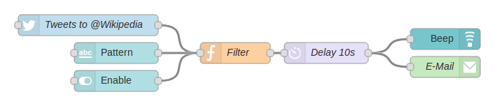
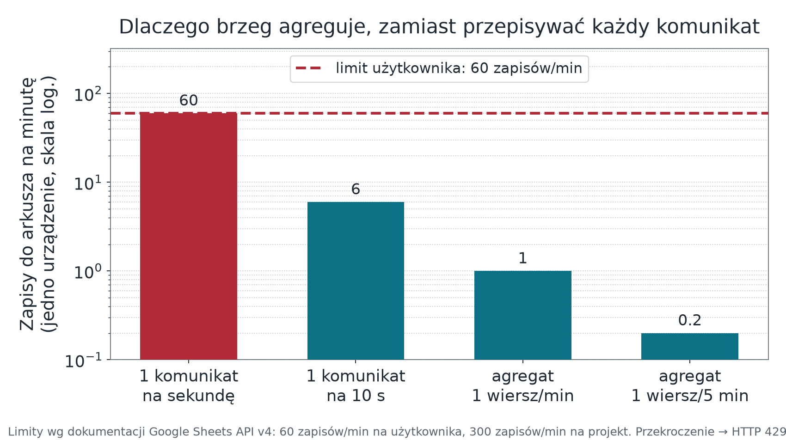

## <i class="bi bi-compass"></i> Po co ten wykład {#cele}

[Pytanie modułu: **kto decyduje, czy pomiar zasługuje na zapisanie — i co się dzieje z tym, który nie zasługuje?**]{.lead}

::: {.columns}
::: {.column width="52%"}
### Cele

::: {.incremental}
* Wymienić cztery zadania brzegu sieci, nie tylko agregację.
* Zbudować przepływ z jawną ścieżką błędu i logiem powodów odrzucenia.
* Dobrać wariant zapisu do arkusza świadomie — wraz z konsekwencją dla bezpieczeństwa.
* Policzyć częstość zapisu wobec limitów interfejsu, zanim powstanie przepływ.
:::
:::

::: {.column width="48%"}
### Droga

1. Od surowych danych do wiedzy
2. Brama brzegowa i jej cztery zadania
3. Przepływ Node-RED węzeł po węźle
4. Reguły walidacji i log odrzuceń
5. Dwa warianty zapisu do arkusza
6. Limity, ponowienia, agregacja
:::
:::

# Brzeg sieci {.sekcja background-color="#0b3b45"}

## <i class="bi bi-funnel"></i> Od gigabajtów do wiedzy {#redukcja}

::: {.columns}
::: {.column width="52%"}
::: {.incremental}
* Pojedynczy czujnik temperatury w chłodni jest bezwartościowy.
* Dziesięć tysięcy czujników w stu magazynach, raportujących co minutę, to już problem składowania i filtrowania.
* Pytanie nie brzmi „gdzie to zmieścić", tylko **„co z tego jest potrzebne do decyzji"**.
* Redukcja następuje **najbliżej źródła**, bo to najtańsze miejsce.
:::
:::

::: {.column width="48%"}
```{mermaid}
%%| fig-width: 6.6
%%| fig-height: 3.8
%%{init: {"themeVariables": {"fontSize": "24px"}}}%%
flowchart TD
    A["Anemometr<br>10 Hz"]
    B["Analizator gazu<br>10 Hz"]
    C("Brzeg sieci<br>agregacja · walidacja")
    D[("Platforma<br>szeregi czasowe")]
    G[("Arkusz<br>raport")]
    A -- "surowy strumień" --> C
    B -- "surowy strumień" --> C
    C -- "bloki 30-minutowe" --> D
    C -- "1 wiersz/min" --> G
    classDef n fill:#e8f2f4,stroke:#0b6b78,stroke-width:2px,color:#0b3b45
    class A,B,C,D,G n
```
:::
:::

---

## <i class="bi bi-router"></i> Brama brzegowa — cztery zadania {#brama}

::: {.columns}
::: {.column width="50%"}
::: {.incremental}
1. **Redukcja i agregacja** — zamiast strumienia tysięcy próbek drgań na sekundę, wpis „stan łożyska: stabilny".
2. **Buforowanie przy braku łącza** — pomiary nie giną, gdy sieć nadrzędna zniknie.
3. **Tłumaczenie protokołów** — radio lokalne po jednej stronie, IP po drugiej.
4. **Reagowanie lokalne** — gdy decyzja nie może czekać na odpowiedź z chmury.
:::
:::

::: {.column width="50%"}
::: {.callout-warning title="Latency"}
Czas przejścia danych od urządzenia do chmury i z powrotem z komendą bywa krytyczny. Dlatego inteligencję przesuwa się bliżej brzegu — nie dla mody, tylko dlatego, że prasa hydrauliczna nie zatrzyma się przez łącze o opóźnieniu 300 ms.
:::

::: {.fragment}
Brzeg sieci nie ogranicza się do filtrowania i przesyłania średnich. Odpowiada również za walidację, routing, reakcję lokalną i kontrolowane odrzucanie danych; w architekturze pilota kluczowa jest decyzja o jakości danych opisana na następnym slajdzie.
:::
:::
:::

---

## <i class="bi bi-shield-exclamation"></i> Piąte zadanie: decyzja o jakości danych {#jakosc}

Node-RED jest **miejscem decyzji o jakości danych**: punktem, w którym odrzucamy błędny pomiar, zanim trafi do arkusza i na wykres. Nie jest jedynie narzędziem do szybkiego łączenia czujnika z pulpitem i powiadomieniem.

::: {.columns}
::: {.column width="50%"}
**Dlaczego nie urządzenie?**

Urządzenie waliduje **zakres fizyczny** — to jego obowiązek z modułu 02. Ale nie zna kontekstu: nie wie, czy jego zegar jest zsynchronizowany, czy inny węzeł nie przysłał już tej samej próbki, ani czy wersja schematu jest nadal obsługiwana.
:::

::: {.column width="50%"}
**Dlaczego nie platforma?**

Platforma zapisuje to, co dostanie. Odrzucenie na platformie oznacza, że błędna wartość **już jest** w szeregu czasowym i trzeba ją usuwać — a w międzyczasie wywołała alarm.

::: {.fragment}
**Przepływ bez walidacji nie spełnia wymagań tego modułu.**
:::
:::
:::

# Przepływ {.sekcja background-color="#0b3b45"}

## <i class="bi bi-diagram-3"></i> Node-RED — węzeł po węźle {#przeplyw}

```{mermaid}
%%| fig-width: 12
%%| fig-height: 3.6
%%{init: {"themeVariables": {"fontSize": "24px"}}}%%
flowchart LR
    M["<b>mqtt in</b><br><small>subskrypcja telemetrii<br>jawny QoS</small>"]
    J["<b>json</b><br><small>parsowanie<br>ładunku</small>"]
    F["<b>function</b><br><small>walidacja: pola, schemat<br>zakres, świeżość</small>"]
    S{"<b>switch</b><br>routing"}
    W["<b>zapis</b><br><small>arkusz raportowy</small>"]
    A["<b>alarm</b><br><small>przekroczenie progu</small>"]
    L["<b>log odrzuceń</b><br><small>z powodem</small>"]
    M --> J --> F --> S
    S -- "poprawne" --> W
    S -- "próg" --> A
    S -- "odrzucone" --> L
    J -. "nieparsowalne" .-> L
    classDef n fill:#e8f2f4,stroke:#0b6b78,stroke-width:2px,color:#0b3b45
    classDef r fill:#fdf3f4,stroke:#b02a37,stroke-width:2px,color:#8f2029
    class M,J,F,S,W n
    class L,A r
```

{width="72%" fig-alt="Zrzut edytora Node-RED z przepływem połączonych węzłów wejściowych, przetwarzających i wyjściowych."}

::: {.zrodlo}
1-Byte, *Node-RED Example*, [Wikimedia Commons](https://commons.wikimedia.org/wiki/File:Node-RED_Example.png), CC BY-SA 4.0.
:::

::: {.fragment}
Dwie zasady konstrukcyjne: komunikat **nieparsowalny trafia na ścieżkę błędu, nie dalej w przepływ**,
a dla jednego strumienia wybieramy **jeden** wariant zapisu — nigdy dwa naraz.
:::

---

## <i class="bi bi-check2-square"></i> Minimalny zestaw reguł walidacji {#walidacja}

::: {.pytania}
* **`schema` zgodne z obsługiwaną wersją** — inaczej odrzucenie z powodem „nieobsługiwana wersja schematu".
* **Każde pole wymagane obecne i o właściwym typie** — `"22.5"` jako tekst to nie to samo co `22.5`.
* **Wartość w zakresie fizycznym czujnika**, nie w zakresie typu danych. `-40…+85 °C`, a nie „cokolwiek, co zmieści się w `float`".
* **Znacznik czasu nie starszy niż podwójny okres raportowania i nie z przyszłości.**
* **Licznik `seq` nie powtarza wartości sprzed chwili** — wykrycie duplikatu z QoS 1.
:::

::: {.fragment}
::: {.callout-important title="Każde odrzucenie zapisujemy z powodem"}
Sam licznik odrzuceń nie pozwala niczego zdiagnozować. „W ciągu doby odrzucono 1841 komunikatów" nie mówi nic.
„1840 × nieobsługiwana wersja schematu, 1 × wartość poza zakresem" wskazuje przyczynę w jednej linii —
i to jest jedyny cel logowania.
:::
:::

# Zapis do arkusza {.sekcja background-color="#0b3b45"}

## <i class="bi bi-file-earmark-spreadsheet"></i> Dwa warianty zapisu {#warianty}

| Cecha | **Dydaktyczny:** Apps Script | **Serwerowy:** Sheets API v4 |
|:---|:---|:---|
| Kto zapisuje | aplikacja internetowa Apps Script wywołana metodą POST | pośrednik po stronie serwera: Node-RED albo własny backend |
| Interfejs | `doPost(e)` → walidacja → `appendRow` | `spreadsheets.values.append` w REST API v4 |
| Uwierzytelnianie | **adres URL wdrożenia pełni funkcję sekretu** | konto usługi i token OAuth 2.0 |
| Ryzyko | ujawnienie adresu = prawo zapisu dla każdego | klucz konta usługi wymaga bezpiecznego magazynu i rotacji |
| Kontrola dostępu | ograniczona, po stronie skryptu | pełna: uprawnienia arkusza nadawane kontu usługi |
| Kiedy dopuszczalny | ćwiczenie laboratoryjne, **dane nieosobowe** | każde użycie poza demonstracją |

::: {.callout-warning title="Bezpieczeństwo Apps Script"}
Adres wdrożenia Apps Script jest sekretem, a nie publicznym endpointem. Kto zna adres, może zapisywać do arkusza. Wariant ten dopuszczamy wyłącznie dla danych nieosobowych w ćwiczeniu; poza laboratorium wymagany jest pośrednik serwerowy z kontem usługi.
:::

---

## <i class="bi bi-speedometer2"></i> Limity, które trzeba znać wcześniej {#limity}

::: {.columns}
::: {.column width="44%"}
Interfejs Google Sheets API v4 ma limity odnawiane **co minutę**:

| Rodzaj | Na projekt | Na użytkownika<br>w projekcie |
|:---|:---|:---|
| Odczyty | 300 / min | 60 / min |
| Zapisy | 300 / min | **60 / min** |

::: {.fragment}
Przekroczenie limitu zwraca **HTTP 429**. Dokumentacja wprost zaleca ponowienie
z **wykładniczym wycofaniem**.
:::

::: {.fragment}
::: {.callout-warning title="Rachunek, który zmienia projekt"}
Urządzenie raportujące **co sekundę** to 60 zapisów na minutę — **cały limit użytkownika na jeden czujnik**.
:::
:::
:::

::: {.column width="56%"}
{width="100%" fig-alt="Wykres słupkowy w skali logarytmicznej: liczba zapisów do arkusza na minutę dla czterech strategii, z linią limitu 60 zapisów na minutę."}

::: {.fragment}
Dlatego arkusz otrzymuje dane **zagregowane** — np. jeden wiersz na minutę — a nie każdy komunikat.
**Agregacja to zadanie brzegu, nie arkusza.**
:::
:::
:::

---

## <i class="bi bi-arrow-counterclockwise"></i> Ponowienia, kolejność, granice arkusza {#ponowienia}

::: {.columns}
::: {.column width="50%"}
::: {.incremental}
* **Błąd zapisu nie może kończyć przepływu.** Komunikat wraca do kolejki z rosnącym opóźnieniem, a po wyczerpaniu prób ląduje w logu odrzuceń.
* **Kolejność wierszy nie jest gwarantowana** przy ponowieniach. Jeżeli ma znaczenie — sortujemy po `ts`, a nie po kolejności wpisu.
* **Arkusz nie jest bazą telemetryczną.** Ma limit komórek i nie obsługuje zapytań po zakresie czasu. Szeregi czasowe trzymamy w platformie z modułu 06.
:::
:::

::: {.column width="50%"}
::: {.mermaid-wysoka}
```{mermaid}
%%| fig-width: 6.7
%%| fig-height: 4.3
%%{init: {"themeVariables": {"fontSize": "24px"}}}%%
flowchart TD
    Z["Zapis wiersza"] --> R{"Odpowiedź"}
    R -- "2xx" --> OK["Gotowe"]
    R -- "429 / 5xx" --> B["Kolejka ponowień<br>backoff + jitter · limit prób"]
    B -- "kolejna próba" --> Z
    B -- "limit wyczerpany" --> L["Log odrzuceń<br>powód + treść"]
    R -- "inne 4xx" --> L
    classDef n fill:#e8f2f4,stroke:#0b6b78,stroke-width:2px,color:#0b3b45
    classDef r fill:#fdf3f4,stroke:#b02a37,stroke-width:2px,color:#8f2029
    class Z,R,OK n
    class B,L r
```
:::
:::
:::

::: {.fragment}
**Rozróżnienie, które ratuje przepływ:** 429 i 5xx ponawiamy, bo problem jest przejściowy. Pozostałe 4xx
(np. 403 — brak uprawnień konta usługi do arkusza) ponawiać nie ma sensu — ponowienie da ten sam wynik,
a zatka kolejkę.
:::

---

## <i class="bi bi-key"></i> Autoryzacja i typowe błędy eksportu {#autoryzacja}

::: {.columns}
::: {.column width="50%"}
**Konto usługi — co trzeba zrobić**

::: {.incremental}
1. Włączyć Google Sheets API (i Drive API, jeśli tworzymy arkusze) w projekcie.
2. Utworzyć konto usługi i pobrać klucz w formacie JSON.
3. **Udostępnić arkusz adresowi e-mail konta usługi** — to krok pomijany najczęściej.
4. W przepływie podać identyfikator arkusza z adresu URL i zakres.
:::
:::

::: {.column width="50%"}
**Co zwraca interfejs, gdy coś nie gra**

| Kod | Typowa przyczyna |
|:---|:---|
| **401** | token wygasł albo jest nieprawidłowy |
| **403** | arkusz **nieudostępniony** kontu usługi, albo API nie włączone w projekcie |
| **404** | zły identyfikator arkusza lub nazwa zakresu |
| **429** | przekroczony limit — ponów z wycofaniem |
| **400** | zakres niezgodny z kształtem danych |
:::
:::

::: {.callout-important title="Higiena sekretów w sprawozdaniu"}
Klucz konta usługi i adres wdrożenia Apps Script **nie występują** w eksporcie przepływu oddawanym
jako sprawozdanie, w zrzutach ekranu ani w repozytorium. Przed oddaniem eksportu sprawdzamy plik
pod kątem pól poświadczeń — Node-RED potrafi je zapisać razem z konfiguracją węzła.
:::

---

## <i class="bi bi-clipboard-check"></i> Test odbioru przepływu {#test-odbioru}

::: {.pytania}
* Poprawny komunikat pojawia się w arkuszu jako **jeden wiersz** z jednostkami w nagłówku.
* Komunikat z wartością **poza zakresem fizycznym** nie pojawia się w arkuszu, ale pojawia się w logu z powodem odrzucenia.
* Komunikat **nieparsowalny** nie zatrzymuje przepływu.
* Po odcięciu połączenia z internetem przepływ **ponawia** zapis i nie traci pomiarów z bufora o zadanym rozmiarze.
* **Sekret** nie występuje w eksporcie przepływu oddawanym jako sprawozdanie.
:::

---

## <i class="bi bi-question-circle"></i> Pytania sprawdzające {#pytania}

::: {.pytania}
* Zespół podłączył urządzenie raportujące co sekundę wprost do arkusza i po kilku minutach zapisy przestały się pojawiać, a w logu są kody 429. Wskaż, dlaczego zwiększenie liczby ponowień pogorszy sytuację, i podaj poprawkę architektoniczną.
* W arkuszu jest wiersz z temperaturą 512 °C i znacznikiem czasu sprzed tygodnia. Które dwie reguły walidacji zostały pominięte i w którym węźle przepływu powinny były zadziałać?
* Przepływ zapisuje jednocześnie przez Apps Script i przez konto usługi, „dla pewności". Podaj dwa konkretne problemy, jakie to powoduje — jeden dotyczący danych, drugi bezpieczeństwa.
:::

---

## <i class="bi bi-flag"></i> Podsumowanie i przejście {#podsumowanie}

::: {.columns}
::: {.column width="55%"}
**Co zostaje z tego modułu**

::: {.incremental}
* Brzeg ma cztery zadania, a w naszym pilocie piąte jest najważniejsze: **decyzja o jakości danych**.
* Komunikat nieparsowalny idzie na ścieżkę błędu, nie dalej w przepływ.
* Każde odrzucenie ma **powód** zapisany w logu.
* Adres wdrożenia Apps Script jest sekretem.
* 60 zapisów na minutę to cały limit użytkownika — dlatego brzeg agreguje.
* Arkusz jest warstwą raportową, nie bazą telemetryczną.
:::
:::

::: {.column width="45%"}
::: {.callout-note title="Moduł 06 — platforma"}
Dane, które przeszły walidację, trafiają do platformy. Zaczniemy nie od wykresu, tylko od **modelu danych**: co jest urządzeniem, co telemetrią, co atrybutem i kto ma prawo to zmienić.
:::
:::
:::

---

## <i class="bi bi-journal-text"></i> Źródła {#zrodla}

::: {style="font-size: 0.7em;"}
* Google, *Usage limits* dla Google Sheets API — limity odczytu i zapisu, kod 429, wycofanie wykładnicze: <https://developers.google.com/workspace/sheets/api/limits>
* Google, `spreadsheets.values.append` (REST, Sheets API v4): <https://developers.google.com/workspace/sheets/api/reference/rest/v4/spreadsheets.values/append>
* Google Apps Script — obsługa żądań HTTP w aplikacji internetowej (`doPost`): <https://developers.google.com/apps-script/guides/web>
* Node-RED — budowa i struktura komunikatu, obsługa błędów: <https://nodered.org/docs/user-guide/messages>
* Node-RED — węzły MQTT: <https://cookbook.nodered.org/mqtt/>
:::
