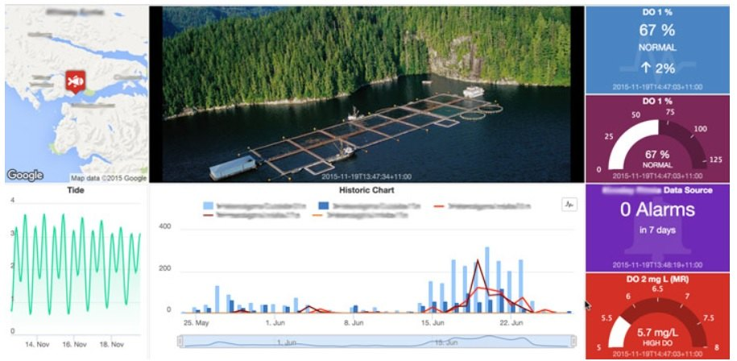

## <i class="bi bi-compass"></i> Po co ten wykład {#cele}

[Pytanie modułu: **co jest urządzeniem, co telemetrią, co atrybutem — i kto ma prawo to zmienić?**]{.lead}

::: {.columns}
::: {.column width="52%"}
### Cele

::: {.incremental}
* Rozróżnić telemetrię od atrybutów i uzasadnić, dlaczego to nie jest formalność.
* Opisać kontrakt tematów MQTT platformy i typy poświadczeń.
* Zbudować sterowanie zwrotne, które pokazuje **stan potwierdzony**, nie żądany.
* Ocenić ryzyko dostawcy i licencji jako parametr projektowy.
:::
:::

::: {.column width="48%"}
### Droga

1. Dlaczego nie zaczynamy od wykresu
2. Telemetria i trzy zakresy atrybutów
3. Tematy, porty, poświadczenia
4. Pulpit i sterowanie przez RPC
5. Cyfrowy bliźniak — jedno omówienie
6. Ryzyko dostawcy i licencji
:::
:::

# Model danych {.sekcja .foto background-color="#0b3b45" background-image="../assets/img/kurs/monitory-diagnostyczne.jpg" background-size="cover"}


[Fot. Siarhei Besarab, CC BY-SA 4.0]{.zrodlo}

## <i class="bi bi-layout-text-window"></i> Wykres jest ostatni, nie pierwszy {#model-najpierw}

Wykres jest **ostatnim elementem łańcucha**. Najpierw powstaje model danych — i to on decyduje, czy wykres będzie w ogóle możliwy do narysowania.

::: {.columns}
::: {.column width="50%"}
**Kolejność, która działa**

::: {.incremental}
1. Co jest **urządzeniem** w platformie i jak się identyfikuje.
2. Które pola to **telemetria** (szereg czasowy), a które **atrybuty** (ostatnia wartość).
3. Kto ma prawo **zapisać** każdy rodzaj danych.
4. Jakie **reguły** mają się uruchomić i na czym się opierają.
5. **Dopiero teraz** — jaki widget i na którym pulpicie.
:::
:::

::: {.column width="50%"}
::: {.callout-warning title="Kolejność, która nie działa"}
Zaczynamy od pulpitu, dobieramy widget, a potem dopasowujemy do niego dane z urządzenia.

Efekt: wersja firmware i adres IP jako szereg czasowy, progi alarmowe zaszyte w widgecie zamiast w regułach alarmowych, i zmiana okresu próbkowania wymagająca ponownego wgrania firmware.
:::
:::
:::

---

## <i class="bi bi-database"></i> Telemetria i trzy zakresy atrybutów {#rodzaje}

| Rodzaj | Zapisuje | Historia | Typowa zawartość |
|:---|:---|:---|:---|
| **Telemetria** (szereg czasowy) | głównie urządzenie (także reguły, REST) | **tak**, z TTL | temperatura, wilgotność, napięcie zasilania |
| **Atrybuty klienta** | urządzenie | nie (ostatnia wartość) | wersja firmware, adres IP, model płytki |
| **Atrybuty współdzielone** | **platforma → urządzenie** | nie | okres próbkowania, progi, wskazanie pakietu OTA |
| **Atrybuty serwerowe** | platforma i użytkownik; **urządzenie ich nie widzi** | nie | `active`, `lastActivityTime`, `inactivityTimeout`, lokalizacja |

::: {.fragment}
::: {.callout-important title="Najczęstszy błąd projektowy"}
Wysyłanie wersji firmware i adresu IP **jako telemetrii**. Powstaje wtedy szereg czasowy tysięcy
identycznych wartości, który zajmuje miejsce i niczego nie wnosi. **To są atrybuty** — to samo
rozróżnienie, które wprowadziliśmy w module 03 przy sile sygnału i adresie IP.

**Wyjątek:** wbudowane OTA platformy oczekuje stanu aktualizacji (`fw_state`, `current_fw_version`) jako **telemetrii** — tu historia przejść ma wartość.
:::
:::

---

## <i class="bi bi-sliders"></i> Atrybuty współdzielone: konfiguracja bez OTA {#wspoldzielone}

::: {.columns}
::: {.column width="52%"}
Atrybut współdzielony to kanał **z platformy do urządzenia**, przeznaczony dla wartości, które
zmieniają się rzadko i mają przeżyć restart. Subskrypcja dostarcza tylko **zmiany** — po starcie urządzenie samo **pobiera** bieżące wartości (`attributes/request`).

::: {.incremental}
* okres próbkowania,
* progi przełączenia wyjścia,
* adres brokera zapasowego,
* wskazanie pakietu firmware do pobrania.
:::

::: {.fragment}
Zmiana okresu próbkowania z 60 s na 300 s to **edycja pola w interfejsie**, nie nowe wydanie firmware.
:::
:::

::: {.column width="48%"}
```{mermaid}
%%| fig-width: 6.4
%%| fig-height: 7.3
%%{init: {"themeVariables": {"fontSize": "30px"}, "flowchart": {"nodeSpacing": 22, "rankSpacing": 32, "padding": 6, "diagramPadding": 4}}}%%
flowchart TD
    P["Platforma<br>samplingPeriodSec = 300"]
    D["ESP32<br>zapis w NVS"]
    N["Nowe zachowanie"]
    P -- "zmiana" --> D
    D --> N
    N -. "potwierdzenie" .-> P
    classDef n fill:#e8f2f4,stroke:#0b6b78,stroke-width:2px,color:#0b3b45
    class P,D,N n
```

::: {.fragment}
Urządzenie **potwierdza** przyjętą wartość jako atrybut klienta. Bez tego nie wiemy, czy zmiana dotarła — wiemy tylko, że ją wysłano.
:::
:::
:::

# Styk z urządzeniem {.sekcja .foto background-color="#0b3b45" background-image="../assets/img/kurs/panel-robota.jpg" background-size="cover"}


[Fot. Artem Svetlov, CC BY 2.0]{.zrodlo}

## <i class="bi bi-signpost-split"></i> Kontrakt tematów MQTT platformy {#tematy}

| Operacja | Temat standardowy | Skrót | Kierunek |
|:---|:---|:---|:---|
| Telemetria | `v1/devices/me/telemetry` | `v2/t` | urządzenie → platforma |
| Atrybuty klienta | `v1/devices/me/attributes` | `v2/a` | urządzenie → platforma |
| Atrybuty współdzielone | `v1/devices/me/attributes` | `v2/a` | platforma → urządzenie (subskrypcja zmian) |
| Pobranie atrybutów po starcie | `v1/devices/me/attributes/request/$id` | `v2/a/req/$id` | urządzenie → platforma, odpowiedź w `…/response/$id` |
| Żądanie RPC | `v1/devices/me/rpc/request/+` | `v2/r/req/+` | platforma → urządzenie |
| Odpowiedź urządzenia | `v1/devices/me/rpc/response/$id` | `v2/r/res/$id` | urządzenie → platforma |

::: {.columns}
::: {.column width="50%"}
* Tematy skrócone są dostępne **od ThingsBoard 3.5** i mogą mieć przyrostek serializacji: `/j` dla JSON, `/p` dla Protobuf. Bez przyrostka obowiązuje format ustawiony w profilu urządzenia.
* Porty: **1883** bez szyfrowania, **8883** z TLS. Obsługiwane wersje: MQTT 3.1, 3.1.1 i 5.0.
:::

::: {.column width="50%"}
ThingsBoard obsługuje na tym styku wyłącznie **QoS 0 i 1**. Projekt nie może zakładać semantyki „dokładnie raz" — **idempotencja odbiornika jest obowiązkowa**.
:::
:::

---

## <i class="bi bi-shield-lock"></i> Poświadczenia urządzenia {#poswiadczenia}

::: {.columns}
::: {.column width="55%"}
| Typ | Jak działa | Kiedy stosować |
|:---|:---|:---|
| **Access Token** | token jest **nazwą użytkownika** MQTT, hasło pozostaje puste | ćwiczenie, szybki start |
| **MQTT Basic** | `clientId`, login z hasłem — albo oba naraz | gdy potrzebny jawny `clientId` |
| **X.509** | certyfikat przy dwustronnym TLS | wdrożenie produkcyjne |

::: {.fragment}
Wybór typu poświadczenia jest decyzją bezpieczeństwa, nie wygody — i zapisujemy go razem z resztą
założeń z modułu 01.
:::
:::

::: {.column width="45%"}
::: {.callout-important title="Access token jest sekretem"}
Token urządzenia **nie może** znaleźć się w sprawozdaniu, zrzucie ekranu, logu ani w repozytorium.

Ujawniony token pozwala obcemu urządzeniu **podszyć się pod Twoje**: publikować fałszywą telemetrię pod Twoją nazwą i odbierać polecenia przeznaczone dla Ciebie.
:::

::: {.fragment}
Zrzut ekranu z konfiguracją urządzenia to najczęstszy sposób przypadkowego ujawnienia tokenu w sprawozdaniu.
:::
:::
:::

---

## <i class="bi bi-arrow-left-right"></i> Sterowanie zwrotne: RPC z potwierdzeniem {#rpc}

::: {.columns}
::: {.column width="48%"}
```{mermaid}
%%| fig-width: 6.6
%%| fig-height: 3.3
%%{init: {"sequence": {"mirrorActors": false, "actorMargin": 30, "width": 150, "height": 46, "boxMargin": 6, "noteMargin": 6, "messageMargin": 22, "diagramMarginX": 10, "diagramMarginY": 6}}}%%
sequenceDiagram
    participant U as Pulpit
    participant P as Platforma
    participant D as ESP32
    U->>P: setSwitch(true)
    P->>D: request/42
    Note over D: wykonaj<br>i zmierz stan
    D->>P: response/42: pump=true
    P->>U: POTWIERDZONY
```

::: {.fragment}
::: {.callout-note title="Istota sterowania, które można audytować"}
Przełącznik ze stanem żądanym kłamie, gdy urządzenie nie odpowiedziało. Ze stanem potwierdzonym **mówi prawdę albo nic** — i to drugie też jest informacją.
:::
:::
:::

::: {.column width="52%"}
::: {.incremental}
1. Pulpit wysyła żądanie z **metodą** (np. `setSwitch`) i parametrami.
2. Urządzenie odbiera je w temacie żądań z identyfikatorem `$id`.
3. Wykonuje je **idempotentnie** — najlepiej polecenie „ustaw stan = X”, nie „przełącz”, bo `$id` może się powtórzyć po restarcie.
4. Publikuje odpowiedź w temacie odpowiedzi z **tym samym `$id`** i podaje **rzeczywisty stan wyjścia**.
5. Pulpit pokazuje stan **potwierdzony**. Wymaga to RPC **dwukierunkowego**; jednokierunkowe kończy się na wysłaniu. Trwałe RPC ma statusy i ponowienia.
:::
:::
:::

---

## <i class="bi bi-bar-chart"></i> Od telemetrii do pulpitu {#pulpit}

::: {.columns}
::: {.column width="50%"}
**Co pulpit powinien pokazywać**

::: {.incremental}
* Wartość bieżącą **wraz z jej wiekiem** — „22,5 °C sprzed 4 s" znaczy co innego niż „22,5 °C sprzed dwóch godzin".
* Stan wyjścia **potwierdzony przez urządzenie**.
* Wersję firmware jako **atrybut**, nie punkt na wykresie.
* Stan łączności — `active` i `lastActivityTime` z atrybutów serwerowych (`active` zmienia się dopiero po `inactivityTimeout`, domyślnie 600 s).
:::
:::

::: {.column width="50%"}
**Czego pulpit nie zastąpi**

::: {.incremental}
* **Reguł alarmowych** (od wersji 4.3 przypinanych do profilu albo do encji) — próg zaszyty w widgecie działa tylko wtedy, gdy ktoś patrzy na ekran.
* **Retencji danych** — TTL telemetrii jest ustawieniem platformy, nie właściwością wykresu.
* **Dowodu** — zrzut pulpitu nie jest zapisem zdarzenia. Zapisem jest telemetria i log alarmów.
:::
:::
:::

::: {.fragment}
::: {.callout-tip title="Test, który warto wykonać na każdym pulpicie"}
Odłącz urządzenie i popatrz na pulpit przez minutę. Jeżeli wiek ostatniego pomiaru nie rośnie i wszystko wygląda tak samo jak przy działającym
urządzeniu — pulpit jest źle zaprojektowany.
:::
:::

---

## <i class="bi bi-speedometer2"></i> Pulpit ma pokazywać stan, nie tylko wykres {#pulpit-przyklad}

::: {.columns}
::: {.column width="62%"}
{width="100%" fig-alt="Przykładowy pulpit IoT dla hodowli ryb: bieżące wartości jakości wody, wykresy trendów, mapa i elementy alarmowe."}

::: {.zrodlo}
Przykład pulpitu środowiskowego IoT (nie interfejs ThingsBoard). Fot. Stephane Malhomme, [Wikimedia Commons](https://commons.wikimedia.org/wiki/File:Aquaculture_iot_water_monitoring_solution_pentair_eagle.io.jpg), CC BY-SA 4.0.
:::
:::

::: {.column width="38%"}
Na przykładzie można wskazać trzy warstwy informacji:

::: {.incremental}
1. **Stan bieżący** — wartości i czas ostatniego pomiaru.
2. **Kontekst** — trend, lokalizacja i progi.
3. **Wyjątek** — alarm wymagający działania operatora.
:::

Ten układ przenosimy do ThingsBoard, ale budujemy go z własnych widgetów i encji.
:::
:::

# Kontekst i ryzyko {.sekcja .foto background-color="#0b3b45" background-image="../assets/img/kurs/turbina-serwis.jpg" background-size="cover"}


[Fot. U.S. Department of Energy, domena publiczna]{.zrodlo}

## <i class="bi bi-boxes"></i> Cyfrowy bliźniak {#bliźniak}

::: {.columns}
::: {.column width="55%"}
::: {.incremental}
* Wirtualna reprezentacja obiektu, systemu albo ekosystemu, **zasilana danymi w czasie rzeczywistym** i rzutowana na model inżynierski.
* Pozwala przeprowadzać symulacje „co jeśli": co się stanie, gdy zawór nr 43 ulegnie awarii podczas szczytu poboru.
* Zastosowania: od optymalizacji maszyn po modelowanie wymiany gazowej na obszarach leśnych.
* Umożliwia testowanie zmian w oprogramowaniu bez zatrzymywania rzeczywistej instalacji.
:::
:::

::: {.column width="45%"}
Cyfrowy bliźniak **nie jest wizualizacją 3D**. Jego istotą jest model zasilany danymi bieżącymi i umożliwiający symulację; renderowanie przestrzenne jest opcjonalnym interfejsem, nie definicją.
:::
:::

---

## <i class="bi bi-buildings"></i> Zastosowania w skali miasta i zakładu {#smart-city}

::: {.columns}
::: {.column width="50%"}
**Infrastruktura miejska**

::: {.incremental}
* Oświetlenie reagujące na rzeczywisty ruch pieszy na peryferiach.
* Czujniki zapełnienia pojemników wyznaczające trasę odbioru odpadów.
* Nawadnianie parków sprzężone z wilgotnością gleby — pompa nie ruszy dzień po deszczu.
* Sieci monitoringu jakości powietrza.
:::
:::

::: {.column width="50%"}
**Przemysł**

::: {.incremental}
* Przewidywanie awarii na podstawie analizy drgań i temperatur.
* Pełna przejrzystość lokalizacji partii w łańcuchu dostaw.
* Optymalizacja przezbrojeń na podstawie danych z maszyn.
:::

::: {.fragment}
**Pytanie, które otwiera moduł 07:** gdy system liczy pojazdy i odczytuje tablice rejestracyjne, kto kontroluje dostęp do statystyk o przemieszczaniu się mieszkańców?
:::
:::
:::

::: {.fragment}
Deklarowane oszczędności procentowe we wdrożeniach miejskich wymagają raportu źródłowego. Bez niego należy traktować je jako wartości poglądowe, a nie dane pomiarowe.
:::

---

## <i class="bi bi-exclamation-diamond"></i> Ryzyko dostawcy i licencji {#ryzyko}

::: {.columns}
::: {.column width="50%"}
**Usługa zarządzana może zniknąć**

::: {.incremental}
* Wycofanie **Google Cloud IoT Core** ogłoszono w **sierpniu 2022 r.**, a usługę wyłączono **16 sierpnia 2023 r.**
* Tysiące wdrożeń wymagało kosztownej migracji.
* Wniosek: **wyjście z platformy projektujemy od początku**, nie w dniu ogłoszenia wycofania.
:::

::: {.fragment}
To ten sam rodzaj ryzyka, który w module 03 widzieliśmy przy operatorze sieci Sigfox.
:::
:::

::: {.column width="50%"}
**Oprogramowanie lokalne też zmienia licencję**

**ThingsBoard 4.4 (29.09.2026) używa licencji Business Source License 1.1** i łączy linie CE/PE w jeden produkt *source-available*. Kod wydania przechodzi na Apache 2.0 po czterech latach. **CE 4.3 LTS** zostaje na Apache 2.0, z poprawkami bezpieczeństwa do 20.07.2027.

::: {.fragment}
::: {.callout-important title="Nasze laboratorium: ThingsBoard CE 4.3 LTS"}
Licencja **Apache 2.0**, poprawki bezpieczeństwa do **20.07.2027**. Zapisz w sprawozdaniu **dokładną wersję** instalacji i **datę sprawdzenia**.
:::
:::
:::
:::

---

## <i class="bi bi-diagram-2"></i> CE a PE — co z tego wynika dla ćwiczeń {#ce-pe}

::: {.columns}
::: {.column width="52%"}
Na zajęciach pracujemy na **CE 4.3 LTS**, gdzie Community Edition i Professional Edition różnią się zakresem funkcji. Od wersji 4.4 linie są scalone w jeden produkt *source-available*.

Dlatego instrukcja znaleziona w sieci może opisywać inną wersję, edycję lub licencję niż instalacja używana na zajęciach.

::: {.callout-note title="Rozdział a izolacja"}
Platforma daje **rozdział logiczny**: dzierżawcy, klienci, profile, uprawnienia. **Izolacja fizyczna** to decyzja wdrożeniowa — osobne instalacje albo bazy danych.
:::

:::

::: {.column width="48%"}
::: {.incremental}
* **Nasza wersja (4.3 LTS):** materiał PE albo 4.4 może opisywać funkcję nieobecną w CE.
* Dla wersji ≥ 4.4 darmowa licencja obejmuje zastosowania **niekomercyjne, w tym edukację, do 1000 urządzeń**, z pełnym zestawem funkcji; komercyjnie — do 100 urządzeń na jednym serwerze.
* Program grantowy dotyczy tylko wdrożeń produkcyjnych CE sprzed 29.09.2026.
* Przed użyciem materiału zapisujemy wersję, licencję i datę sprawdzenia.
:::
:::
:::

---

## <i class="bi bi-clipboard-check"></i> Test odbioru modułu {#test-odbioru}

::: {.pytania}
* Urządzenie widoczne w platformie, telemetria napływa i jest widoczna na wykresie.
* **Model płytki i adres IP widnieją jako atrybuty klienta**, nie jako szereg czasowy.
* Zmiana atrybutu współdzielonego (np. okresu próbkowania) zmienia zachowanie urządzenia **bez ponownego wgrywania firmware**.
* Przełącznik na pulpicie zmienia stan aktuatora, a pulpit pokazuje **stan potwierdzony przez urządzenie**.
* **Wersja instalacji (CE 4.3 LTS, Apache 2.0) zapisana w sprawozdaniu** wraz z datą sprawdzenia.
:::

---

## <i class="bi bi-question-circle"></i> Pytania sprawdzające {#pytania}

::: {.pytania}
* Po tygodniu pracy baza platformy urosła dziesięciokrotnie bardziej, niż przewidywano, choć liczba pomiarów się zgadza. Które pole najprawdopodobniej wysyłano jako telemetrię zamiast jako atrybut i jak to sprawdzić?
* Operator klika przełącznik na pulpicie, wskaźnik zmienia się na „włączone", ale pompa nie działa. W której z dwóch możliwych implementacji sterowania ten objaw w ogóle nie mógłby wystąpić — i dlaczego?
* Instrukcja z internetu opisuje funkcję, której nie ma w Twojej instalacji. Wymień dwie przyczyny, które trzeba sprawdzić, zanim uznasz to za błąd instalacji.
:::

---

## <i class="bi bi-flag"></i> Podsumowanie i przejście {#podsumowanie}

::: {.columns}
::: {.column width="55%"}
**Co zostaje z tego modułu**

::: {.incremental}
* Platforma to najpierw **model danych**, dopiero potem pulpit.
* Telemetria ma historię, atrybuty mają ostatnią wartość — pomylenie ich kosztuje miejsce i sens.
* Atrybuty współdzielone pozwalają zmieniać konfigurację **bez wydania firmware**.
* Platforma gwarantuje na styku MQTT najwyżej QoS 1; idempotencja jest obowiązkowa.
* Pulpit pokazuje **stan potwierdzony**, nie żądany.
* Wersja i licencja instalacji to zapis w sprawozdaniu, nie ciekawostka.
:::
:::

::: {.column width="45%"}
::: {.callout-note title="Moduł 07 — odporność i eksploatacja"}
System działa i da się nim sterować. Ostatni moduł przechodzi przez całość przekrojowo: jak system ma **sam zauważyć**, że urządzenie zamilkło, jak udowodnić, że alarm zamyka się po powrocie, i jakie obowiązki wychodzą poza kod.
:::
:::
:::

---

## <i class="bi bi-journal-text"></i> Źródła {#zrodla}

::: {style="font-size: 0.7em;"}
* ThingsBoard, *MQTT API* — tematy standardowe i skrócone, porty, wersje protokołu, QoS, typy poświadczeń: <https://thingsboard.io/docs/reference/mqtt-api/>
* ThingsBoard, *Telemetry*: <https://thingsboard.io/docs/user-guide/telemetry/> oraz *Attributes*: <https://thingsboard.io/docs/user-guide/attributes/>
* ThingsBoard, *RPC* — jedno- i dwukierunkowe, trwałe RPC: <https://thingsboard.io/docs/user-guide/rpc/>
* ThingsBoard, *Device connectivity status* — `active`, `inactivityTimeout`: <https://thingsboard.io/docs/user-guide/device-connectivity-status/>
* ThingsBoard 4.3 — *Alarm Rules 2.0*: <https://thingsboard.io/blog/thingsboard-4-3-alarm-rules-2-0-enhanced-calculated-fields-api-keys-and-more/>
* ThingsBoard, *Dashboards*: <https://thingsboard.io/docs/user-guide/dashboards/>
* ThingsBoard, informacja o scaleniu produktu i licencji BSL 1.1 od wersji 4.4: <https://thingsboard.io/blog/one-thingsboard-source-available/> oraz *Community Grant Program*: <https://thingsboard.io/community-grant-program/>
* Google Cloud, archiwalne *IoT Core release notes* — komunikat o wyłączeniu 16 sierpnia 2023 r. (kopia oficjalnej strony z 18 sierpnia 2022 r.): <https://web.archive.org/web/20220818025528id_/https://cloud.google.com/iot/docs/release-notes>
:::
