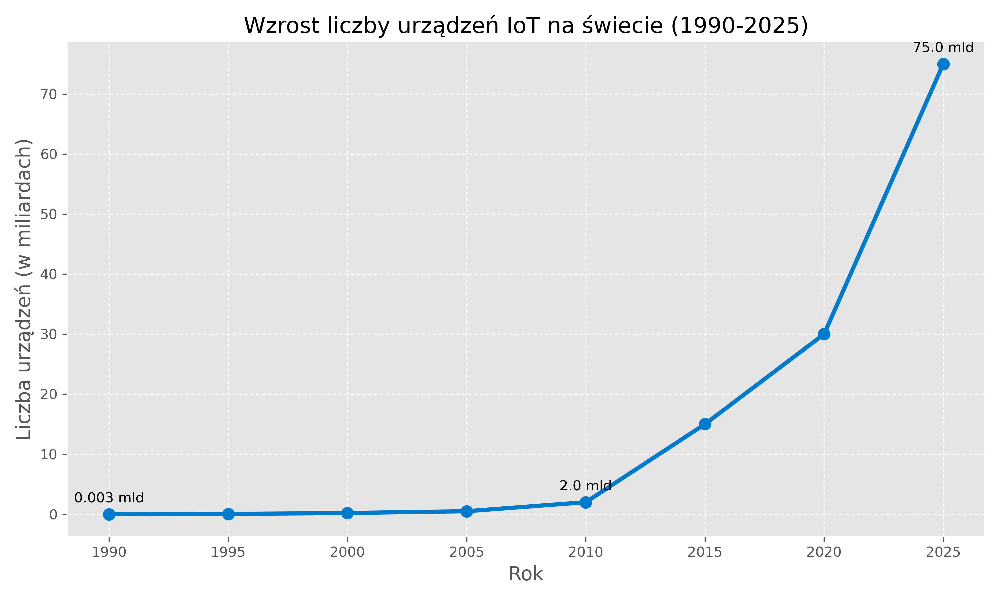
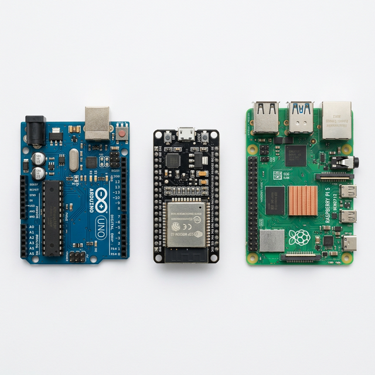

# Prolog: Pragnienie, które zrodziło cyfrowy ekosystem {background-color="#f8f9fa"}

## <i class="bi bi-telephone-outbound"></i> 1. Ewolucja: Od punktu do punktu

Zanim maszyny zaczęły rozmawiać autonomicznie, musieliśmy zbudować drogi.

::: {.incremental}
* **1832:** Baron Schilling konstruuje w Rosji pierwszy telegraf elektromagnetyczny. Zdefiniowało to komunikację punkt-punkt.
* **1844:** Publiczne wiadomości telegraficzne kodem Samuela Morse'a.
* **1876:** Patent Aleksandra Bella na telefon (komunikacja głosowa na odległość).
* **1955:** Edward O. Thorp buduje pierwszy komputer ubieralny (wearable) do przewidywania ruletki.
* **1969:** Uruchomienie sieci ARPANET (komutacja pakietów, fundament dzisiejszego Internetu).
:::

::: {.notes}
Historia IoT jest nierozerwalnie związana z rozwojem komunikacji. Pokaż słuchaczom, że potrzeba przesyłania danych na odległość istnieje od wieków, ale dopiero lata 80. i 90. XX wieku przyniosły miniaturyzację pozwalającą wyeliminować z tego łańcucha żywego operatora (telegrafistę).
:::

---

## <i class="bi bi-cup-straw"></i> 2. Mit Założycielski: Pragnienie

Kawa, kod i chęć oszczędności czasu – od tego zaczął się IoT.

::: {.columns}
::: {.column width="60%"}
::: {.incremental}
* **Gdzie?** Carnegie Mellon University (CMU), wydział informatyki.
* **Kiedy?** Rok 1982.
* **Problem:** Studenci pracujący po nocach schodzili piętro niżej po napoje do automatu z Coca-Colą.
* Często dowiadywali się na miejscu, że w automacie brakuje napojów.

:::
:::

::: {.column width="40%"}
::: {.fragment}
::: {.callout-note}
### Narodziny idei
„Zrobmy tak, żeby maszyna sama nam mówiła, czy jest sens do niej schodzić”.
:::
:::
:::
:::

::: {.notes}
**Rozpoczęcie:** Studenci, zamiast chodzić po schodach, postanowili wykorzystać to, co umieli najlepiej – połączyć maszynę z lokalną siecią wydziału (pre-internetem ARPANET). Zainstalowali mikroprzełączniki rejestrujące fakt otwarcia drzwiczek oraz ładowania butelki (by mierzyć czas chłodzenia). Informacje te były dostępne zdalnie przez program Finger. To był dowód koncepcji: rzeczy mogą się komunikować bez człowieka w środku.
:::

---

## <i class="bi bi-person-fill"></i> 3. Kevin Ashton i Toster (Lata 90.)

Od uczelnianych ciekawostek do potencjału komercyjnego.

::: {.columns}
::: {.column width="50%"}
### Pierwsze urządzenie TCP/IP (1990)
::: {.incremental}
* J. Romkey na konferencji Interop udowodnił potęgę stosu TCP/IP.
* Zdalnie sterowany **toster kuchenny**.
* Włączanie i wyłączanie odbywało się z użyciem Internetu.
* Jedna wada: człowiek musiał najpierw włożyć do niego chleb.
:::
:::

::: {.column width="50%"}
### Narodziny Terminu "IoT" (1999)
::: {.incremental}
* Kevin Ashton, Procter & Gamble (P&G).
* Analizował łańcuchy dostaw, poszukując przyczyny pustych półek ze szminkami Olay.
* Sformułował przełomową prezentację pt. **„The Internet of Things”**.
* Zidentyfikował technologię RFID jako klucz do autonomicznego śledzenia towarów.
:::
:::
:::

::: {.notes}
Ashton zauważył, że problemem nie była logistyka przesyłek, ale brak widoczności w czasie rzeczywistym. "Komputery wiedzą o rzeczach tylko to, co my im powiemy" - to zdanie z jego prezentacji w 1999 definiuje ograniczenia starych systemów IT.
:::

---

## <i class="bi bi-globe"></i> 3. Moment Zwrotny: Skala zjawiska

Prawdziwy IoT zaczyna się tam, gdzie człowiek przestaje być głównym twórcą danych.

::: {.columns}
::: {.column width="50%"}
::: {.incremental style="font-size: 0.85em"}
* **Czym jest IoT?** To sieć składająca się z urządzeń posiadających unikalne identyfikatory (UID) potrafiących wymieniać dane autonomicznym strumieniem bez interakcji człowieka.
* **Podział Urządzeń:** 
    * *Digital-first:* Projektowane z myślą o sieci (laptopy, smartfony).
    * *Physical-first:* Przedmioty fizyczne, stające się widoczne w sieci dzięki dołożonym mikroczipom (bramy wjazdowe, żarówki, pralki).
* **Rok 2008 / 2009:** Historyczny Rubikon.
* Wtedy po raz pierwszy liczba aktywnych, połączonych urządzeń przewyższyła całkowitą populację ludzi na Ziemi (moment zdefiniowany analizami Cisco).
:::
:::

::: {.column width="50%"}
::: {.fragment}
{width=85%}

::: {style="font-size: 0.6em; color: gray;"}
Źródło: Cisco Annual Internet Report
:::

:::
:::
:::

::: {.notes}
Do 2008 roku "internet" w dużej mierze polegał na tym, co wpisał człowiek: status na MySpace, mail w skrzynce, zapytanie w Google. 
Zmiana polega na pasywnym i aktywnym generowaniu gigabajtów danych telemetrycznych, o których ludzkość nie ma pojęcia dopóki komputer nie wskaże anomalii. Zwróć uwagę na eksponencjalny wzrost na wykresie w ciągu ostatnich 10 lat – to efekt boomu małych mikrokontrolerów.
:::

---

# Rozdział I: Anatomia „Cyfrowej Rzeczy” {background-color="#f8f9fa"}

## <i class="bi bi-layers"></i> 4. Architektura Systemów IoT

Rozbicie abstrakcyjnego pojęcia „inteligentnego przedmiotu” na logiczne ramy (warstwy).

::: {.incremental}
* Aby system działał, komunikacja musi posiadać hierarchiczną, 3-warstwową konstrukcję ustandaryzowaną przez IEEE.
* Jak układ nerwowy człowieka: czuje, przekazuje szybki impuls, analizuje go w mózgu.
* Powszechnie przyjęty model zakłada trzy filary: 
  * Percepcję (Czujniki i Aktuatory)
  * Sieć (Bramy i Routing)
  * Aplikację (Interfejsy i Analityka)
:::

::: {.notes}
Kluczowe w modelu jest odizolowanie poszczególnych procesów. Architektura warstwowa daje systemowi możliwość aktualizacji i konserwacji bez pełnego przebudowywania układu. Jeśli wymieniasz stary router na lepszy, czujnik krańcowy na zewnątrz nie powinien w ogóle o tym wiedzieć.
:::

---

## <i class="bi bi-cpu-fill"></i> 5. Schemat przepływu

Trzy warstwy to fundament – bez płynnego ruchu informacji w pionie, system paraliżuje się.

::: {.column width="100%"}
<div style="text-align: center; transform: scale(3.5); transform-origin: top center; margin-top: 50px;">
::: {.r-stack}

<!-- KROK 1 -->
::: {.fragment .fade-out fragment-index=1}
```{mermaid}
%%| fig-align: center
%%| fig-width: 3
%%| fig-height: 1
%%{init: {'theme': 'default', 'flowchart': { 'useMaxWidth': false, 'htmlLabels': false }, 'themeVariables': { 'fontSize': '20px', 'fontFamily': 'sans-serif', 'fontColor': '#000000', 'lineColor': '#000000' }}}%%

graph TD
    A["Warstwa Percepcji:<br>Czujniki, Aktuatory"] 
```
:::

<!-- KROK 2 -->
::: {.fragment .current-visible fragment-index=1}
```{mermaid}
%%| fig-align: center
%%| fig-width: 3
%%| fig-height: 1.2
%%{init: {'theme': 'default', 'flowchart': { 'useMaxWidth': false, 'htmlLabels': false }, 'themeVariables': { 'fontSize': '20px', 'fontFamily': 'sans-serif', 'fontColor': '#000000', 'lineColor': '#000000' }}}%%

graph TD
    A["Warstwa Percepcji:<br>Czujniki, Aktuatory"] --> B["Warstwa Sieciowa:<br>Gateway, MQTT, Wi-Fi"]
```
:::

<!-- KROK 3 -->
::: {.fragment .fade-in fragment-index=2}
```{mermaid}
%%| fig-align: center
%%| fig-width: 3
%%| fig-height: 2
%%{init: {'theme': 'default', 'flowchart': { 'useMaxWidth': false, 'htmlLabels': false }, 'themeVariables': { 'fontSize': '15px', 'fontFamily': 'sans-serif', 'fontColor': '#000000', 'lineColor': '#000000' }}}%%

graph TD
    A["Warstwa Percepcji:<br>Czujniki, Aktuatory"] --> B["Warstwa Sieciowa:<br>Gateway, MQTT, Wi-Fi"]
    B --> C["Warstwa Aplikacji:<br>Dashboardy, Analityka Cloud"]
```
:::
:::
</div>
:::

::: {.notes}
Warstwa percepcji to palce systemu. Warstwa sieci to rdzeń kręgowy. Warstwa aplikacji to kora mózgowa. 
Podkreśl prelegentom, że nie zawsze informacja musi iść w górę do aplikacji – w nowoczesnym Edge Computing, jeśli warstwa percepcji wyczuje „ból” (np. awarię prasy hydraulicznej), to na poziomie bramy Edge następuje odcięcie mocy, z całkowitym zignorowaniem długiej i wolnej drogi do Chmury.
:::

---

## <i class="bi bi-eye"></i> 6. Warstwa Percepcji: Zmysły maszyny

Jak fizyka staje się sygnałem cyfrowym?

::: {.columns}
::: {.column width="60%"}
::: {.incremental}
* **Rodzaje "czucia":** temperatura, wilgotność, natężenie światła, gazy (VOC, CO2), ciśnienie, ruch (akcelerometry), wibracje, geolokalizacja (GPS).
* **Klasyfikacja czujników:**
    * Pasywne (nie wymagają zasilania do detekcji – np. fotorezystor).
    * Aktywne (emitują sygnał by zmierzyć odbicie, np. ultradźwięki, Lidar).
* Rola kalibracji (np. drift wskazań sensora, dryft zera).
:::
:::

::: {.column width="40%"}
::: {.fragment}
::: {.callout-note}
### Wady Świata Fizycznego
Środowisko naturalne niszczy sprzęt. Ekstremalne drgania na linii produkcyjnej zniszczą lutowane łącza szybciej niż jakikolwiek protokół przestanie mieć rację bytu.
:::
:::
:::
:::

::: {.notes}
Klucz inżynierski: sam proces „uzyskania pomiaru” to konwersja wielkości fizycznej na sygnał elektryczny (najczęściej napięcie lub natężenie), który następnie przechodzi przez Przetwornik Analogowo-Cyfrowy (ADC), otrzymując numeryczny byt, zazwyczaj rzędu bitowego mrugania mikrokontrolera.
:::

---

## <i class="bi bi-hammer"></i> 7. Warstwa Percepcji: Aktuatory

Aby mieć wpływ na fizykę, system wykorzystuje aktuatory – elementy wykonawcze. 

::: {.incremental}
* Informacja zwrotna: Posiadanie dachu reagującego na burzę wymaga elementu domykającego włazy.
* **Typy urządzeń wykonawczych:**
    * *Elektryczne:* przekaźniki półprzewodnikowe, serwomechanizmy, silniki krokowe, oświetlenie.
    * *Ciekłe/Gazowe:* elektrozawory (kontrola nawadniania, upusty ciśnienia).
* Przepływ pracy (Pętla Sterowania):
    * Pomiar → Decyzja w warstwie wyższej → Akcja Aktuatora.
:::

::: {.notes}
Każdy aktuator stwarza „ryzyko twarde” - jeśli czujnik okłamie system (fałszywy odczyt mrozu z uszkodzonego termistora), system w dobrej wierze załączy grzałki, co może stworzyć ryzyko pożarowe. Warto poruszyć z audytorium aspekt niezawodności w systemach czasu rzeczywistego (RTOS).
:::

---

## <i class="bi bi-router"></i> 8. Brama brzegu sieci (Edge Gateway)

Zjawisko izolacji i ochrony w sieciowych gardłach.

::: {.columns}
::: {.column width="50%"}
::: {.incremental}
* **Edge Computing "Brzeg sieci":** Odchodzimy od przesyłania *wszystkich* danych bezpośrednio do wielkiej chmury. 
* Gateway staje się inteligentnym hubem: uczy się, filtruje, przesyła średnie agregaty (nie 10 milionów pakietów drgań na sekundę, tylko log "Stan Łożyska: Stabilny").
:::
:::

::: {.column width="50%"}
::: {.fragment}
::: {.callout-warning}
### Latency
Czas pokonania trasy danych od urządzenia do chmury obliczeniowej i z powrotem z komendą do urządzenia. Często jest krytyczny (np. hamowanie autonomicznych pojazdów), dlatego przenieśliśmy inteligencję blisko brzegu sieci (Edge).
:::
:::
:::
:::

::: {.notes}
Będziemy wielokrotnie słyszeć termin Gateway, czyli lokalna brama (często fizycznie skrzynka montowana na szynie DIN w rozdzielnicy) agregująca w fabryce setki małych czujników Bluetooth, tłumacząca sygnał na Ethernet/Światłowód i przesyłająca go dalej na zewnątrz firmy przez VPN. Translacja języka radia to kwintesencja bramek.
:::

---

# Rozdział II: Narzędzia Twórców – Prototypowanie {background-color="#f8f9fa"}

## <i class="bi bi-lightbulb"></i> 9. Od pomysłu do wdrożenia

Złoty wiek IoT to zasługa drastycznego obniżenia bariery wejścia i skrócenia czasu od pomysłu do wdrożenia (Time To Market).

::: {.incremental}
* Przed dekadą zaprojektowanie modułu testującego łączność to były miesiące testowania specjalistycznych płytek drukowanych PCB, analiz schematów Altium/Eagle.
* Zjawisko „Rapid Prototyping” (Szybkiego Prototypowania).
* Gotowe środowiska deweloperskie ustandaryzowały piny, uziemienia (GND), zasilania (VCC), porty wejścia-wyjścia cyfrowego (GPIO).
:::

::: {.notes}
Pokazując środowiska DIY, warto podkreślić, że inżynieria Przemysłu 4.0 również zaczyna od gotowego sprzętu w celu weryfikacji koncepcji (proof-of-concept). Najwięksi liderzy przemysłowi posiadają wewnętrzne struktury badawcze, budujące prototypy z gotowych modułów (Arduino/Raspberry Pi), zanim zlecą produkcję docelowego układu w technice SMT.
:::

---

## <i class="bi bi-motherboard"></i> 10. Platformy sprzętowe jako kamień węgielny

Wybór platformy zależy od poboru mocy i profilu radiowego.

::: {.columns}
::: {.column width="35%"}
### Mikrokontrolery (MCU)
::: {.incremental}
* **Arduino:** Klasyczne, edukacyjne, łatwy w przyswojeniu język C/C++. Brak łączności radiowej na samej płytce (trzeba dodatkowych tzw. shieldów).
* **ESP32:** Król taniego, profesjonalnego IoT. Układ SoC (System on Chip) z wbudowanym Wi-Fi i Bluetooth, a w trybie uśpienia pobiera zaledwie mikroampery.
:::
:::

::: {.column width="35%"}
### Komputery (SBC)
::: {.incremental}
* **Raspberry Pi 5:** To dosłownie PC. Uruchamia Linuksa. 
* Przestarzałe względem roli czujnika, zbyt prądożerne (grzeje się, kilkanaście Wattów ciągłego obciążenia w piku).
* Właśnie na nim stawiamy lokalne serwery MQTT czy Edge Computing w domu.
:::
:::

::: {.column width="30%"}
{width=100%}
:::
:::

::: {.notes}
Wyjaśnij zdjęcie na slajdzie. Mikrokontrolery: Arduino Uno i ESP32. Arduino jest znacznie większe od ESP, ale drastycznie ustępuje mu wydajnością w przeliczeniu na rozmiar krzemu. SBC (Single Board Computer) – to zupełnie inna klasa urządzeń, przeznaczona do zadań wymagających pełnego systemu operacyjnego.
:::

---

## <i class="bi bi-battery-half"></i> 11. "Deep Sleep" - czyli kompromis Mocy

Co to znaczy "Zasilane małą baterią na 3 lata"?

::: {.incremental}
* Typowe moduły Wi-Fi zużywają setki miliamperów energii na samo przeszukiwanie sieci i zestawianie połączenia TCP/IP.
* Mikrokontrolery wykorzystują paradygmat: obudź procesor z głębokiego snu, wykonaj błyskawicznie zadanie (odczyt + nadanie pakietu) w ułamku sekundy i ponownie uśpij jednostkę.
* Procesor główny na płytce odcina sobie zasilanie, pozostawiając jedynie minimalny zegar czasu rzeczywistego (RTC) do wybudzenia (Ultra Low Power).
::: 

::: {.notes}
Baterie IoT nie wyrosły magicznie – pojemność ogniw poprawiano przez 40 lat jedynie symbolicznie. Prawdziwy postęp to zasługa agresywnego zarządzania poborem mocy. Zmiana paradygmatu dotyka fizyki: zamiast pompować więcej prądu z potężnego ogniwa Li-Po, układ wyłącza swoje systemy, by obudzić się i wysłać paczkę radiową do bramy na kilka dziesiątych sekundy.
:::

---

## <i class="bi bi-building-add"></i> 12. Digital Twins (Cyfrowy Bliźniak)
Ewolucja warstw abstrakcyjnych, wizualne odtworzenie hardware. 

::: {.columns}
::: {.column width="60%"}
::: {.incremental}
* Wirtualne odbicia połączonych systemów – cyfrowe kopie silników, przesyłek, pociągów, serwerowni, a nawet systemów wentylacyjnych szpitala.
* Pozwalają z dużym wyprzedzeniem, na podstawie danych historycznych, szukać słabych punktów w cyklu operacyjnym.
* Przemysłowe maszyny i hale poddawane są symulacjom stochastycznym (od scenariusza „co by było, gdyby pożar w rogu hali” po testowanie uszkodzenia konkretnego podzespołu).
:::
:::

::: {.column width="40%"}
::: {.fragment}
::: {.callout-note}
### Wirtualne prototypowanie
Zamiast zatrzymywać kosztowną linię produkcyjną na test nowego oprogramowania, uruchamia się kod na Cyfrowym Bliźniaku, widząc odpowiedź czujników symulowaną z wysoką wiernością matematyczno-fizyczną w chmurze.
:::
:::
:::
:::

::: {.notes}
Pojęcie bliźniaka zamyka pierwszy moduł architektury i pokazuje jej ewolucję. 40 lat temu łączono się z automatem z Coca-Colą, by zobaczyć zimne napoje na terminalu tekstowym uczelni. Dziś technologia mapuje miasta i procesy z odchyleniami rzędu milimetrów od rzeczywistości, uwzględniając odczyty z czujników wibracyjnych i temperaturowych.
:::

---

## <i class="bi bi-table"></i> 13. Zestawienie: Arduino vs ESP vs Raspberry Pi

Trzy kompletnie różne światy, często błędnie wrzucane do jednego worka.

| Parametr | ESP32 | Arduino Uno | Raspberry Pi 5 |
|:---|:---|:---|:---|
| **Typ układu** | Mikrokontroler (SOC) | Mikrokontroler | Komputer (SBC) |
| **System Operacyjny** | Brak / RTOS | Brak | Linux |
| **Pobór prądu / Zasilanie** | Bardzo niskie (Bateria, uśpienie w $\mu A$) | Niskie (mA) | Wysokie (Sieciowe stałe, piki Watowe) |
| **Wbudowane Radio** | **Tak** (Wi-Fi, Bluetooth) | **Nie** (Wymaga "Shieldów") | **Tak** (Wi-Fi, Bluetooth, Ethernet) |
| **Główne zastosowanie** | Autonomiczne Czujniki Terenowe | Proste prototypy edukacyjne | Lokalna Brama (Gateway) koordynująca |

::: {.notes}
Kluczowe podsumowanie dla inżynierów. ESP32 dominuje na rynku komercyjnym małych urządzeń, ponieważ ma wbudowane anteny Wi-Fi/BT przy minimalnym poborze energii w trybie uśpienia. Arduino to legenda edukacyjna, idealna do nauki elektroniki i programowania bez łączności radiowej. Raspberry Pi udźwignie lokalną chmurę, bazy danych i serwery MQTT, ale musi być podłączone do stałego zasilania jak komputer stacjonarny.
:::

---

## <i class="bi bi-gear"></i> 14. Podsumowanie

::: {.incremental}
* W tym wykładzie poznaliśmy **podstawy**: jak fizyczny przedmiot otrzymuje tożsamość (UID) i zmysły (czujniki/aktuatory).
* Omówiliśmy rolę bramek brzegowych (Gateway) i przetwarzania na krawędzi sieci (Edge Computing).
* Zrozumieliśmy, że mały błąd na warstwie percepcyjnej wywołuje lawinę błędnych algorytmów w warstwie końcowej analizy.


* ***Dziękuję za uwagę.***
:::

::: {.notes}
Kluczowa lekcja pierwszych zajęć – żadne AI ani magia programisty nie uratuje słabego i niezakalibrowanego łącza sprzętowego. Zabrudzony czujnik to pierwszy problem inżyniera wdrażającego układy w zakładach mechanicznych i pierwszy powód fałszywych odczytów w systemach domowych.
:::

