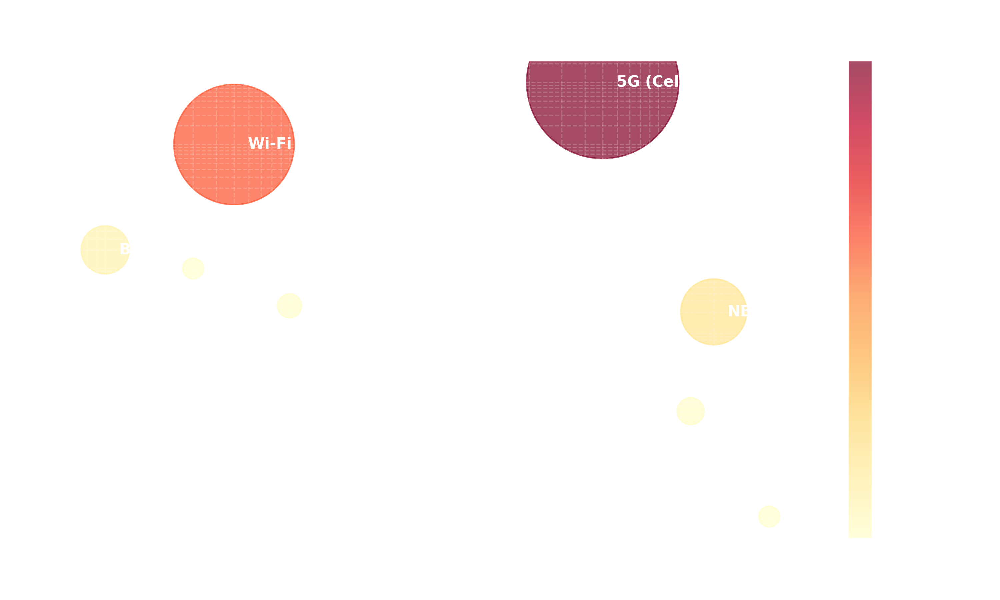
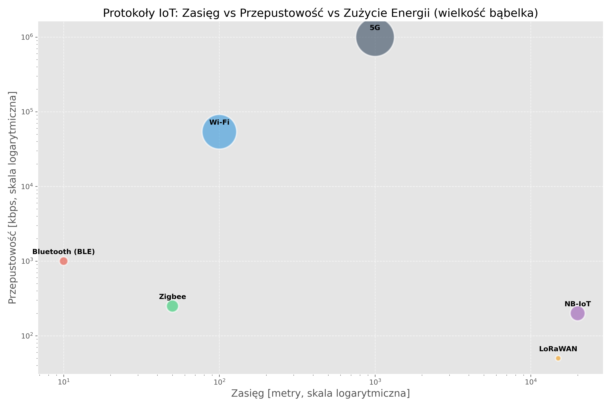

# Prolog: Fizyka, Energia i Wieża Babel {background-color="#f8f9fa"}

## <i class="bi bi-translate"></i> 1. Problem Komunikacji M2M

W świecie Internetu Rzeczy komunikacja „Maszyna-Maszyna" (M2M) opiera się na radykalnych kompromisach, których nie znamy w świecie komputerów osobistych.

::: {.columns}
::: {.column width="50%"}
::: {.incremental}
* Wyobraź sobie miliardy urządzeń.
* Nie mają gniazdka 230 V – tylko baterię wielkości monety.
* Działają w piwnicach, na pełnym morzu lub zakopane w glebie twardej jak beton.
* Jak sprawić, by w takich warunkach przesłać dane i nie opróżnić baterii w pięć minut?
:::
::: {.fragment .fade-in .callout-note style="font-size: 0.8em; background-color: #e6f3f7ff;"}
### Trójkąt Niemożliwy IoT
Inżynier projektujący system sieciowy musi wybrać **tylko dwa z trzech** parametrów:

1. Zasięg (kilometry)
2. Przepustowość (megabajty na sekundę)
3. Czas życia na baterii (lata)
:::
:::

::: {.column width="50%"}
::: {.fragment}
{width=90%}

:::
:::
:::

::: {.notes}
**Rozpoczęcie:** Nawiąż do wykładu pierwszego – urządzenia już mają zmysły (czujniki), ale milczą. Dziś nauczymy je mówić. Problem polega na fizyce: fala elektromagnetyczna wymaga energii i napotyka opór w postaci ścian i odległości. Nie da się wysyłać strumienia wideo z licznika wody w piwnicy bez stałego zasilania sieciowego. To wymusza powstanie całkowicie nowych protokołów bezprzewodowych dostosowanych do specyfiki komunikacji M2M.
:::

---

# Rozdział I: Komunikacja na Wyciągnięcie Ręki {background-color="#f8f9fa"}

## <i class="bi bi-wifi"></i> 2. Wi-Fi (IEEE 802.11): Przekleństwo i Błogosławieństwo

Król Internetu w domach jest najsłabszym ogniwem IoT na bateriach.

::: {.columns}
::: {.column width="60%"}
::: {.incremental}
* **Zalety:** Ogromna przepustowość (MB/s), powszechność infrastruktury (router w każdym współczesnym domu), natywna integracja z protokołem IP.
* **Wady:** Architektura Wi-Fi jest koszmarnie prądożerna – napadowe budzenie anteny i przeszukiwanie nadajników (beaconing) pochłaniają setki mA.
* Złożony proces zestawiania połączenia (handshake), zanim prześle znikomą wartość, np. samą wilgotność powietrza 45%.
* **Zastosowanie w IoT:** Tylko tam, gdzie istnieje stałe zasilanie – np. Smart TV, asystenci głosowi, sprzęty AGD.
:::
:::

::: {.column width="40%"}
::: {.fragment}
::: {.callout-warning}
### Podatność na zakłócenia
Zagęszczone pasmo 2,4 GHz w budynkach mieszkalnych powoduje wzajemne zakłócenia między urządzeniami Wi-Fi, degradując jakość połączenia.
:::
:::
:::
:::

::: {.notes}
Wyjaśnij, że chociaż Wi-Fi jest najpopularniejsze, w profesjonalnym IoT pełni głównie rolę „backhaulu" dla bramek (gateways), a nie protokołu dla czujników końcowych rozrzuconych w terenie. Zwróć uwagę, dlaczego producenci inteligentnych żarówek zalecają własne mostki zamiast podłączania dziesiątek żarówek bezpośrednio pod Wi-Fi – kilkanaście tanich czujników bardzo skutecznie wysyca limit połączeń domowego routera.
:::

---

## <i class="bi bi-bluetooth"></i> 3. Bluetooth i rewolucja BLE (Low Energy)

Od ciągłego przesyłu audio do energooszczędnych opasek zdrowotnych.

::: {.columns}
::: {.column width="60%"}
::: {.incremental}
* **Bluetooth (Classic):** Zaprojektowany dla ciągłego strumienia danych, np. sygnału audio w zestawach głośnomówiących. Moc ciągła, radio zawsze aktywne.
* **Bluetooth Low Energy (BLE):** Rewolucja wprowadzona w specyfikacji Bluetooth 4.0. Urządzenie śpi, błyskawicznie emituje kilka pakietów danych w milisekundy i wraca w tryb uśpienia.
* Pobór prądu spada nawet stukrotnie w porównaniu z klasycznym Bluetooth.
* **Zastosowania:** Opaski fitness, medycyna cyfrowa, bezprzewodowe tagi lokalizacyjne (beacony).
:::
:::

::: {.column width="40%"}
::: {.fragment}
::: {.callout-note}
### Różnica architektoniczna
Klasyczny Bluetooth przesyła ciągły strumień (np. audio). BLE „usypia" radio natychmiast po wysłaniu pakietu danych telemetrycznych. Bateryjka CR2032 wystarcza modułom BLE na lata pracy.
:::
:::
:::
:::

::: {.notes}
Najlepszy punkt wyjścia do opisania technologii beaconingu sklepowego. Wyjaśnij różnicę między protokołem „Classic", który musi utrzymywać połączenie 24/7 (audio), a systemem oszczędnym z krótkimi powiadomieniami dla urządzeń ubieralnych (wearables).
:::

---

## <i class="bi bi-diagram-3-fill"></i> 4. Zigbee i Z-Wave: Inżynieria Roju (Mesh)

Rozwiązanie problemu krótkiego zasięgu poprzez architekturę sieci kratowej.

::: {.columns}
::: {.column width="50%"}
::: {.incremental}
* W tradycyjnej topologii gwiazdy sygnał czujnika trafia do centralnego routera. Problem pojawia się, gdy router oddzielony jest czterema zbrojonymi ścianami.
* **Zigbee (Mesh):** Urządzenia zasilane z sieci (np. inteligentne gniazdka) działają jednocześnie jako wzmacniacze (routery), odbierając pakiet od słabego czujnika bateryjnego i przekazując go dalej.
* System „samoleczący się" (self-healing) – awaria jednego węzła powoduje automatyczne znalezienie nowej trasy.
:::
:::

::: {.column width="50%"}
::: {.fragment}
```{mermaid}
%%| fig-width: 5
%%| fig-height: 2.5
%%{init: {'theme': 'default', 'themeVariables': { 'fontSize': '16px', 'fontFamily': 'sans-serif' }}}%%
graph LR
    A((Gateway)) --> B((Node 1))
    A --> C((Node 2))
    B -.->|Awaria| D((Node 3))
    C --> D
    style B fill:#f8d7da,stroke:#842029
```

::: {.callout-tip}
### Z-Wave – pasmo sub-GHz
Z-Wave działa w paśmie 868 MHz (EU), co zapewnia znacznie lepszą penetrację ścian niż protokoły 2,4 GHz (Zigbee, Wi-Fi). Wadą jest brak jednego uniwersalnego standardu – każdy producent tworzy własne nakładki (np. Philips Hue, IKEA TRÅDFRI).
:::
:::
:::
:::

::: {.notes}
Prezentując ten slajd, zapytaj słuchaczy, ile żarówek Zigbee należy umieścić w domu jednorodzinnym między piętrem a ogrodem, by czujnik na bramie zyskał zasięg do pierwszej najbliższej lampki-wzmacniacza pod werandą. To idealne studium rozciągania „niewidzialnego sznura połączeń".
:::

---

# Rozdział II: Komunikacja Dalekiego Zasięgu {background-color="#f8f9fa"}

## <i class="bi bi-broadcast"></i> 5. LPWAN: Telemetria na kilometry

**Low Power Wide Area Network** – odpowiedź na potrzeby systemów telemetrycznych działających na rozległych obszarach.

::: {.columns}
::: {.column width="55%"}
::: {.incremental}
* Aby zwiększyć zasięg przy minimalnym zużyciu energii, drastycznie ograniczamy przepustowość – z megabitów na sekundę do zaledwie kilkudziesięciu bajtów na sekundę.
* Żywotność baterii: od 5 do nawet 10 lat na pojedynczym ogniwie (np. litowo-tionylowym).
* Zasięg: nawet 15–20 km w otwartym terenie.
* Służy wyłącznie do przesyłania telemetrii. Czujnik wilgotności gleby przyśle odczyt, ale kamera 4K jest całkowicie wykluczona z LPWAN.
:::
:::

::: {.column width="45%"}
::: {.fragment}
{width=100%}
:::
:::
:::

::: {.notes}
Zwróć uwagę na jednoznaczną granicę – technologie LPWAN nie są zaprojektowane do przesyłania strumieni wideo ani dużych plików. Tylko krótkie paczki zmiennych liczbowych i tekstowych. Warto odnieść się do badań środowiskowych: zamiast ciągnąć kilometry kabli zasilających do stacji pomiarowej w lesie, można zastosować sieć LPWAN, która prześle uśrednione wyniki bezpośrednio do bramki oddalonej o wiele kilometrów.
:::

---

## <i class="bi bi-tower"></i> 6. Porównanie technologii radiowych

Gdzie leży fizyczna i energetyczna granica każdego standardu?

::: {.columns}
::: {.column width="30%"}
::: {.incremental}
* Lewy górny róg wykresu: duża przepustowość, ale wysoki pobór energii (większy bąbel).
* Prawy dolny róg: LPWAN – zasięg poza horyzont przy zaledwie kilkudziesięciu bajtach co kwadrans i minimalnym koszcie energetycznym.
:::
:::

::: {.column width="70%"}
{width=60%}
:::
:::

::: {.notes}
Wyjaśnij kolorowy wykres Bubble Chart. Oś „x" to dystans (od metrów do kilometrów), oś „y" to przepustowość (skala logarytmiczna). Wielkość bąbli reprezentuje pobór energii. Zrozumienie tego wykresu decyduje u większości początkujących inżynierów o wyborze technologii dla nowo projektowanej inwestycji.
Handover (lub handoff) to proces w sieciach bezprzewodowych (głównie komórkowych), który polega na przekazaniu aktywnego połączenia urządzenia z jednej stacji bazowej (nadajnika) do drugiej w momencie, gdy użytkownik się przemieszcza.
:::

---

## <i class="bi bi-antenna"></i> 7. LoRaWAN vs NB-IoT: Prywatna sieć czy abonament?{.smaller}

Dwa konkurencyjne podejścia do łączności dalekiego zasięgu.

::: {.columns}
::: {.column width="50%"}
### LoRa / LoRaWAN
::: {.incremental}
* **LoRa (warstwa fizyczna):** Opatentowana modulacja Chirp Spread Spectrum (CSS), odporna na zakłócenia.
* **LoRaWAN (warstwa logiczna):** Otwarty protokół sieciowy. Pozwala na budowę własnych bramek w darmowym paśmie 868 MHz.
* Społeczność crowdsourcowa: The Things Network (TTN) – bezpłatne, globalne pokrycie.
* Słabsza penetracja gęstej zabudowy miejskiej.
:::
:::

::: {.column width="50%"}
### NB-IoT / LTE-M
::: {.incremental}
* Standard operatorów telekomunikacyjnych (Orange, Play, T-Mobile) – nakładka na istniejące stacje bazowe 4G.
* **NB-IoT:** Doskonała penetracja piwnic i podziemnych parkingów. Urządzenie stacjonarne (brak handoveru).
* **LTE-M:** Wyższa przepustowość, obsługa mobilności (śledzenie pojazdów) i komunikacji głosowej.
* Wadą jest stała opłata za kartę SIM i zależność od operatora.
:::
:::
:::

::: {.fragment}
```{mermaid}
%%| fig-align: center
%%| fig-width: 10
%%| fig-height: 1.5
%%{init: {'theme': 'default', 'themeVariables': { 'fontSize': '16px', 'fontFamily': 'sans-serif' }}}%%
graph LR
    A[Czujnik z baterią] -->|LoRa RF| B((Bramka LoRa))
    B -->|IP / Ethernet| C[Network Server]
    C -->|API / HTTPS| D[Application Server]
```
:::

::: {.notes}
Potężny kompromis projektanta: jeśli budujesz 20 wodomierzy w osiedlu miejskim, kup karty NB-IoT za 2 zł/mies. i śpij spokojnie. Jeśli masz 120 hektarów pod Nowym Tomyślem, postaw 2 własne stacje LoRaWAN z panelem słonecznym i nie płać ani złotówki abonamentu.
:::

---

## <i class="bi bi-soundwave"></i> 8. Sigfox: ultralekkie wiadomości jako usługa

Model „Network as a Service" – operator globalnej sieci dostarcza łączność bez budowy własnej infrastruktury.

::: {.incremental}
* Maksymalnie **140 wiadomości dziennie** od pojedynczego urządzenia.
* Rozmiar ładunku (payload): zaledwie **12 bajtów** na wiadomość.
* Architektura silnie asymetryczna – bardzo ograniczone wysyłanie danych w dół (downlink) do czujnika.
* Ekstremalnie tanie wdrożenia, ale narzuca poważne ograniczenia projektowe.
:::

::: {.notes}
Sigfox to dobry przykład technologii o skrajnie wąskim zastosowaniu: idealny np. do jednorazowego potwierdzenia „jestem sprawny" raz na godzinę, ale kompletnie nieprzydatny do sterowania lub pobierania większych porcji danych.
:::

---

# Rozdział III: Protokoły Warstwy Aplikacji {background-color="#f8f9fa"}

## <i class="bi bi-x-octagon"></i> 9. Dlaczego protokół HTTP nie pasuje do IoT?

Klasyczne środowisko webowe (REST API) jest zbyt „ciężkie" dla urządzeń o ograniczonych zasobach.

::: {.columns}
::: {.column width="60%"}
::: {.incremental}
* **Narzut nagłówków:** Nagłówki HTTP potrafią zajmować więcej bajtów niż same dane pomiarowe (np. pojedyncza wartość „temperatura = 22,5°C").
* **Model Request-Response:** Architektura synchroniczna – czujnik musi czekać na potwierdzenie od serwera, trzymając włączone, prądożerne radio.
* **Brak natywnego wsparcia dla asynchroniczności i broadcastu** – każde urządzenie musi indywidualnie odpytywać serwer.
:::
:::

::: {.column width="40%"}
::: {.fragment}
<div style="text-align: center; transform: scale(1.7); transform-origin: top center;">
```{mermaid}
%%| fig-width: 4
%%| fig-height: 4
%%{init: {'theme': 'default', 'themeVariables': { 'fontSize': '14px', 'fontFamily': 'sans-serif' }}}%%
graph BT
    subgraph "Pakiet HTTP (~500 B)"
    A[Dane: 22.5] --- B[Nagłówek HTTP] --- C[TCP / IP]
    end
    
    subgraph "Pakiet MQTT (~40 B)"
    D[Dane: 22.5] --- E[Nagłówek MQTT] --- F[TCP / IP]
    end
    
    style B fill:#f8d7da,stroke:red
    style E fill:#d1e7dd,stroke:green
```
</div>
:::
:::
:::

::: {.notes}
Kluczowe, by uświadomić słuchaczom, że zasobność pamięci mikrokontrolera i komputera osobistego to przepaść. Typowa strona internetowa ważąca kilkanaście megabajtów nie przejdzie przez pamięć buforową płytki ESP32, dysponującej zaledwie kilkuset kilobajtami RAM.
:::

---

## <i class="bi bi-envelope-paper"></i> 10. MQTT: Lekki, binarny standard IoT

**Message Queuing Telemetry Transport** – architektura Publikacja/Subskrypcja (Pub/Sub).

::: {.columns}
::: {.column width="60%"}
::: {.incremental}
* Czujnik nie łączy się bezpośrednio z odbiorcą danych. Wysyła wiadomość do centralnego **Brokera** pod określonym **tematem (Topic)**.
* Broker filtruje i dystrybuuje wiadomości do wszystkich zainteresowanych subskrybentów.
* Urządzenia klienckie nie wiedzą o swoim wzajemnym istnieniu – znają tylko Brokera.
* Skrajnie asynchroniczny, zoptymalizowany pod kątem niestabilnych połączeń sieciowych.
:::
:::

::: {.column width="40%"}
::: {.fragment}
<div style="text-align: center; transform: scale(1.7); transform-origin: top center;">
```{mermaid}
%%| fig-align: center
%%| fig-width: 5
%%| fig-height: 3
%%{init: {'theme': 'default', 'themeVariables': { 'fontSize': '14px', 'fontFamily': 'sans-serif' }}}%%
graph TD
    A[Czujnik Temp] -->|PUBLISH| B((BROKER MQTT))
    B -->|PUSH| C[Baza SQL]
    B -->|PUSH| D[Dashboard]
```
</div>

:::
:::
::: {.fragment .fade-up .callout-note}
### Efektywność
Nagłówek wiadomości MQTT wynosi zaledwie **2 bajty**, co minimalizuje czas pracy modułu radiowego i zużycie energii.
:::
:::

::: {.notes}
„MQTT (Message Queuing Telemetry Transport)" – protokół stworzony pierwotnie przez IBM dla sektora naftowego. Klucz architektury Pub/Sub polega na tym, że czujnik i aplikacja na dashboardzie nigdy nie komunikują się bezpośrednio – obaj niezależnie łączą się z Brokerem. To zapewnia pełną niezależność klientów i lekkość protokołu.
:::

---

## <i class="bi bi-folder2-open"></i> 11. MQTT: Tematy, QoS i „Ostatnia Wola"

Zaawansowane mechanizmy niezawodności wbudowane w protokół.

::: {.columns}
::: {.column width="50%"}
### Tematy (Topics)
::: {.incremental}
* Wiadomości kategoryzowane są w logiczne, hierarchiczne drzewa: `prod/hala_B/prasa_3/temperatura`
* Separacja środowisk (`dev/`, `test/`, `prod/`) pozwala izolować dane eksperymentalne od produkcyjnych na jednym Brokerze.
:::
:::

::: {.column width="50%"}
### QoS i LWT
::: {.incremental style="font-size: 0.85em;"}
* **QoS 0** – „wyślij i zapomnij" (najszybszy).
* **QoS 1** – wymaga potwierdzenia (możliwe duplikaty).
* **QoS 2** – pełny handshake, gwarancja dostarczenia.
* **Last Will (LWT):** Automatyczne powiadomienia o awarii.
:::
:::
:::

---

<div style="text-align: center; transform: scale(1.7); transform-origin: top center;">
```{mermaid}
%%| fig-align: center
%%| fig-width: 5
%%| fig-height: 4.5
%%{init: {'theme': 'default', 'themeVariables': { 'fontSize': '12px', 'fontFamily': 'sans-serif' }}}%%
sequenceDiagram
    participant C as Czujnik
    participant B as Broker
    Note over C,B: QoS 0
    C->>B: PUBLISH
    Note over C,B: QoS 1
    C->>B: PUBLISH
    B-->>C: PUBACK
    Note over C,B: QoS 2
    C->>B: PUBLISH
    B-->>C: PUBREC / PUBREL / PUBCOMP
```
</div>

::: {.notes}
Bardzo ważny slajd pod kątem organizacji kodu i danych. Zaprojektowanie dobrego drzewa tematów to połowa sukcesu w utrzymaniu porządku w złożonym systemie. Pozwala to analitykom w R lub Pythonie subskrybować jednym poleceniem całe kategorie danych (np. wszystkie czujniki temperatury w hali „B").
:::

---

## <i class="bi bi-arrow-left-right"></i> 12. CoAP i AMQP: Alternatywy dla specyficznych scenariuszy

::: {.columns}
::: {.column width="50%"}
### CoAP (Constrained Application Protocol)
::: {.incremental}
* Odpowiednik HTTP (metody GET, POST, PUT), ale oparty na bezpołączeniowym protokole **UDP** – szybszy, lecz bez gwarancji dostarczenia.
* Wbudowane wsparcie dla szyfrowania DTLS.
* Idealny dla prostych interakcji typu żądanie-odpowiedź na mikrokontrolerach.
:::
:::

::: {.column width="50%"}
### AMQP (Advanced Message Queuing Protocol)
::: {.incremental}
* Skomplikowany, potężny system kolejek wiadomości dla środowisk korporacyjnych i finansowych.
* Zbyt ciężki dla mikrokontrolerów – stosowany na zapleczu (backend), np. między serwerami w chmurze (RabbitMQ).
:::
:::
:::

::: {.notes}
CoAP sprawdza się tam, gdzie MQTT jest „za dużo" – np. pojedynczy mikrokontroler, który po prostu odpowiada na zapytanie „podaj aktualną temperaturę" bez potrzeby stałego połączenia z Brokerem. AMQP z kolei żyje w świecie serwerów, nie czujników.
:::

---

## <i class="bi bi-table"></i> 13. Podsumowanie: Dobór technologii

Wybór standardu komunikacyjnego determinuje całą architekturę systemu IoT.

| Warstwa | Technologia | Zastosowanie |
|:---|:---|:---|
| **Krótki zasięg** | BLE, Zigbee, Z-Wave | Wearables, Smart Home, czujniki lokalne |
| **Daleki zasięg** | LoRaWAN, NB-IoT, Sigfox | Rolnictwo, monitoring środowiskowy, Smart City |
| **Protokół aplikacyjny** | MQTT (Pub/Sub) | Niska latencja, asynchroniczność, izolacja środowisk |
| **Protokół aplikacyjny** | CoAP (Req/Res) | Proste interakcje na mikrokontrolerach (UDP) |
| **Protokół aplikacyjny** | HTTP | Wyłącznie bramki i serwery ze stałym zasilaniem |


::: {.notes}
To podsumowanie powinno pozwolić słuchaczom szybko odnaleźć się w gąszczu technologii. Kluczowa zasada: im dalej chcesz przesłać dane, tym mniej ich przesyłasz i tym dłużej bateria przeżyje.
:::

---

## <i class="bi bi-arrow-left-right"></i> 14. Dziękuję za uwagę


### W kolejnym wykładzie omówimy 

* przetwarzanie zebranych danych w chmurze (Cloud), 
* zagadnienia bezpieczeństwa oraz 
* zaawansowane zastosowania IoT (Smart City, Digital Twins).
