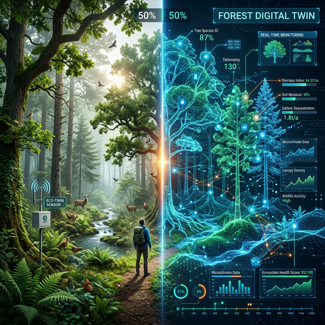

# Prolog: Gdzie trafiają sny maszyn? {background-color="#f8f9fa"}

## <i class="bi bi-cloud-haze2"></i> 1. Od gigabajtów do wiedzy

Problem skali danych: „Dane to nowa ropa" brzmi pięknie, dopóki nie musisz jej rafinować.

::: {.columns}
::: {.column width="60%"}
::: {.incremental}
* Pojedynczy czujnik temperatury w chłodni jest bezwartościowy.
* 10 000 czujników w 100 magazynach w Europie, generujących logi co minutę, tworzy **Big Data**.
* Gdzie to wszystko składować, filtrować i jak wyciągać użyteczne biznesowo wnioski?
* **Odpowiedź:** Chmura Obliczeniowa (Cloud Computing) – ostateczna Warstwa Aplikacji w modelu IoT.
:::
:::

::: {.column width="40%"}
::: {.fragment}
<div style="text-align: center; transform: scale(2); transform-origin: top center;">
```{mermaid}
%%| fig-width: 4.5
%%| fig-height: 3.5
%%{init: {'theme': 'default', 'themeVariables': { 'fontSize': '13px', 'fontFamily': 'sans-serif' }}}%%
flowchart TD
    subgraph "Urządzenia Pomiarowe"
        A[Anemometr<br>10 Hz]
        B[Analizator Gazu<br>10 Hz]
    end
    
    subgraph "EDGE COMPUTING"
        C(Gateway<br>Kowariancja wirów)
    end
    
    subgraph "CLOUD COMPUTING"
        D[(Chmura)]
    end
    
    A -->|Surowy szum| C
    B -->|Surowy szum| C
    C -->|Agregacja:<br>Bloki 30-minutowe| D
```
</div>

:::
:::
:::

::: {.notes}
**Rozpoczęcie:** Wyjaśnij słuchaczom, że po opanowaniu sprzętu (Wykład 1) i dostarczeniu danych drogą radiową do Internetu (Wykład 2), inżynier staje przed ścianą IT i analizy danych. Surowe, wysokoczęstotliwościowe dane środowiskowe są najpierw redukowane na brzegu sieci, a do chmury trafiają już uśrednione strumienie (np. wartości 30-minutowe).
:::

---

# Rozdział I: Potęga Ekosystemu IT {background-color="#f8f9fa"}

## <i class="bi bi-server"></i> 2. Platformy korporacyjne (PaaS)

Rozwiązania dostarczane przez gigantów technologicznych, pozwalające na błyskawiczne skalowanie.

::: {.columns}
::: {.column width="50%"}
::: {.incremental}
* **AWS IoT Core:** Lider rynku. Potężna integracja z usługami analitycznymi i bazami danych (np. DynamoDB).
* **Azure IoT Hub:** Silna pozycja w sektorze przemysłowym (IIoT), świetna integracja z Active Directory.
* Obie platformy umożliwiają masową aktualizację oprogramowania wewnętrznego (OTA – Over The Air) dla milionów urządzeń jednocześnie, z zastosowaniem certyfikatów kryptograficznych.
:::
:::

::: {.column width="50%"}
::: {.fragment}
::: {.callout-warning}
### Vendor Lock-in (Złota Klatka)
W 2023 roku Google wyłączyło swoją usługę **Google Cloud IoT Core**. Zmusiło to tysiące firm do kosztownej i czasochłonnej migracji całych ekosystemów do konkurencji. Oparcie projektu w 100% o jednego dostawcę chmury to poważne ryzyko biznesowe.
:::
:::
:::
:::

::: {.notes}
Kluczowa jest definicja OTA (Over The Air). W dobie IoT nie podłącza się urządzenia kablem do aktualizacji. System autoryzuje podpis kluczem cyfrowym, a urządzenie samodzielnie w tle nadpisuje firmware – np. auto aktualizuje się po wjeździe do garażu z Wi-Fi. Wykorzystaj przypadek Google IoT Core jako przestrogę inżynieryjną.
:::

---

## <i class="bi bi-code-slash"></i> 3. Narzędzia otwartoźródłowe: niezależność twórców

Jak zachować niezależność i prywatność danych? Odpowiedzią są systemy wdrażane na własnych serwerach (On-Premise).

::: {.columns}
::: {.column width="50%"}
::: {.incremental}
* **ThingsBoard:** Profesjonalne pulpity nawigacyjne (dashboardy) obsługujące ogromne potoki danych telemetrycznych z fizyczną izolacją środowisk (dev, test, prod).
* **Home Assistant:** Integracja lokalna bez zależności od zewnętrznych chmur.
* **Node-RED:** Wizualne programowanie logiki (Low-code).
:::
:::

::: {.column width="50%"}
::: {.fragment}
{width=90%}
:::
:::
:::

::: {.notes}
Platformy Open-Source pozwalają studentom na szybkie prototypowanie. Można podpiąć czujnik LoRaWAN do graficznego silnika Node-RED, po czym natychmiast zaprezentować odczyt na tablicy analitycznej i wysłać powiadomienie na kanał Discord lub przez SMS. Node-RED sprawdza się doskonale jako „klej" integracyjny w architekturze IoT.
:::

---

# Rozdział II: Żywe Organizmy – Smart City {background-color="#f8f9fa"}

## <i class="bi bi-buildings-fill"></i> 4. Barcelona: Pionierzy „miasta jako komputera"

Co się dzieje, gdy dodamy miastu układ nerwowy?

::: {.columns}
::: {.column width="50%"}
::: {.incremental}
* **Oświetlenie miejskie:** 10 000 lamp analizujących ruch pieszych i gasnących inteligentnie na peryferiach – oszczędność 30% budżetu energetycznego rocznie.
* **Wywóz odpadów:** Czujniki laserowe mierzące poziom zapełnienia kontenerów wytyczają dynamiczną trasę dla śmieciarki, redukując puste przejazdy o 28%.
* **Nawadnianie parków:** Czujniki wilgotności glebowej sterujące zaworami podlewania – pompa nie uruchomi się dzień po deszczu.
:::
:::

::: {.column width="50%"}
::: {.fragment}
::: {.callout-note}
### Kto kontroluje dane?
Gdy system ITS (Inteligentny System Transportowy) liczy pojazdy i odczytuje tablice rejestracyjne (LPR) kamerami, kto ostatecznie kontroluje dostęp do statystyk o przemieszczaniu się mieszkańców? To pytanie otwiera dyskusję etyczną.
:::
:::
:::
:::

::: {.notes}
Opowiadając o Smart City, płynnie przechodzimy od optymistycznych raportów do naruszeń prawa prywatności – przygotowując grunt pod kolejny rozdział o zagrożeniach. Miasto, które „czuje i liczy oddech", generuje jednocześnie ogromną wartość monetarną i poważne wyzwania etyczne.
:::

---

## <i class="bi bi-buildings"></i> 5. Smart City i Przemysł 4.0 (IIoT)

Jak łączność IoT transformuje przestrzeń miejską i produkcję?

::: {.columns}
::: {.column width="50%"}
### Inteligentne miasta
::: {.incremental}
* Systemy ITS optymalizujące ruch uliczny w czasie rzeczywistym.
* Gęste sieci monitoringu jakości powietrza.
* Inteligentne oświetlenie dopasowujące się do natężenia ruchu.
:::
:::

::: {.column width="50%"}
### Przemysł 4.0 (IIoT)
::: {.incremental}
* **Predictive Maintenance:** Przewidywanie awarii maszyn na podstawie analizy wibracji i temperatur – zanim fizycznie do nich dojdzie.
* Optymalizacja łańcucha dostaw (Supply Chain) z pełną transparentnością lokalizacji paczek.
:::
:::
:::

::: {.notes}
Jako przykład z życia podaj infrastrukturę miejską Poznania, gdzie systemy telematyczne i środowiskowe połączone są w jeden spójny organizm. Dane z tych systemów często trafiają do otwartych interfejsów API.
:::

---

## <i class="bi bi-vr"></i> 6. Cyfrowe Bliźniaki (Digital Twins)

Wirtualna reprezentacja fizycznego obiektu, systemu lub całego ekosystemu, zasilana danymi w czasie rzeczywistym.

::: {.columns}
::: {.column width="50%"}
::: {.incremental}
* To nie tylko wizualizacja 3D. Cyfrowy Bliźniak jest zasilany strumieniem danych z czujników w czasie rzeczywistym – rzutowanych 1:1 na model inżynierski.
* Umożliwia przeprowadzanie symulacji „What If": co się stanie, jeśli zawór nr 43 ulegnie awarii podczas festiwalu?
* **Zastosowania:** Od optymalizacji silników odrzutowych po modelowanie dynamiki wymiany gazowej na dużych obszarach leśnych.
:::
:::

::: {.column width="50%"}
{width=90%}
:::
:::

::: {.notes}
Tak wygląda futurystyczny panel dla operatora dużych inwestycji infrastrukturalnych. Gdy komunikat „Awaria pompy ciśnieniowej ul. Północnej" na pasku tekstowej konsoli niewiele mówi, ten sam sygnał alarmowy na fotorealistycznej makiecie 3D z nałożonymi odczytami obciążeniowymi precyzuje skalę awarii natychmiast. Zamiast testować hipotezy na fizycznym systemie, analityk wykonuje symulacje na jego cyfrowej kopii.
:::

---

# Rozdział III: Cienie IoT – Bezpieczeństwo {background-color="#f8f9fa"}

## <i class="bi bi-shield-slash-fill"></i> 7. Gdy „rzeczy" stają się bronią DDoS

Paradoks tanich chipów – kupić szybko, włączyć od razu, nie aktualizować nigdy.

::: {.columns}
::: {.column width="50%"}
::: {.incremental}
* **Ograniczone zasoby:** Brak mocy obliczeniowej na zaawansowane algorytmy kryptograficzne.
* **Dostęp fizyczny:** Czujniki w terenie publicznym podatne na sabotaż sprzętowy (np. odczyt pamięci Flash).
* **Brak aktualizacji:** Miliony urządzeń działają latami na przestarzałym oprogramowaniu z domyślnym hasłem „admin / admin" – tzw. porzucone technologie.
:::
:::

::: {.column width="50%"}
::: {.fragment}
::: {.callout-important}
### Botnet Mirai (2016)
Złośliwe oprogramowanie (botnet) przejęło kontrolę nad niezabezpieczonymi kamerami IP, dokonując gigantycznego ataku DDoS na infrastrukturę DNS (m.in. Twitter, Netflix).
:::
{width=70%}
:::
:::
:::

::: {.notes}
Podkreśl różnicę między atakiem na serwer webowy a atakiem na systemy IoT. W IoT atakujący może uzyskać kontrolę nad fizycznymi zaworami, przekaźnikami lub zakłócić krytyczne odczyty środowiskowe. 

**Warto wyjaśnić "niemiecki ślad" na mapie:** Choć Mirai był globalny, Niemcy stały się głośnym przykładem w listopadzie 2016 r., gdy wariant Mirai zaatakował routery Deutsche Telekom (wykorzystując lukę w TR-064). Odcięło to od sieci blisko 900 000 klientów, stąd na mapach historycznych Niemcy często widnieją jako główne ognisko (pole bitwy), mimo że źródło ataku było rozproszone.
:::

---

## <i class="bi bi-check-circle"></i> 8. Dobre praktyki bezpieczeństwa (Defence in Depth)

Ochrona systemu IoT musi być wdrażana wielowarstwowo.

::: {.columns}
::: {.column width="45%"}
::: {.incremental style="font-size: 0.9em;"}
1. **Tożsamość:** Szyfrowanie asymetryczne (X.509) dla TLS/DTLS.
2. **Aktualizacje OTA:** Zdalne łatanie podatności.
3. **Segmentacja sieci (VLAN):** Izolowanie czujników IoT od głównej sieci biurowej/serwerów.
4. **Secure Boot:** Blokada nieautoryzowanego kodu.
:::
:::

::: {.column width="55%"}
::: {.fragment}
<div style="text-align: center; transform: scale(1.7); transform-origin: top center;">
```{mermaid}
%%| fig-width: 5.5
%%| fig-height: 3.5
%%{init: {'theme': 'default', 'themeVariables': { 'fontSize': '12px', 'fontFamily': 'sans-serif' }}}%%
graph LR
    subgraph "VLAN Biurowy / Serwery"
        PC((PC Pracownika))
        DB[(Zasoby Sieciowe)]
    end
    
    FW{Zapora<br>Firewall}
    
    subgraph "VLAN IoT (Sensory)"
        S1[Czujnik<br>Klimatu]
        S2[Kamera<br>Zewnętrzna]
    end
    
    PC --- FW
    DB --- FW
    FW -.->|Izolacja / Brak Dostępu| S1
    FW -.->|Izolacja| S2
    
    style FW fill:#f8d7da,stroke:#842029
```
</div>
:::
:::
:::

::: {.notes}
Segmentacja sieci i izolowanie środowisk (np. testowych od produkcyjnych) to absolutny standard bezpieczeństwa. Atakujący, który włamie się do niezabezpieczonego testowego węzła IoT, nie może mieć ścieżki przejścia do bazy z wrażliwymi danymi produkcyjnymi.
:::

---

## <i class="bi bi-eye"></i> 9. Prywatność w epoce mikrofonów zawsze włączonych

Kto nas słucha, liczy i mierzy? Profilowanie konsumenckie na danych z warstw IoT.

::: {.incremental style="font-size: 0.9em;"}
* **Inteligentne liczniki energii** mierzące zużycie co 10 sekund potrafią na podstawie analizy pików zużycia określić, kiedy włączasz czajnik (07:30), kiedy wychodzisz z domu (08:30) i kiedy wracasz (14:00). To nie jest fikcja – to dane dostępne dostawcy energii.
* **Zabawki IoT** wysyłające nieszyfrowane nagrania głosowe dzieci do chmur w obcych jurysdykcjach – częsty powód wycofań produktów z rynku europejskiego (np. lalka „My Friend Cayla").
* **Opaski fitness** profilujące puls i aktywność mogą posłużyć do automatycznego podniesienia składki ubezpieczenia zdrowotnego na podstawie odczytów wskazujących na siedzący tryb życia.
:::

::: {.notes}
To kluczowy moment wykładu, w którym inżynieria spotyka się z etyką. Filozofia „zbieramy wszystko, bo chmura jest tania" uderza o twardy filar dyskusji prawno-etycznej o tym, czy IoT powinno być projektowane z myślą o prywatności i bezpieczeństwie „by default" (Privacy by Design).
:::

---

# Epilog: Podsumowanie Trylogii o Rzeczach {background-color="#f8f9fa"}

## <i class="bi bi-balance-scale"></i> 10. Bilans korzyści i wyzwań na nową dekadę

::: {.columns}
::: {.column width="50%"}
### Obiecujące zyski
::: {.incremental}
* **Precyzyjne rolnictwo:** Redukcja zużycia wody nawet o 50% dzięki pomiarom „na kroplę do celu" w nawadnianiu upraw.
* **Predictive Maintenance:** Czujniki wibracji chronią turbiny – przewidzą awarię szybciej, niż stopi się łożysko nośne silnika.
* **Edge AI (AIoT):** Modele uczenia maszynowego (np. TensorFlow Lite) działające bezpośrednio na mikrokontrolerach, bez potrzeby łączności z chmurą.
:::
:::

::: {.column width="50%"}
### Wyzwania
::: {.incremental}
* **E-Waste:** Miliardy jednorazowych urządzeń z baterią niemożliwą do wymiany, zaklejonych w plastikowej obudowie – góra elektroniki jednorazowej.
* **Energy Harvesting:** Konieczność odejścia od klasycznych baterii na rzecz zasilania z otoczenia (różnice temperatur, wibracje, fale radiowe).
* **Etyka i regulacje:** Kto jest właścicielem danych generowanych przez „rzeczy" w twoim domu?
:::
:::
:::

::: {.notes}
Paradoks zrównoważonego rozwoju: IoT pozwala ratować zasoby planety (Green-Tech), ale jednocześnie generuje tony elektronicznych śmieci z jednorazowymi urządzeniami. Predictive Maintenance pozwala chronić miliony na prewencji katastrof i tu tkwi ogromna szansa dla IoT w skali przemysłowej.
:::

---

## <i class="bi bi-stars"></i> 11. Przyszłość: 6G i nowe paradygmaty

W jakim kierunku zmierza telemetria i systemy wbudowane?

::: {.incremental}
* **Integracja 6G:** Oczekiwane opóźnienia na poziomie sub-milisekund i gigabitowe przepustowości pozwolą na błyskawiczną synchronizację Cyfrowych Bliźniaków o wysokiej rozdzielczości.
* **Konwergencja AI + IoT:** Inteligentne urządzenia podejmujące decyzje autonomicznie, bez ciągłej łączności z chmurą.
* **Regulacje prawne:** Unia Europejska wprowadza Cyber Resilience Act, nakładający obowiązek aktualizacji bezpieczeństwa przez cały cykl życia produktu IoT.
:::

::: {.notes}
Podsumuj cykl wykładów. Podkreśl, że sprzęt jest coraz tańszy, a protokoły ustandaryzowane. Prawdziwym wyzwaniem dla przyszłych inżynierów będzie wyciągnięcie wartości z oceanu danych (Big Data) przy jednoczesnym zachowaniu etyki i pełnego bezpieczeństwa infrastruktury.
:::

---

## <i class="bi bi-flag-fill"></i> 12. Zakończenie cyklu wykładów

::: {.fragment}
::: {.callout-note icon=false appearance="simple" style="font-size: 01.9em;"}
IoT zbudowali inżynierowie, którzy chcieli zaoszczędzić sobie chodzenia po schodach po Coca-Colę.<br> Dziś ta sama filozofia steruje miastami, fabrykami i systemami ratującymi życie.
:::
:::

::: {.fragment .fade-up}
<br><br>
<h3 style="text-align: center; color: #ff3333;">Jaką inteligentną rzecz zaprojektujesz i zbudujesz?</h3>
:::

::: {.fragment}
<br>
<p style="text-align: center; font-size: 1.2em;">***Dziękuję za uwagę.***</p>
:::

::: {.notes}
Koniec trzyczęściowego cyklu wykładów. Wezwanie skierowane do audytorium inżynieryjnego: wszyscy mamy dostęp do ESP32 za kilkanaście złotych i brokera MQTT na Raspberry Pi. W kilka godzin możemy zbudować działający prototyp inteligentnego systemu. I tego właśnie uczmy.
:::
