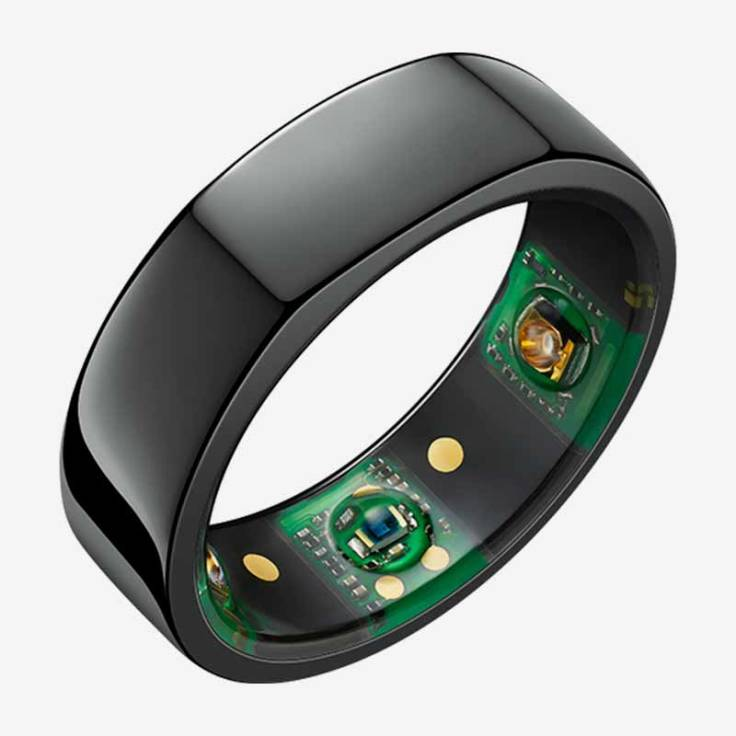
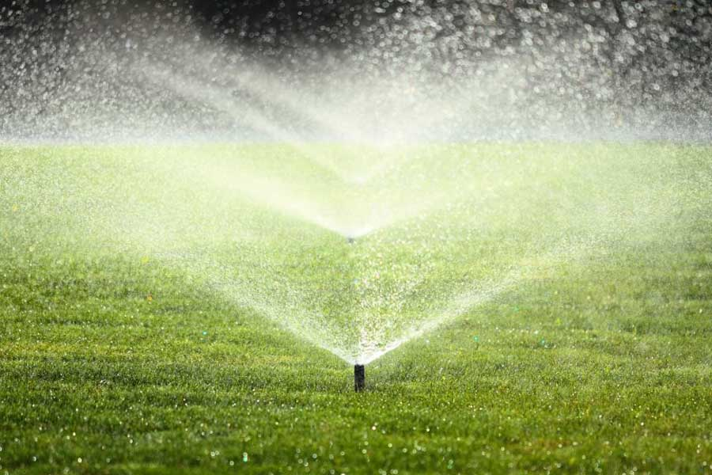
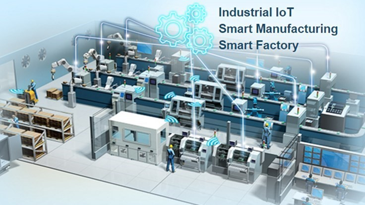
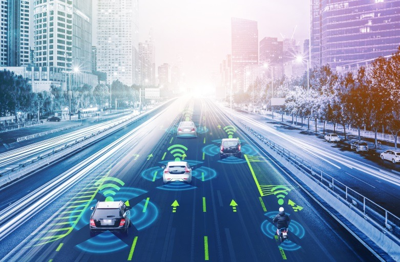
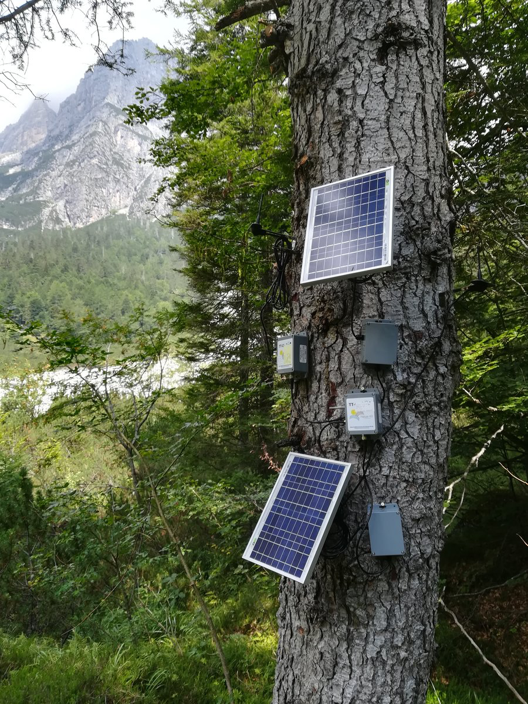

# Złudzenia i Rzeczywistość {background-color="#f8f9fa"}

## <i class="bi bi-lightbulb"></i> 1. Technologia was wyzwoli?

::: {.fragment}
::: {.callout-caution title="Motto" style="font-size: 1.5em;"}
... „**globalizacja**”, „**blockchain**”, „**inżynieria genetyczna**”, „**sztuczna inteligencja**”, „**uczenie maszynowe**” – prości ludzie zapewne podejrzewają, że żadne z tych pojęć ich nie dotyczy.

--- *21 Lekcji Na XXI Wiek, Yuval Noah Harari*
:::
:::

::: {.notes}
Zaczynamy od mocnego uderzenia. Pokaż studentom, że technologia to nie tylko nowe formaty kabli. Dziś przeciętny człowiek uważa, że zaawansowane pojęcia technologiczne go nie dotyczą – do momentu, w którym algorytm połączony z siecią IoT (jak np. asystent w aucie) decyduje w stochastyczny sposób o jego życiu.
:::

---

## <i class="bi bi-exclamation-triangle"></i> 2. Kto tworzy "przyszłość"?

::: {.callout-important title="Odpowiedzialność" style="font-size: 1.5em;"}
Rewolucje dokonujące się w biotechnologii i technologii informacyjnej przeprowadzają **inżynierowie, przedsiębiorcy i naukowcy**, którzy często nie zdają sobie sprawy z politycznych czy wręcz globalnych konsekwencji własnych decyzji, i z całą pewnością... **nikogo nie reprezentują**.
:::

::: {.incremental}
* Technologia nie ma moralności – jest neutralnym wektorem siły.
* To cel (i wdrożenie) definiuje czy Internet Rzeczy służy ratowaniu klimatu, czy totalnej inwigilacji obywatela.
:::

::: {.notes}
Kluczowe wejście w temat IoT: ci którzy tworzą układy "smart" to inżynierowie, nie politycy. Kiedy projektowaliśmy bezprzewodowe mikro-kamery lub asystentów domowych, chodziło o wygodę, nie budowę globalnego systemu podsłuchowego. A to myślenie wpływa na Wasze (słuchaczy) jutrzejsze projekty.
:::

---

# Nowe Perspektywy Danych {background-color="#f8f9fa"}

## <i class="bi bi-graph-up-arrow"></i> 3. Jasna strona mocy (Profity z IoT)

Technologia daje nam narzędzia, jakich nigdy wcześniej nie posiadała ludzkość, pozwalając na jednoczesne powiązanie: 

::: {.incremental}
1. Poszerzenia wiedzy o środowisku.
2. Poznania nas samych (lepsza opieka medyczna ludzi, zwierząt oraz... roślin).
3. Świadomego i zrównoważonego wykorzystywania kurczących się zasobów globu.
4. Rewolucyjnej poprawy procesów produkcji (Przemysł 4.0).
5. Natychmiastowej komunikacji wektorowej.
:::

::: {.notes}
Przechodzimy do rdzenia tematycznego inżynierii XXI wieku - czym jest optymalizacja zasilana danymi (Data-Driven). Jeżeli nie możemy zmierzyć planety w 20.000 miejscach jednocześnie, to na jakiej podstawie chcemy nią zarządzać?
:::

---

## <i class="bi bi-tree"></i> 4. IoT w Rolnictwie: Monitoring upraw i ekosystemów

Zrozumienie, zapobieganie, reagowanie.

::: {.columns}
::: {.column width="60%"}
::: {.incremental}
* Systemy zintegrowanego monitoringu zastępują intuicję „starego rolnika”.
* Analiza mikroklimatu bezpośrednio w chmurze liści (temperatura, wilgotność, natężenie PAR).
* Minimalizacja użycia oprysków: algorytmy AI analizują sensory na polu sugerując fungicydy tylko po przekroczeniu fizycznego progu punktu rosy, powstrzymując plagi prewencyjnie.
* Czujniki glebowe mierzące NPK oraz pH minimalizujące wymywanie do wód gruntowych.
:::
:::

::: {.column width="40%"}
::: {.fragment}
{width=100%}
:::
:::
:::

::: {.notes}
Przykład agrotechniczny to świetny argument: precyzyjne rolnictwo optymalizuje dawkę chemii co do centymetra i pory dnia, chroniąc wodę. Działa to oczywiście dzięki systemom takim jak Tree-Talker mierzącym strumień transpiracji.
:::

---

## <i class="bi bi-heart-pulse"></i> 5. Medycyna – Poznać Siebie (Smart Wearables)

Opaska nie jest tylko zegarkiem.

::: {.columns}
::: {.column width="50%"}
::: {.incremental}
* Zjawisko „Self-Tracking” (Quantified Self). 
* Zegarki i smart-obrączki dokonują odczytów zmienności rytmu zatokowego (HRV) oraz nasycenia tlenem.
* Bazy danych uczą się wzorców spania, wyprzedzając diagnozy spadku samopoczucia zanim te zamienią się w depresję czy arytmię.
* Ekstrakcja kluczowych danych "in-vivo", a nie w sterylnym labie co pół roku u lekarza.
:::
:::

::: {.column width="50%"}
::: {.fragment}
{height=600px}
:::
:::
:::

::: {.notes}
Zwróć uwagę słuchaczy na Oura Ring. Pokazuje to miniaturyzację. Zaledwie kilkanaście lat temu zapis tętna 24h/7 wymagał noszenia klamorów z Holterem EKG. Czerwona dioda na naszym ciele ciągle mierzy nasz rytm biologiczny i w tle (w smartfonie, połączonym Bluetooth) buduje gigantyczną sieć diagnoz AI populacji globalnej.
:::

---

## <i class="bi bi-droplet"></i> 6. Zrównoważone Zastosowanie Zasobów

Każda kropla wody i każdy Watt zliczony na bieżąco - nawożenie 'Smart'.

::: {.columns}
::: {.column width="45%"}
::: {.fragment}
{width=100%}
:::
:::

::: {.column width="55%"}
::: {.incremental}
* Systemy nawadniające połączone z satelitarną prognozą pogody i lokalnym czujnikiem deszczu – oszczędzające dziesiątki milionów litrów wody deszczowej.
* Optymalizacja szlaków kurierskich na poziomie milisekund, redukująca spaliny.
* Oświetlenie uliczne przyciemniane dzięki czujnikom wykrywającym niewielki ruch pieszy w nocy.
:::
:::
:::

::: {.notes}
System domowych zraszaczy. Jeśli podlewanie załączy się o 4:00 bo taki jest harmonogram, a o 6:00 zacznie nawalać burza - zmarnowałeś prąd na pompy i zasoby. Smart zraszacz używa otwartego API meteo, zatrzymując algorytm na 2 godziny.
:::

---

## <i class="bi bi-gear-wide-connected"></i> 7. Przemysł 4.0: Monitoring Procesów

::: {.columns}
::: {.column width="55%"}
::: {.incremental}
* To rewolucja silników napędzających nowoczesne gospodarki.
* Analiza predykcyjna (Predictive Maintenance) – czujniki wibracji na robotach chwytnych mogą wykryć zatarte łożyska jeszcze przed pęknięciem.
* Pełna automatyzacja i cyfrowe bliźniaki hal produkcyjnych, minimalizujące liczbę przestojów w dostawach pojazdów na globalny rynek.
:::
:::

::: {.column width="45%"}
::: {.fragment}
{width=100%}
:::
:::
:::

::: {.notes}
Przemysł to główny odbiorca IIoT (Industrial IoT). Tutaj czas to ogromne pieniądze. Każda sekunda postoju taśmy oznacza wady produkcyjne za miliony euro. Roboty już dzisiaj same wzywają inżynierów serwisowych zanim ulegną defektom akustycznym.
:::

---

## <i class="bi bi-truck"></i> 8. Komunikacja wektorowa

Samojezdne platformy i logistyka naczyń połączonych.

::: {.columns}
::: {.column width="50%"}
::: {.fragment}
{width=100%}
:::
:::

::: {.column width="50%"}
::: {.incremental}
* Inteligentne autostrady posiadające zintegrowane systemy wykrywania oblodzenia i dostosowywania dynamiki znaków LED w zależności od mgły.
* Autonomiczna jazda plutonowa (platooning) ciężarówek – pojazdy sprzężone radiowo jadą w odległości 2 metrów od siebie, drastycznie redukując współczynnik oporu aerodynamicznego (Cx).
* Zarządzanie flotowe dla e-commerce od terminala po drzwi Twojej zamrażarki. 
:::
:::
:::

::: {.notes}
Komunikacja dotyczy miast. Transport publiczny i komercyjny optymalizowany jest przez zwinne sieci komunikacji Machine-to-Machine. Półciężarówki V2X (Vehicle to Everything) w niedalekiej przyszłości zaczną informować się nawzajem o korkach i wybojach bez podłączenia ludzi.
:::

---

## <i class="bi bi-diagram-3"></i> 9. Cykl IoT & AI – To przyszłość, a obecnie?

Cztery fazy rozwoju procesowania danych w historii.

::: {.fragment}
* **Generacja 1.0:** Ręczna, prosta praca fizyczna oparta o mięśnie zwierząt.
* **Generacja 2.0:** Zastosowanie maszyn mechanicznych – przeskok z energii biologicznej na napęd ropą naftową oraz węglem.
* **Generacja 3.0:** Przewidywanie matematyczne, informatyka lat 90', sztywne systemy ERP próbujące planować wydajność w Excelach.
:::

::: {.fragment}
::: {.callout-note style="font-size: 1.5em;"}
### Transformacja rolnictwa / Przemysłu do Generacji 4.0
Wkraczamy w czwarty wyższy paradygmat świadomości – Wykorzystanie narzędzi IoT na brzegu sieci do natychmiastowego zbioru gigabitów informacji i napędzania tymi bazami danych algorytmów uczenia maszynowego (ML / AI). System staje się reagujący na warunki brzegowe środowiska i rozmawia "językiem naturalnym".
:::
:::

::: {.notes}
Warto tu nawiązać do ewolucji rolnictwa podanej w źródłach "doi.org/10.1016/j.compag.2022.107217". Generacje uległy zmianom. W 4.0 rolnik (czy manager produkcji) nie operuje już pługiem a panelem tableta odpalającym w roju autonomiczne drony zapylające czy siejące na skali makro.
:::

---

## <i class="bi bi-binoculars"></i> 10. Przypadek Studyjny: 'Tree Talker'

Sensory jako "Nature 4.0".

::: {.columns}
::: {.column width="60%"}
::: {.incremental}
* Klasyczna leśna dendrometria ulega rewolucji wizyjnej – przełamano problem "drogich przyrządów".
* Zastosowanie Tree-Talker'a (Walentini i in., 2019): autonomiczne opaski przybijane do pni drzew analizujące:
  * Przepływ soków (Xylem sap flow) w czasie rzeczywistym.
  * Absorpcję i dyspersję światła słonecznego z pułapu liści.
  * Sensoryczne zorientowanie przestrzeni przez akcelerometry 3D na korze (wiatrołomy, zgorzele).
* Oraz oczywiście, sam zasilany małym panelem fotowoltaicznym z baterią. 
:::
:::

::: {.column width="40%"}
::: {.fragment}
{width=100%}
:::
:::
:::

::: {.notes}
To konkretny eksperyment akademicki. Wyjaśnij jak IoT przeszło od sterylizowanych hal do pni drzew we mgle i brudzie. To świetny most dla studentów kierunku, by widzieli praktyczne wykorzystanie radiostacji LoRa w bagnach i lasach mieszanych Europy badających ocieplenia klimatu.
:::

---

## <i class="bi bi-signpost-split"></i> 11. Podsumowanie Wstępu

::: {.incremental}
* Jesteśmy świadkami niezwykłej transformacji od ustandaryzowanego pisania oprogramowania IT do inżynierii danych świata fizycznego.
* Narzędzia IoT pozwalają człowiekowi spojrzeć w głąb silników, serc żywych ludzi i ekosystemów leśnych, dostarczając ziaren optymalizacji.
* Jest jednak ukryty koszt, a każda mocna innowacja nieświadomie podąża drogą potencjalnych dysfunkcji społecznych i filozoficznych... o czym porozmawiamy szerzej w drugiej części Wstępu.
* ***Dziękuję za pierwszą część.***
:::

::: {.notes}
Przemowa zakańczająca część 1. Należy tu nastroić widownię niepokojem. Ukazałem ci profity, zieleń oczyszczoną i niesamowitą potęgę medycyny, ale w kolejnej minucie wejdziemy w zagmatwane koncepcje moralności używania tych danych na globalnej psychologii mas.
:::

