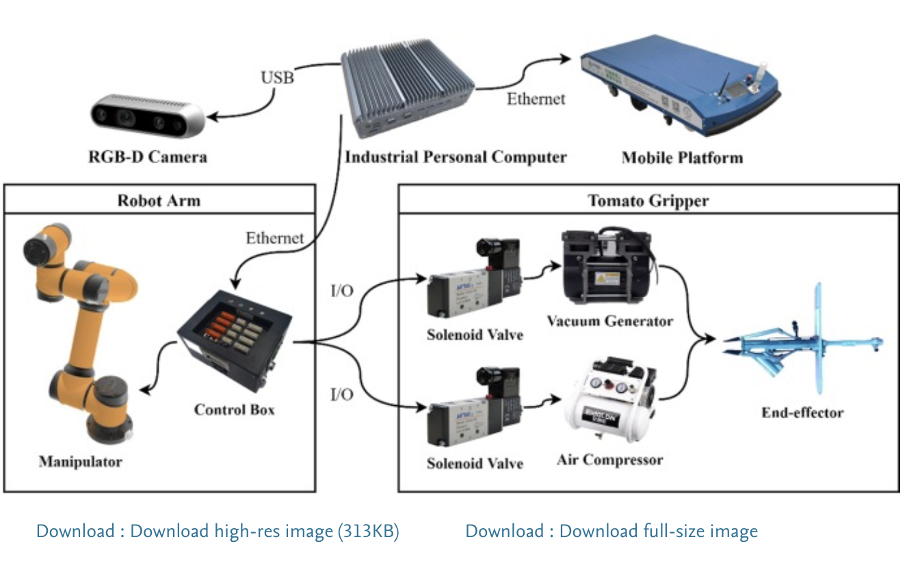
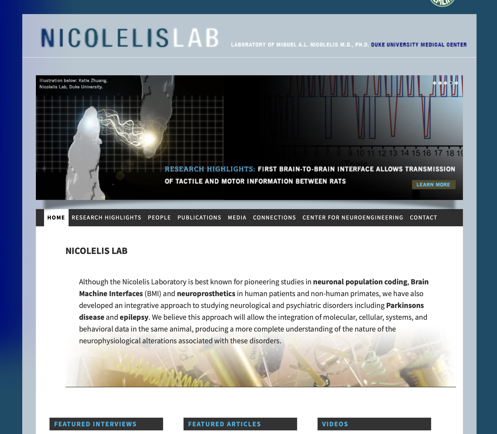
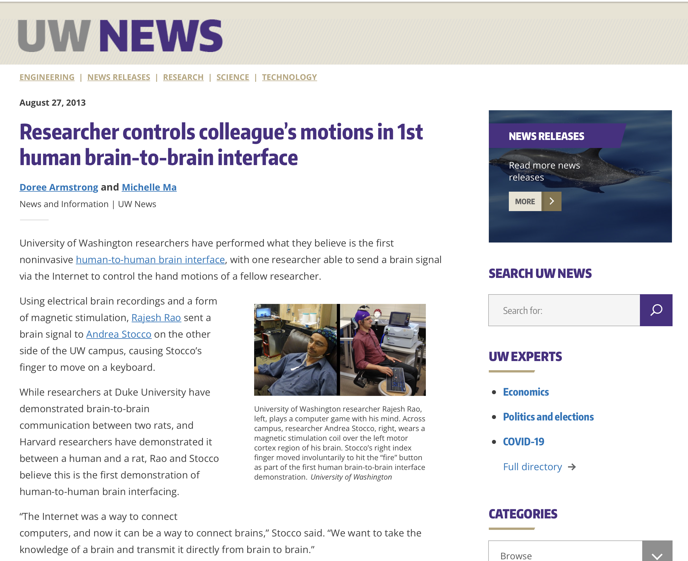

# Cyfrowe Cienie {background-color="#f8f9fa"}

## <i class="bi bi-mask"></i> 1. Ciemna strona mocy: Dobre narzędzia, Złe intencje

Zastanówmy się czy technologia rodzi same korzyści.

::: {.columns}
::: {.column width="50%"}
::: {.incremental}
* **Afera Cambridge Analytica:** Wykorzystanie danych z pozoru niewinnego Facebooka do mikro-targetowania ('hakowania świata') wpływającego na demokratyczne wybory.
* **Chiński System Kredytu Społecznego:** Automatyczna weryfikacja i nadzór. *„Ktoś, kto przez dziesięć godzin dziennie gra w gry wideo, zostanie zaklasyfikowany jako osoba bezproduktywna.”*
* Powszechna, zintegrowana inwigilacja staje się mierzalną szarą strefą państw.
:::
:::

::: {.column width="50%"}
::: {.fragment}
::: {.callout-important}
### Od kontroli do dedykowanej propagandy
Zagrożenia technologii to nie wojna nuklearna maszyn. To sterowanie demokracjami poprzez precyzyjną, dedykowaną propagandę oraz pełna kontrola społeczeństw na poziomie ludzkich pragnień i obaw. (Nawiązanie do wizji "Nowego wspaniałego świata").
:::
:::
:::
:::

::: {.notes}
Początek to szybkie zejście na ziemię po utopii z pierwszej części. Jak widać, technologia analityki Big Data działa w dwie strony. Ten slajd idealnie unaocznia "hakowanie zachowań", o którym pisze Yuval Noah Harari.
:::

---

## <i class="bi bi-robot"></i> 2. Sztuczna Inteligencja: Asystent czy Konkurencja?

AI wkracza w sfery zarezerwowane wyłącznie dla intelektu.

::: {.columns}
::: {.column width="50%"}
::: {.incremental}
* Algorytmy piszą kod, przewidują zachowania rynkowe i stawiają diagnozy medyczne trafniejsze od lekarzy pierwszego kontaktu.
* Istnieje ryzyko, że rewolucja sztucznej inteligencji wypchnie miliardy ludzi z rynku pracy.
* Stworzy to nową klasę społeczną: "bezużyteczną klasę", która doprowadzi do politycznych napięć.
:::
:::

::: {.column width="50%"}
::: {.fragment}
::: {.callout-note}
### Efekt Skali i Asymetria Pracy
Do obsługi każdego bezzałogowego drona w strefie kryzysowej potrzeba na ziemi około **30 osób**, a do analizowania zbieranych przez drona danych wideo – kolejnych **80 pilotów/analityków**. Paradoksalnie "autonomia" sprzętu oznacza dla nas więcej pracy z danymi, nie zawsze na produkcji.
:::
:::
:::
:::

::: {.notes}
Podkreśl przesunięcie kompetencyjne na rynku. Bezrobocie dla pracowników fizycznych idzie w parze z gigantycznym zapotrzebowaniem na wysokokwalifikowanych oficerów danych, których jest ogromny deficyt. A same komputery, jak drony autonomiczne z przykładu na slajdzie, bez danych są ślepe.
:::

---

## <i class="bi bi-hdd-network"></i> 3. Czy jesteśmy programami?

Algorytmy maszyn stają naprzeciw ludzkiej intuicji.

::: {.fragment}
> "...Nasze decyzje w każdej sprawie – od wyboru jedzenia po wybór partnerów – wynikają nie z jakiejś tajemniczej wolnej woli, lecz raczej z miliardów neuronów w ułamku sekundy obliczających prawdopodobieństwa. Osławiona „ludzka intuicja” jest w rzeczywistości „rozpoznawaniem wzorców”."
>
> --- *Yuval Noah Harari (21 Lekcji Na XXI Wiek)*
:::

::: {.incremental}
* Sztuczna inteligencja jest gotowa osiągnąć lepsze od nas wyniki, bazując na tych samych zasadach wzorców i prawdopodobieństw.
* Jeżeli człowiek jest biochemicznym algorytmem, to z krzemu można stworzyć sztuczny zamiennik ludzkiej decyzyjności.
:::

::: {.notes}
Głęboko filozoficzny wątek dla inżynierów. Jeśli uznajemy, że nie ma w nas iskry boskiej a jedynie skomplikowana macierz sieci neuronów (które to sieci my sami właśnie tworzymy w Pythonie w Tensorflow), to znaczy, że nasza przewaga z dnia na dzień po prostu będzie zanikać z każdą falą tranzystorów TSMC 3 nanometry w procesorach.
:::

---

## <i class="bi bi-phone-fill"></i> 4. Ucieczka z "Tu i Teraz"

Dlaczego tak łatwo ulegamy algorytmom?

::: {.fragment}
::: {.callout-important style="font-size: 1.5em;"}
### Cyfrowe Znieczulenie
„Jeżeli większość ludzi spędza znaczną część swojego czasu nie tu i teraz ani w przewidywalnej przyszłości, ale gdzie indziej, w pozbawionych znaczenia zaświatach sportu i oper mydlanych, mitologii i metafizycznych fantazji, **społeczeństwu będzie trudno oprzeć się zakusom tych, którzy chcą nim manipulować**, dążąc do przejęcia kontroli.”
*— Aldous Huxley (Nowy Wspaniały Świat 30 Lat Później)*
:::
:::

::: {.notes}
Zwróć uwagę na prorocze słowa Huxleya. Nie jesteśmy w świecie inwigilacji rodem z "Roku 1984" Orwella przez ból i biczowanie, żyjemy w dyktaturze przyjemności i rozrywki z telefonu i TikToka. Dajemy się zniewolić przez łatwą i darmową usługę, płacąc za nią informacjami o naszych przyzwyczajeniach.
:::

---

# Nowe Perspektywy Gatunku {background-color="#f8f9fa"}

## <i class="bi bi-person-bounding-box"></i> 5. Kierunki rozwoju: Wychodząc z Jaskini

Jak technologia pozwala ewoluować samemu gatunkowi.

::: {.columns}
::: {.column width="55%"}
::: {.incremental}
* Ludzkość nie zdominowała natury przez ostre pazury, ogromną siłę, ani wielki intelekt poszczególnej jednostki.
* To komunikacja: Nasza przewaga to absolutna umiejętność asynchronicznego koordynowania pracy na miliardowej skali, wymieniania myśli i budowy struktur, których nie pojmie i nie stworzy pojedynczy umysł.
* Nowe sieci (jak IoT, internet satelitarny Starlink itp.) to biologicznie patrząc nowy sposób globalnego neuronowego pająka.
:::
:::

::: {.column width="45%"}
::: {.fragment}
{width=100%}
:::
:::
:::

::: {.notes}
Klucz do przetrwania - współpraca. Komputery współpracują miliony razy lepiej. Dziś człowiek uczy się maszynowego punktu widzenia. Zdjęcie ilustruje jak technologia uczy roboty "widzieć i zbierać owoce", ucząc się naszej domeny na naszym poziomie.
:::

---

## <i class="bi bi-wifi"></i> 6. Bezpośredni transfer wrażeń (BCI)

Idea rodem z Matrixa udowodniona naukowo 10 lat temu.

::: {.columns}
::: {.column width="60%"}
::: {.incremental}
* **Projekt Miguela Nicolelisa:** W serii eksperymentów wszczepiono implanty do ośrodków ruchowych dwóch szczurów. 
* Jeden znajdował się na kampusie Duke (USA), drugi w Brazylii.
* Połączono ich na serwerach siecią i przesyłano komendy ruchowe.
* Szczur podrzędny uczył się pociągać właściwe dźwignie świetlne **wyłącznie z sygnałów przesyłanych pętlą TCP/IP prosto z mózgu pierwszego**.
:::
:::

::: {.column width="40%"}
::: {.fragment}
{width=100%}
:::
:::
:::

::: {.notes}
Zobrazuj im skok jaki to robi: komunikacja siecią Internet poleceń motorycznych pomiędzy szczurami oddalonymi o kontynenty. Ten "Brain to Brain Interface" nie jest tylko medycyną do naprawy zerwanego rdzenia, to komunikacja, gdzie człowiek podłączałby się pod pamięć roboczą chmury internetowej.
:::

---

## <i class="bi bi-person-check-fill"></i> 7. Interfejs Człowiek-Człowiek (University of Washington, 2013)

Eksperyment, który przekroczył barierę ludzką: *Nieinwazyjny interfejs komputera mózgowego*.

::: {.columns}
::: {.column width="60%"}
::: {.incremental}
* Rajesh Rao i Andrea Stocco zagrali w grę wideo w przeciwnych połówkach kampusu.
* **Rajesh** widział na monitorze nadlatujące obiekty, lecz nie posiadał klawiatury ani pada. Chciał wystrzelić pocisk, a myśl ta przesyłana za pomocą analizy EEG (elektroencefalogramu) była przesyłana pętlą TCP/IP prosto z mózgu kolegi.
* **Andrea** siedziała w ślepym zamkniętym pokoju z klawiaturą (kontrolerem), nie widząc samej gry, ale mając na głowie cewkę oddziałującą polem magnetycznym na korę ruchową dłoni.
* Myśl Rajesha, po zdekodowaniu, wędrowała milisekundy siecią wi-fi by wzbudzić drgnięcie mięśniowe dłoni Andrei naciskającej klawisz. Z sukcesem ustrzelili cel. 
:::
:::

::: {.column width="40%"}
::: {.fragment}
{width=100%}
:::
:::
:::

::: {.notes}
Ten eksperyment (z 2013 roku, ponad dekadę temu) to pokaz "Transferu Telemetrycznego" do człowieka. Przekaz impulsu do wykonania z intencji. Pokazuje to gigantyczne pole przed systemami Neuralink.
:::

---

## <i class="bi bi-battery-charging"></i> 8. Podstawowa Blokada: Prawdziwy Koszt Energii

Paliwo ludzkiego a maszynowego bytu.

::: {.columns}
::: {.column width="60%"}
::: {.incremental}
* Energia dzienna spożywana przez dorosłego pracującego ciężko człowieka wynosi ok. **2500 - 3000 kcal** (co matematycznie daje **~12.6 MJ** energii, lub 3.5 kWh prądu).
* Z drugiej strony, przeciętne auto potrzebuje blisko 2,5 MJ energii na każdy kilometr jazdy.
:::
:::

::: {.column width="40%"}
::: {.fragment}
::: {.callout-warning style="font-size: 1.5em;"  }
### Ekologia zderza się z Fizyką
Aby pokonać błahe **5 km** samochodem i przewieźć fizycznie 1 człowieka, infrastruktura wyzwala ładunek energetyczny potężniejszy niż dobowy koszt egzystencji (BMR) całego zapotrzebowania narządów i mózgu tego człowieka na 24h. Systemy komputerowe są ogromnie prądożerne na wzór aut.
:::
:::
:::
:::

::: {.notes}
Klucz i konkluzja na sam koniec – wszystko zmierza do energooszczędności na poziomie biochemii. Obecnie serwerownie pożerają zasilanie całych dzielnic w czasie, gdy ludzki mózg liczy genialne i kreatywne operacje, pobierając 20 W mocy ze spalania małego wafelka z czekoladą.
:::

---

## <i class="bi bi-journal-text"></i> 9. Literatura do Wstępu i Zakończenie

Jeśli zafascynowały was omawiane koncepcje...

::: {.callout-note style="font-size: 1.5em;"}
**Zalecana biblioteka inspiracji**

- Yuval Noah Harari: **"Homo Deus, krótka historia jutra"** (2015)
- Yuval Noah Harari: **"21 Lekcji Na XXI Wiek"**
- Jacek Dukaj: **"Po słowie"** (2019)
- Ramez Naam: Trylogia **Nexus, Crux, Apex**
- Aldous Huxley: **"Nowy wspaniały świat"** (1931)
:::

::: {.fragment}
* ***Dziękuję za Państwa uwagę na tym Wprowadzeniu. Zapraszam was serdecznie na Część Główną cyklu Internetu Rzeczy.***
:::

::: {.notes}
Zamykamy drugą część Wykładu Zerowego. Zostawcie studentom na ekranie listę autorów fantastyki naukowej (i hard sci-fi jak Ramez Naam) oraz socjologów, ponieważ te dzieła kształtują młode umysły i dają tło do obaw na inżynierii przed ślepym i radosnym wdrożeniem skomplikowanych technologii.
:::

